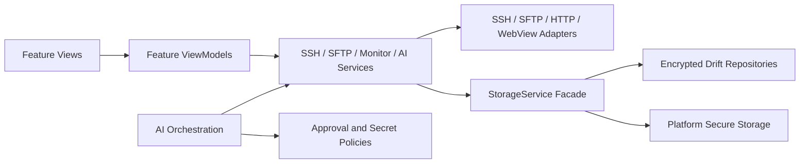

# Repository Guidelines

> 最新更新时间：2026-08-07

## Project Structure & Module Organization

This is a Dart workspace containing the full Flutter app for SSH, SFTP, server monitoring (including general metrics, port usage, process application performance, and service status), logs, LAN Quick Share, and OpenAI-compatible AI tools. The current full app lives in `apps/ssh_mobile_full/`: its `lib/` uses feature-first MVVM, its platform projects, assets, tests, and app-specific tools live beside it, and its `pubspec.yaml` is a workspace member. Cross-feature SSH/SFTP/storage/LLM/MCP infrastructure currently remains under `apps/ssh_mobile_full/lib/services/`; shared security/protocol helpers remain under `apps/ssh_mobile_full/lib/core/services/`; Drift database and repositories remain under `apps/ssh_mobile_full/lib/data/`; shared UI remains under `apps/ssh_mobile_full/lib/theme/` and `apps/ssh_mobile_full/lib/widgets/`; and common helpers remain under `apps/ssh_mobile_full/lib/utils/`. `lib/models/` and `lib/screens/` inside the full app are legacy compatibility surfaces, not destinations for new work. Root-level `packages/core/`, `packages/infrastructure/`, and `packages/features/` are reserved for the staged modular migration; the first Core contract package is `packages/core/app_core/`, which has no production Flutter/UI dependency. The existing native Dart package is now `packages/infrastructure/ssh_mobile_network_native/`. Root `pubspec.yaml` and `melos.yaml` define workspace tooling, with Melos pinned as a root development dependency, while `docs/`, `scripts/`, `installer/`, `.github/`, and `third_party/` remain repository-level directories. The vendored terminal package under `third_party/xterm/` is excluded from the full app analyzer.

## High-Level Architecture

Feature-first MVVM with Provider/Selector for state. UI composition, protocol adapters, persistent storage, monitoring, and AI orchestration are independent, separately testable layers:



- `apps/ssh_mobile_full/lib/main.dart` composes application-lifetime services and shared ViewModels via `MultiProvider`; `AppBootstrapCoordinator` starts preference and storage setup without blocking `runApp()`, and feature scopes initialize SSH, SFTP, LAN receiver, System Administration, and AI tools only when needed. Route/screen-scoped state stays local — e.g. the AI chat runtime is created by `AiChatRuntimeFactory` and provided by the chat view; terminal screens create focused session/history/window ViewModels. Views hold layout and transient presentation state; validation, async orchestration, and repository coordination belong in ViewModels and services.
- Current feature roots under `apps/ssh_mobile_full/lib/features/`: `connection`, `terminal`, `sftp`, `ai_chat`, `ai_skills`, `client_webview`, `performance`, `system_admin`, `lan_share`, `playbook`, `rag`, `settings`, `startup`, `home`, `developer_log`, `developer_panel`, `mcp_console`. New UI belongs in the owning feature, never in `apps/ssh_mobile_full/lib/screens/` (legacy) or `apps/ssh_mobile_full/lib/models/` (legacy shared surface).
- Cross-feature infrastructure in `apps/ssh_mobile_full/lib/services/`: SSH/SFTP/LLM/AI-tool, monitoring, storage, LAN-share, MCP, and platform adapters. `apps/ssh_mobile_full/lib/core/services/` holds lower-level shared security/protocol factories (host-key policy, data protection). `apps/ssh_mobile_full/lib/data/` holds the Drift database, DAOs, and repositories. New shared infrastructure belongs in the appropriate package under `packages/` only when its current Step permits migration.
- Storage layering: Drift for growing structured data (AI chats, agent metrics, terminal-history metadata, playbooks, SFTP path records) with sensitive fields encrypted at rest; small preferences in SharedPreferences; passwords, private keys, API keys, and MCP tokens only in platform secure storage (`flutter_secure_storage`). A production DB failure must not silently fall back to an in-memory database.

AI agent runtime (client-side, not on the managed server): model context is built on-device, the provider is called, and the tool loop reaches remote systems via SSH/SFTP. Tool safety boundaries are enforced in code, not just prompts:

- Remote writes, uploads, renames, deletions, sensitive reads, and downloads require explicit approval.
- Destructive shell deletion commands are blocked; env-var dumps, cloud metadata endpoints, and sensitive paths are restricted.
- `.ssh`, `.env`, private keys, tokens, and cloud credentials are excluded from preview caches; tool arguments/results/traces are filtered by `ToolSecretPolicy`.
- Approvals bind to immutable server/provider/playbook/skill/monitor snapshots; an action is rejected if its snapshot is no longer current.
- Dangerous MCP tools return `approval_required` and cannot bypass the in-app approval UI.

## Build, Test, and Development Commands

Dependency and code generation (run after `pubspec.yaml` or Drift model changes):

- `dart pub get`: resolve the root Dart workspace from `pubspec.yaml`.
- `dart run melos exec --scope=app_core -- dart analyze .`: analyze the Core contract package.
- `dart run melos exec --scope=app_core -- flutter test --no-pub`: run Core contract tests.
- From `apps/ssh_mobile_full/`, `dart run build_runner build`: regenerate Drift DAOs (`lib/data/database/app_database.g.dart`) and other codegen. Generated files are committed; verify with `git diff --exit-code -- apps/ssh_mobile_full/lib/data/database/app_database.g.dart`.
- From `apps/ssh_mobile_full/`, `dart run tool/generate_app_icons.dart`: regenerate app icons. Verify with `git diff --exit-code -- apps/ssh_mobile_full/assets apps/ssh_mobile_full/android apps/ssh_mobile_full/ios apps/ssh_mobile_full/macos apps/ssh_mobile_full/web apps/ssh_mobile_full/windows/runner/resources/app_icon.ico`.

Static checks and formatting:

- `dart format apps/ssh_mobile_full/lib apps/ssh_mobile_full/test apps/ssh_mobile_full/tool`: format full-app Dart code.
- `dart format packages/core/app_core/lib packages/core/app_core/test`: format Core contract code.
- `dart format --output=none --set-exit-if-changed apps/ssh_mobile_full/lib apps/ssh_mobile_full/test apps/ssh_mobile_full/tool`: format check that fails on diffs (used in CI).
- From `apps/ssh_mobile_full/`, `flutter analyze`: run static analysis using the app's `analysis_options.yaml`. `third_party/**` is excluded from the analyzer.
- From `apps/ssh_mobile_full/`, `flutter test`: run all Flutter tests under the app's `test/`.
- From `apps/ssh_mobile_full/`, `flutter test test/path/to/file_test.dart`: run a single test file.
- From `apps/ssh_mobile_full/`, `flutter test --coverage --reporter expanded`: run tests with coverage.
- From `apps/ssh_mobile_full/`, `dart run tool/check_coverage.dart --minimum=35`: enforce the 35% non-generated line-coverage floor (CI gate).

Full local quality gate (fast loop):

```bash
dart pub get
dart format --output=none --set-exit-if-changed apps/ssh_mobile_full/lib apps/ssh_mobile_full/test apps/ssh_mobile_full/tool
cd apps/ssh_mobile_full
flutter analyze
flutter test
```

Run and platform builds:

- From `apps/ssh_mobile_full/`, `flutter devices`: list available targets.
- From `apps/ssh_mobile_full/`, `flutter run -d <device-id>`: run locally on a device, emulator, or desktop target (`android`, `windows`, `macos`, `chrome`, or a device ID).
- From `apps/ssh_mobile_full/`, `flutter build apk --debug`: build an Android debug APK. Release: `flutter build apk --release` / `flutter build appbundle --release`.
- From `apps/ssh_mobile_full/`, `flutter build macos`: build the macOS desktop app (enable first with `flutter config --enable-macos-desktop`).
- From `apps/ssh_mobile_full/`, `flutter build ios --release --no-codesign`: build iOS on macOS (requires iOS 14.0+).
- From `apps/ssh_mobile_full/`, `flutter build windows`: build the Windows desktop app (enable first with `flutter config --enable-windows-desktop`).
- `powershell -ExecutionPolicy Bypass -File .\scripts\build_windows_msi.ps1`: build the Windows MSI installer.

Agent skill sync (run after editing shared skills):

- `powershell -ExecutionPolicy Bypass -File .\scripts\sync_agent_skills.ps1 -Mode Check`
- `powershell -ExecutionPolicy Bypass -File .\scripts\sync_agent_skills.ps1 -Mode Link -Force`

## Coding Style & Naming Conventions

Use standard Dart formatting and `flutter_lints`. Prefer two-space indentation, `lower_snake_case.dart` filenames, `UpperCamelCase` classes/widgets, and `lowerCamelCase` members. Keep UI text centralized in `AppStrings`/`TerminalStrings` with Chinese and English entries. Route logs through `AppLogService`; do not use ad hoc `print` calls for app diagnostics. Keep UI styling consistent with `lib/theme/app_theme.dart`.

Every maintained Markdown document must place a `最新更新时间：YYYY-MM-DD` (or
`Last updated: YYYY-MM-DD` for English-first documentation) marker at its
beginning, immediately after YAML front matter when present. Update that marker
whenever the document content changes.

## Testing Guidelines

Add focused tests under `test/` with names ending in `_test.dart`. Use `flutter_test` for widget and unit coverage. Run `flutter test` and `flutter analyze` before submitting changes. Broaden tests when touching shared services such as storage, SSH/SFTP behavior, LLM tool dispatch, or platform branching. Automated tests use fakes and controlled fixtures and require no real SSH credentials or API keys — never commit real secrets into test fixtures, screenshots, or logs.

Deeper architecture, security, performance, and release detail lives in `docs/` (e.g. `MOBILE_UI_QA.md`, `RELEASE_CHECKLIST.md`, `VALIDATION_REPORT.md`, `ADR_ENGINEERING_BASELINE.md`, `PERFORMANCE_ACCEPTANCE.md`, `security_manual_regression.md`, `ANDROID_NATIVE_REWRITE_GUIDE.md`). The README is the user-facing source of truth for setup, configuration, and the integration checklist.

## Commit & Pull Request Guidelines

Recent commit subjects are short and direct, often English or Chinese, for example `add log`, `update`, or `font config`. Keep commits scoped and imperative when possible. Pull requests should include a clear summary, validation commands run, linked issues if applicable, and screenshots or screen recordings for UI changes.

## Security & Agent-Specific Notes

Never commit passwords, private keys, API keys, tokens, or server credentials. Store secrets through `flutter_secure_storage`, not `SharedPreferences`, and keep exports credential-free. Read `AGENT_MEMORY.md` before non-trivial maintenance work. Keep `.agents/skills/ssh-mobile-maintenance/SKILL.md` and `.claude/skills/ssh-mobile-maintenance/SKILL.md` synchronized with `.\scripts\sync_agent_skills.ps1 -Mode Check` after skill edits.
