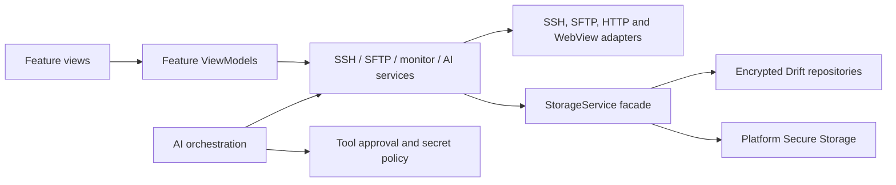

<p align="center">
  
</p>

<h1 align="center">SSH Mobile</h1>

<p align="center">
  面向移动端长时间会话的跨平台 SSH / SFTP、服务器监控与 AI 辅助运维客户端
</p>

<p align="center">
  <a href="https://github.com/2949282402/ssh_mobile/actions/workflows/flutter.yml"></a>
</p>

SSH Mobile 是一个基于 Flutter 的跨平台 SSH / SFTP 客户端，项目覆盖 Android、iOS、macOS、Windows 和 Web。它把 SSH 多窗口终端、远程文件管理、服务器监控、安全存储和 OpenAI-compatible AI tools 组合成一个完整的移动运维工作台。

SSH Mobile is a Flutter-based cross-platform client for long-running terminal sessions, remote file management, server monitoring, and AI-assisted operations.

> 后台网络连接仍会受到系统省电、网络切换和进程回收影响。需要尽量保留服务器端工作现场时，推荐使用 `SSH + tmux`。

## Portfolio Snapshot

| Area | Evidence in this repository |
| --- | --- |
| Mobile engineering | App lifecycle flushing, Android foreground service, battery/network/runtime health checks, adaptive mobile/desktop navigation |
| Architecture | Feature-first MVVM with Provider/Selector, protocol adapters, repository seams, and centralized dependency composition |
| Data and security | Secure Storage for credentials, encrypted Drift fields and caches, SSH Host Key TOFU, approval gates, and secret redaction |
| Reliability | Unit/widget coverage for ViewModels, storage migrations, protocol parsing, LLM streaming, tool loops, and security policies |
| Delivery | Pinned Flutter/dependency baseline, GitHub Actions quality gates, Android/Windows/macOS/iOS builds, and reproducible icon generation |

### Verified Baseline

Local verification on 2026-07-10 with Flutter 3.44.2 / Dart 3.12.2:

- `flutter analyze`: no issues
- `flutter test --coverage`: 568 tests passed
- non-generated line coverage: 39.3% (`12690/32302`), with a 35% CI floor
- Android debug and unsigned release APKs built successfully
- Windows release build completed successfully
- icon generation, Drift generation, shared-skill sync, formatting, and diff checks are deterministic

See [docs/VALIDATION_REPORT.md](docs/VALIDATION_REPORT.md) for commands, scope,
and the device-dependent checks that remain.

## Architecture



## Related Docs

- [docs/RELEASE_CHECKLIST.md](docs/RELEASE_CHECKLIST.md)
- [docs/VALIDATION_REPORT.md](docs/VALIDATION_REPORT.md)
- [docs/ADR_ENGINEERING_BASELINE.md](docs/ADR_ENGINEERING_BASELINE.md)
- [docs/PERFORMANCE_ACCEPTANCE.md](docs/PERFORMANCE_ACCEPTANCE.md)
- [docs/security_manual_regression.md](docs/security_manual_regression.md)
- [docs/ANDROID_NATIVE_REWRITE_GUIDE.md](docs/ANDROID_NATIVE_REWRITE_GUIDE.md)

## Highlights

- MVVM 架构：`lib/main.dart` 负责依赖装配，`lib/features/*` 负责 feature 状态和动作，`lib/services/*` 负责协议与存储基础设施。
- SSH 连接管理：支持密码、私钥、私钥密码、跳板机、服务器平台选择，以及 SSH Host Key 首次信任校验。
- 多终端窗口：同一服务器可创建多个窗口，窗口名固定，用于稳定绑定 tmux 会话。
- SFTP：支持目录浏览、最近/收藏路径、上传、下载、文本编辑、文件预览、加密预览缓存和输入名称确认删除。
- 性能监控：包含 Performance、Ports、Applications、Services 四个分区。
- AI 聊天：支持流式输出、Markdown、聊天历史、消息编辑、重新生成、分支和上下文压缩。
- AI tools：支持服务器诊断、SFTP 路径操作、客户端信息、WebView 搜索与读取、日志与备份操作。
- 本地 MCP Server：Windows/macOS/desktop 端可在设置中开启 `127.0.0.1:<port>/mcp` Streamable HTTP + JSON-RPC 端点，并复制 Codex、Claude Code、Gemini CLI 配置。
- 日志：集中记录 SSH、SFTP、LLM、AI tools 和异常信息，并统一脱敏常见凭据、令牌和私钥内容。
- 设置与备份：支持语言、主题、终端字体、AI 设置、聊天和窗口历史导入导出，但不导出密码、私钥或 API Key，导入会做大小、数量和 schema 校验。主题对象会复用缓存，终端字体等非视觉外壳设置只刷新对应功能，不会重建整个应用。移动设置抽屉会限制在当前视口内、保留系统底部安全区，并使用完整宽度的列表/网格选择器。
- 自适应界面：主导航顺序为 Servers、SFTP、AI、System Admin、Logs，启动仍落在 Servers。桌面导航轨可从任意主页面打开应用设置；移动端 Servers 页提供可见的设置入口。AI 页顶部的调节按钮只负责独立的 LLM 设置。移动端由 `MobileUiMetrics` 统一适配 1280–1440 px 物理短边：1.5K 屏幕适度收紧控件与导航密度，2K 屏幕保持标准比例，同时不缩放系统文字。宽度达到 840dp 时切换导航轨，高度低于 480dp 时使用紧凑图标轨；Servers 网格仅在至少 720dp 宽时启用。
- 附加页面：包含系统管理、Playbook、RAG 知识库、AI Skills、终端历史和客户端 WebView。

## Project Structure

当前仓库采用 feature-first 的 MVVM 结构。新增业务优先落在对应 feature，而不是继续把状态堆到 screen 类里。

- `lib/main.dart`: 应用启动和 `MultiProvider` 装配入口，注册基础 service 与 feature ViewModel。
- `lib/features/`: feature 自有目录。当前重点包括 `connection/models|viewmodels|views`、`ai_chat/viewmodels|services`、`settings/viewmodels`、`performance/viewmodels`、`sftp/viewmodels`、`terminal/viewmodels`。
- `lib/features/*/views/`: 页面、导航壳、基于 Dart `part` 的复合 UI 和 feature 子组件，主要负责布局、路由和少量瞬时 UI 状态。
- `lib/theme/app_theme.dart`、`lib/widgets/app_surface.dart` 与 `lib/widgets/server_selector.dart`: 全局颜色、排版、圆角、控件主题，主页面背景、页头、图标徽标、分组卡片、空状态，以及 SFTP / 系统管理共用的桌面和移动服务器选择栏。新增界面应优先复用这些设计基础，避免页面级颜色和阴影分叉。
- `lib/services/`: SSH、SFTP、LLM、AI tools、监控、存储、MCP 等基础设施与 repository-style service，子目录包括 `ai_tool/`、`client_webview/`、`mcp/`、`ssh/`、`sftp/`、`storage/`。
- `lib/data/`: Drift 数据库、DAO 和 Drift-backed repository 实现。`StorageService` 仍作为兼容 facade 暴露现有接口。
- `lib/core/services/`: 更底层的跨 feature 服务与工厂，例如 `ssh_client_factory.dart`、`data_protection_service.dart`。
- `lib/models/`: 仍未迁入 feature 的共享模型。
- `lib/theme/`, `lib/utils/`, `lib/widgets/`: 主题、工具和复用组件
- `assets/`: 静态资源
- `docs/`: 设计与维护文档
- `scripts/`: 构建和维护脚本
- `test/`: 单元和组件测试
- `third_party/xterm/`: vendored terminal package

## Agent Collaboration

Codex 使用 `.agents/skills/ssh-mobile-maintenance/SKILL.md`，Claude Code 使用 `.claude/skills/ssh-mobile-maintenance/SKILL.md`。修改 skill 后请同步检查：

```powershell
.\scripts\sync_agent_skills.ps1 -Mode Check
.\scripts\sync_agent_skills.ps1 -Mode Link -Force
```

`AGENT_MEMORY.md` 用于保存跨会话的非敏感项目记忆，不要写入密码、私钥、API Key、token 或服务器凭据。

## Development

### Environment

- Flutter `>=3.44.0`（CI 固定为 `3.44.2`）
- Dart SDK `>=3.12.0 <4.0.0`
- Android Studio / Android SDK 或对应平台工具链
- Windows 桌面构建需要 Visual Studio 的 `Desktop development with C++`
- iOS / macOS 构建需要 macOS 和 Xcode

如国内网络访问 `pub.dev` 不稳定，可临时使用：

```powershell
$env:PUB_HOSTED_URL='https://pub.flutter-io.cn'
flutter pub get
```

### Common Commands

```powershell
flutter pub get
dart format lib test tool
flutter analyze
flutter test
flutter test --coverage
dart run tool/check_coverage.dart --minimum=35
flutter devices
flutter run -d <device-id>
flutter build apk --debug
flutter build windows
powershell -ExecutionPolicy Bypass -File .\scripts\build_windows_msi.ps1
```

应用图标由仓库内脚本统一生成，修改品牌图形后运行：

```powershell
dart run tool/generate_app_icons.dart
```

### Run

```powershell
flutter devices
flutter run -d <device-id>
```

如果安装 Android APK 时出现 `INSTALL_FAILED_USER_RESTRICTED`，通常是手机系统拦截了 USB 安装或用户取消了安装确认。

### Build

Android:

```powershell
flutter pub get
flutter build apk --debug
flutter build apk --release
flutter build appbundle --release
```

输出目录：

- `build/app/outputs/flutter-apk/`
- `build/app/outputs/bundle/release/app-release.aab`

Windows:

```powershell
flutter config --enable-windows-desktop
flutter pub get
flutter build windows
powershell -ExecutionPolicy Bypass -File .\scripts\build_windows_msi.ps1
```

输出目录：

- `build/windows/x64/runner/Release/`
- `build/windows_msi/out/SSH_Mobile_Windows_v1.0.0_setup.msi`

MSI 脚本使用 WiX Toolset v3；若本机未安装，脚本会下载到 `build/wix` 后直接使用。

macOS:

```bash
flutter config --enable-macos-desktop
flutter pub get
flutter build macos
```

输出目录：

- `build/macos/Build/Products/Release/ssh_mobile.app`

iOS:

```bash
flutter pub get
flutter build ios --debug
flutter build ios --release
open ios/Runner.xcworkspace
```

iOS 和 macOS 只能在 macOS 上构建。

## Usage Overview

### Servers and Terminal

服务器页负责保存连接、选择启动模式和管理终端窗口。保存或编辑服务器时，应用会先尝试用当前 host、port、username 和认证信息验证 SSH 登录，并在首次看到 SSH Host Key 时要求用户确认；之后指纹变化会阻断连接。Linux 服务器默认适合 `SSH + tmux`，Windows 服务器使用 plain SSH，除非用户明确连接到 WSL 或其他 Linux-like shell。

终端窗口管理已经嵌入服务器页。每台服务器卡片下方都有默认折叠的窗口区域，窗口名创建后保持固定，用于绑定 tmux 会话。连接历史入口位于服务器窗口总览区域。

### SFTP

SFTP 页支持多服务器切换、路径记忆、最近路径、收藏路径、上传、下载、文本编辑，以及文本、Markdown、图片和沙箱 HTML 预览。Markdown/HTML 的外部资源与导航会被阻断；远程 PDF 不会在应用内读取或解析，而是提示下载后使用可信阅读器打开。删除文件或目录前必须输入完整目标名称。预览缓存会加密落盘，`.ssh`、`.env`、私钥、token、云凭据和系统敏感路径不写缓存。客户端可在设置中调整普通下载、文本预览、富预览和文本编辑的大小限制；内存读取会在分配前执行硬上限与分块校验，大目录条目构建和排序在后台 isolate 完成，以避免大文件、错误元数据或大量目录项阻塞界面。

### Performance Monitor

性能监控页包含四个分区：

- `Performance`: 多服务器、手动开始、保留近 10 分钟内存样本
- `Ports`: 单服务器端口快照
- `Applications`: 单服务器进程快照
- `Services`: 单服务器服务状态快照

系统管理页中，`Monitor` 保持独立的多服务器选择；其他系统管理功能共用当前单选服务器。快照模式不需要 root，`Users` / `Sessions` / `Power` 以及 `Ports` / `Services` 的管理模式才会按需连接 root。端口与服务页的模式选择保持居中、刷新操作固定在右侧；单服务器快照不重复显示服务器摘要卡片。

Linux 监控使用 `/proc` 和 `df -P`，Windows 监控使用 `ServerStatusProbe` 中的 PowerShell JSON 采样路径。远程命令输出解码以及端口、应用、服务、用户和监控 JSON 的解析排序在后台 isolate 完成；UI isolate 只接收结果并刷新状态。监控服务会维护内存中的健康分和最近告警，服务器页可展示轻量健康状态。

### AI Chat

AI 页负责聊天、历史、WebView、Skills 和 LLM 设置。当前聊天支持：

- SSE 流式回复和 Markdown 渲染
- 聊天历史侧边覆盖层
- 用户消息编辑后重发
- AI 回复重新生成和从指定回复创建分支
- 工具调用、工具结果、审批和 reasoning 的折叠详情
- 上下文窗口 `259K` / `512K` / `1M`
- 上下文达到 90% 时自动压缩旧历史
- 页面切换时保活

LLM 设置集中在单独的设置页中，包含 Base URL、API Key 历史、模型、上下文窗口、DeepSeek / OpenAI 推理参数、Web 搜索、多代理、上传大小等配置。AI 聊天回复、上下文压缩、多代理辅助和工具回合不设置固定请求超时；如果发送时遇到可重试网络错误，会自动重试三次，失败后再显示错误。

AI 聊天的 tool 调用现在有按单次请求计算的预算保护：默认预算为 20 次，首次达到预算会自动增加一半，并在 trace 中提醒用户观察工具调用是否仍然合理；之后每次继续扩容前都会运行一次内部安全审计，必要时会停止继续调用工具，并强制模型给出一次无工具的总结与下一步建议。

Agent loop 轮次与 tool 调用预算独立计数。LLM 设置页提供 Balanced、Deep 和 Unlimited 三种 Agent loop 模式；Balanced 默认允许 16 个主模型 round，用户批准后每次增加 8 个 round，Deep 为 24/+12，Unlimited 只取消 Agent loop 轮次上限，tool 调用预算和安全审批仍然生效。

本地 AI 技能（AI Skills）无论是通过界面直接创建/修改，还是大模型调用 `client_save_experience_skill` 或 `client_update_skill` 进行的自动技能沉淀与更改，由于属于本地状态的写入与修改，均必须通过用户的 `local_skill_change` 审批。审批界面会展示详细的前后 Name、Description、Enabled 以及 References 变动差异预览，以便用户进行安全与有效性核实。

默认情况下，AI 会先为当前聊天生成可批准执行的 `todoSteps` 计划；只有当用户明确要求保存、复用或管理这次运维脚本时，才应创建或运行独立的 `Playbook`。

#### Agent Runtime

Current agent architecture in the Flutter client:

- `lib/screens/llm_chat_screen.dart` 保持页面组合与路由职责，`lib/features/ai_chat/viewmodels/ai_chat_viewmodel.dart` 负责聊天状态与动作调度，`lib/features/ai_chat/services/` 承担上下文构建、生成执行、状态翻译和 metrics 持久化等非 UI 逻辑。
- `ChatOrchestrator` and `ChatContextAssembler` now own RAG injection, approved-plan execution context, assistant trace compaction, and todo step finalization instead of spreading prompt assembly across UI code.
- AI settings now support `mainModel`, `helperModel`, `auditModel`, and a fallback policy so lightweight helper and audit turns can run on cheaper/faster models while the main assistant keeps the primary tool loop.
- `ToolExposureRouter` trims the tool set per request based on plan mode, approved plans, selected servers, and WebView availability to reduce prompt noise.
- The LLM tool loop now includes deterministic read-only loop blocking, short-TTL cache reuse, richer ledger metadata, and persisted `AgentRunMetrics`.
- Approved plan execution runs a client runtime health preflight on Android/client state; blocking issues stop execution, while warnings require explicit confirmation.
- New composite diagnostic tools are available for higher-signal troubleshooting: `inspect_service_health`, `collect_incident_context`, and `compare_server_states`.
- Operational memory retrieval now mixes RAG chunks, AI skills, prior todo/playbook wins, and useful traces before each run.

### AI Tools

AI tools 以能力分组维护在 `lib/services/ai_tool/` 中，而不是把逻辑散在聊天页里。当前主要包括：

- 服务器与诊断：`list_servers`、`run_command`、`get_server_status`、`generate_ops_report`
- SFTP 路径操作：目录列表、元数据、文本读取、下载，以及写入、上传、创建目录、重命名、删除
- 客户端工具：时间、设备、网络、电池、权限、运行健康检查、剪贴板、提醒、日志、备份、应用设置
- WebView / 搜索：`web_search`、当前聊天 WebView 读取和导航
- 技能记忆：如 `client_save_experience_skill`

约束规则：

- 普通运维请求默认使用当前聊天内的 `todoSteps` 执行计划；只有用户明确要求保存/复用剧本时，才使用 `create_playbook`、`run_playbook` 等 Playbook 工具。
- `client_*` tools 运行在 SSH Mobile 客户端，不连接服务器。
- `client_check_runtime_health` 汇总客户端网络、通知权限、电池优化、省电模式和热状态，用于长时间 agent 执行、SSH 保活、SFTP 传输和监控前的端上预检。
- `run_command` 会强制遵守保存的 `serverPlatform`，并阻断环境变量 dump、云 metadata endpoint 和敏感路径读取；日志读取默认需要审批。
- 远程写入、远程文件读取/下载、本地导入、日志删除/清空、监控状态变更等操作必须经过统一审批。
- AI destructive shell delete/remove 命令会被拦截；SFTP 敏感路径读取、下载和写入会直接阻断。
- SSH 会话开关、tmux 会话恢复和终端历史删除也属于显式审批范围，不会绕过审批面板。
- 所有 tool 参数、结果和 trace 都经过 `ToolSecretPolicy` 过滤或拦截，避免暴露凭据和敏感路径内容。

### Logs, Settings, Backup

日志页记录开发日志、SSH/SFTP 状态、LLM 请求、AI tool 调用和异常。应用设置与 LLM 设置分离：桌面端从主导航轨底部的设置按钮进入，移动端从 Servers 页面进入；AI 页顶部的调节按钮打开 LLM 设置。应用设置提供后台通知是否显示服务器名的隐私开关，默认隐藏。设置中的 MCP Server 区域可开启本地 `POST /mcp` 端点、选择端口、检查端口占用、重启服务、重新生成 Bearer token，并复制 Codex、Claude Code、Gemini CLI 配置；MVP 只绑定 `127.0.0.1`，拒绝未认证和非本地 Origin 请求，写入/危险 tools 默认只返回 `approval_required`。增长型结构化数据（AI 聊天、AgentRunMetrics、终端历史元数据、Playbook、SFTP 最近/收藏路径）由 Drift 持久化；小设置仍保留在 SharedPreferences，密码、私钥、API Key 和 MCP token 仍只放 secure storage。导出备份包含服务器、窗口恢复信息、终端历史、AI 设置、AI 聊天、Playbook、AgentRunMetrics、SFTP 路径记录和自定义 Skills，但密码、私钥和 API Key 会保持为空，导入后需要重新配置。

Drift 仅用于增长型结构化数据。需要查询或排序的 metadata 可以保持明文，但 AI message 正文、context、attachments、tool traces、todoSteps 和 Playbook content 会在写入 SQLite 前做字段级加密；旧 SharedPreferences protected-pref 数据仍保留为迁移失败或回滚兼容路径。历史 Drift 明文敏感字段会通过 `drift_sensitive_fields_encrypted_v1` 启动迁移重加密，迁移完成后才视为存储安全边界完整。生产数据库打开失败时不会静默切换到内存 SQLite，避免新写入数据在重启后丢失。Startup re-encryption runs in retryable batches and logs row counts only, never sensitive field values.

## Operational Notes

- 系统后台策略、网络切换和进程回收仍可能影响长时间连接。
- Android release 默认禁用 cleartext；debug/profile 仅用于本地 OpenAI-compatible provider 测试。
- macOS 端保存密码、私钥和 API Key 时，保持普通 Keychain 配置，避免 `-34018` entitlement 错误。

## Troubleshooting

### Device Not Found

```powershell
flutter devices
```

如果目标设备未出现，请检查 USB 调试、授权弹窗、数据线、驱动和目标平台工具链。

### APK Install Failed

如果出现：

```text
INSTALL_FAILED_USER_RESTRICTED: Install canceled by user
```

请在手机上允许 USB 安装、允许当前电脑调试、关闭系统安装限制，或手动确认安装弹窗。

### tmux Missing

如果服务器提示没有安装 tmux，请手动登录服务器安装：

```bash
# Debian / Ubuntu
sudo apt-get update && sudo apt-get install -y tmux

# Fedora
sudo dnf install -y tmux

# CentOS / RHEL
sudo yum install -y tmux

# Arch Linux
sudo pacman -Sy --noconfirm tmux

# Alpine Linux
sudo apk add tmux
```

### LLM API Errors

- 确认 Base URL 是正确的 OpenAI-compatible 接口地址
- 确认 API Key 已保存且未被显式清空
- 确认模型名称可用
- DeepSeek `reasoning_content` 已在 tool round 中自动回传
- 详细错误会写入日志页，便于排查

## License

当前仓库未声明开源许可证。公开发布前请补充明确的 `LICENSE` 文件。
包名、正式签名、许可证、隐私联系信息和真机验收等发布前事项集中记录在 [发布清单](docs/RELEASE_CHECKLIST.md) 中。
