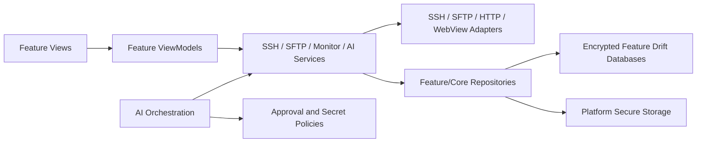

> Last updated: 2026-08-13

<p align="center">
  
</p>

<h1 align="center">SSH Mobile</h1>

<p align="center">
  A cross-platform SSH, SFTP, server monitoring, and AI-assisted operations client for long-running remote sessions
</p>

<p align="center">
  <strong>English</strong> | <a href="./README.zh-CN.md">简体中文</a>
</p>

<p align="center">
  <a href="https://github.com/hejulian2004/ssh_mobile/actions/workflows/flutter.yml"></a>
</p>

SSH Mobile is a Flutter-based cross-platform SSH and SFTP client for Android, iOS, macOS, Windows, and Web. It combines multi-window terminals, remote file management, server monitoring, secure storage, and OpenAI-compatible AI tools in a single mobile and desktop operations workspace.

The codebase is being migrated incrementally as a Dart workspace. The Terminal,
SFTP, real-time Monitoring, System Administration, Playbook, RAG, MCP, and AI
capabilities now have package boundaries under `packages/features/`; their
legacy App paths remain compatibility bridges while later Steps converge the
remaining shared services. AI data lives in `ai.db`; RAG metadata lives in
`rag.db`, while bounded document/vector cache files follow TTL and eviction
limits.

Each workspace member keeps a concise package contract in its `README.md` and
`AGENTS.md`, covering ownership, public APIs, dependencies, storage, lifecycle,
and validation. These files are the first reference for package-scoped work;
release-oriented `CHANGELOG.md` files are added only when a package has a
user-visible change that needs release notes.

The project began with a two-core server that had only 1 GB of memory. Running a complete AI agent directly on that machine was unreliable, so SSH Mobile moves model inference and agent orchestration to the client device. The client can inspect and manage low-resource servers through SSH and SFTP without consuming their limited memory.

> Mobile operating systems may suspend background processes, switch networks, or reclaim the application process. For durable remote workspaces, use SSH Mobile together with `SSH + tmux`.

## Highlights

- **SSH connection management** with passwords, private keys, encrypted private keys, jump hosts, server platform selection, and SSH host-key trust-on-first-use verification.
- **Multi-window terminals** that allow several fixed-name sessions per server and stable tmux session binding.
- **SFTP file management** with browsing, recent and favorite paths, uploads, downloads, editing, previews, and explicit deletion confirmation. The upload action follows the active theme's secondary color instead of a fixed deep purple.
- **LAN Quick Share & Network Transfer** with mDNS/UDP discovery, QR and device-list pairing invitations, reciprocal PIN confirmation, and encrypted device-to-device transfers. File sends run through the Rust network runtime: pinned-identity Quinn direct paths are selected first and the current WSS Relay path carries only opaque AES-GCM ciphertext when direct reachability is unavailable. Session traffic uses forward-secret authenticated Noise XX roots, structured epoch/direction/counter nonces, and explicit key rotation; authenticated TCP and direct WebSocket routes are bounded Delivery fallbacks and never silently downgrade E2EE. Route migration preserves the logical SessionId, pending Delivery state, and Session crypto context. Incoming direct and Relay offers require a global explicit approval, verified data is committed in the app sandbox, and success is reported only after receiver persistence and acknowledgement. The active development build does not retain the old HTTPS file-send fallback. The
feature-facing RealtimeSession exposes only lifecycle/state/media views; PeerConnection,
ICE, SDP, sockets, and Relay signaling remain native/App Shell owned.
- **Server monitoring** for performance, ports, applications, services, users, and active sessions.
- **AI chat and agent execution** with streaming output, Plan Mode, approval-controlled tools, persistent history, message branching, context compression, RAG, skills, and execution traces.
- **Local MCP server** support on desktop platforms, including generated configuration for Codex, Claude Code, and Gemini CLI; it supports `reviewConfiguredTools` (default) and `trustedAgent` modes while always enforcing its loopback-only and hard security boundaries.
- **Developer panel** with opt-in runtime, memory, FPS, frame-jank, build-mode, platform, Dart-version, and known lifecycle-resource diagnostics; its floating entry can be configured independently.
- **Secure storage** using platform secure storage, encrypted Drift fields, encrypted preview caches, secret redaction, and immutable approval targets.
- **Adaptive layouts** for phones, tablets, and desktop environments, including dedicated 1.5K and 2K Android QA profiles.
- **Backup and restore** for servers, terminal history, AI settings, chats, playbooks, metrics, and path records without exporting passwords, private keys, or API keys.

## Setup and Run

### Requirements

- Flutter `>=3.44.0`; CI is pinned to Flutter `3.44.2`.
- Dart SDK `>=3.12.0 <4.0.0`.
- Android Studio and Android SDK, or the corresponding platform toolchain.
- Visual Studio with `Desktop development with C++` for Windows builds.
- macOS and Xcode for iOS and macOS builds.
- iOS 14.0 or later.

### Install dependencies

```bash
git clone https://github.com/hejulian2004/ssh_mobile.git
cd ssh_mobile
dart pub get
```

### Run the application

```bash
cd apps/ssh_mobile_full
flutter devices
flutter run -d <device-id>
```

Examples:

```bash
flutter run -d android
flutter run -d windows
flutter run -d macos
flutter run -d chrome
```

The application can launch without real server or AI credentials. A reachable SSH server is required for terminal, SFTP, and monitoring integration tests. An AI provider is required only for AI chat and agent execution.

## Control Plane & Public Relay Production Deployment

The bundled `relay/` Go service provides a memory-only WSS relay and device control plane for Network Transfer / P2P fallback. Its standalone React + Vite + TypeScript administration console lives in `front/`; enrollment and dashboard credentials must be configured explicitly, and the service refuses to start with missing or weak secrets.

Docker Compose with Caddy is the supported production deployment path. Follow the [relay deployment guide](relay/README.md), then run:

```powershell
cd relay
Copy-Item .env.example .env
# Set the domain, all ports/runtime limits, and every token, key, and admin credential in .env.
docker compose --env-file .env up --build
```

This single command builds and starts `front`, `relay`, and `caddy`, then keeps their combined logs attached. Caddy exposes the front-end SPA publicly and forwards `/api/admin/v1`, `/v1`, and `/healthz` to the internal Relay service. Restarting the memory-only relay invalidates existing device enrollment, so clients must enroll again.

In SSH Mobile, open **LAN Share Settings** and enter the HTTPS relay host, port, and enrollment token. The token is used only for enrollment and is never persisted in preferences; the endpoint is stored as an origin while the device credential remains in platform secure storage. The page reports connected/disconnected/failed state and provides explicit reconnect, disconnect, and clear actions. Production clients require a valid TLS certificate.


### Platform builds

```bash
# Run these commands from apps/ssh_mobile_full.
cd apps/ssh_mobile_full

# Android
flutter build apk --debug
flutter build apk --release
flutter build appbundle --release

# macOS
flutter config --enable-macos-desktop
flutter build macos

# iOS, on macOS
flutter build ios --release --no-codesign
```

```powershell
# Windows
Set-Location apps/ssh_mobile_full
flutter config --enable-windows-desktop
flutter build windows
Set-Location ../..
powershell -ExecutionPolicy Bypass -File .\scripts\build_windows_msi.ps1
```

Android CI uses the official Google, Maven Central, and Flutter artifact repositories. Aliyun Maven mirrors are optional for local environments and can be enabled with `USE_ALIYUN_MAVEN=true` or the Gradle property `-PuseAliyunMaven=true`.

## Configuration Guide

SSH Mobile separates application settings, server credentials, and LLM settings so each security boundary can be reviewed independently.

### 1. Application settings

On desktop, open application settings from the bottom of the navigation rail. On mobile, open them from the Servers page. The AI page settings button opens LLM settings instead of application settings. Feature-specific settings now live with their feature: server list layout is in the Servers header, terminal appearance is in the terminal more menu, SFTP limits are in SFTP settings, LAN identity and relay options are in LAN Share settings, and AI Skills/MCP settings are in the AI LLM settings page.

Important defaults:

| Setting | Default | Notes |
| --- | --- | --- |
| Language | Chinese | Chinese and English are supported. |
| Theme | Light with Monochrome palette | Dark and OLED dark themes are available. Monochrome, Indigo, Ocean, Emerald, Rose, and Amber palettes persist across launches and backups. |
| Server list | List | Change from the Servers header view menu; grid is enabled only when the viewport is wide enough. |
| Notification privacy | Hide server names | Prevents server names from appearing in background notifications by default. |
| RAG | Disabled | Search mode defaults to BM25 with top-N set to 3. |
| MCP server | Disabled | Configure from AI → LLM settings → Tools & Automation; binds only to loopback when enabled. |
| MCP approval mode | Dangerous operations require review | Select `trustedAgent` only when external Agent automation is explicitly trusted; configure Tool exposure and review choices in the desktop Local MCP Console. Hard security checks remain active in both modes. |
| SFTP download limit | 512 MB | Configure from the SFTP page; valid range is 64 KB to 2 GB. |
| Text preview limit | 2 MB | Files above the limit require download. |
| Rich preview limit | 20 MB | Applies to supported images and rich previews. |
| Text edit limit | 512 KB | Prevents large remote files from exhausting mobile memory. |

Terminal theme/font and LAN Share device identity, relay, and runtime permissions
are also edited from their respective feature pages. Application-level language,
theme, security/privacy, backup, and developer controls remain in application
settings.

### 2. SSH server profile

Create a server from the Servers page and provide:

- display name;
- host or IP address;
- SSH port, normally `22`;
- username;
- password or private key authentication;
- Linux or Windows platform;
- plain SSH or `SSH + tmux` launch mode;
- optional jump-host details.

The application validates the SSH credentials before saving. On the first connection, review and approve the SSH host-key fingerprint. A later fingerprint change blocks the connection.

### 3. LLM and GPT-5.6 settings

Open the AI page and select LLM Settings. Configure:

- provider base URL;
- API format: OpenAI Chat Completions, OpenAI Responses, Anthropic Messages, Gemini Native, or Gemini OpenAI-compatible;
- main model;
- optional helper and audit models;
- API key;
- context window;
- reasoning settings;
- tool-call budget and Agent Loop mode;
- optional web search, RAG, multi-agent coordination, and custom prompts.

GPT-5.6 is not hard-coded. It can be selected as the main, helper, or audit model when the configured provider exposes a compatible model ID. Each agent run captures an immutable in-memory snapshot of the provider URL, API format, model roles, and credentials so settings cannot change halfway through an approved operation.

### 4. Local MCP server

Desktop builds can expose:

```text
http://127.0.0.1:<port>/mcp
```

The MCP server uses a generated Bearer token and rejects unauthenticated and non-local requests. External MCP calls use one of two modes: `reviewConfiguredTools` (the default) sends exposed, configured tools into the local approval queue when the dynamic risk check produces an approval request; `trustedAgent` executes exposed tools directly. The shared exposed Tool set is configured in the Windows/macOS Local MCP Console. Missing exposure preferences preserve the current behavior for existing hard-allowed tools; after an explicit exposure change, new Tool names remain unexposed until selected. Both modes retain input validation, target binding, secret filtering, sensitive-path blocking, and destructive-command restrictions. Approval requests and callbacks remain in memory, are cleared when the MCP server stops or policy changes, and are never persisted.

From AI → LLM settings → Tools & Automation, open **MCP settings**. On Windows
and macOS, that page can open the **Local MCP Console**.
It provides loopback-only status, port checks, a three-step authenticated
`initialize` / `tools/list` self-test, client configuration copy buttons, and
the current exposure decision for every tool. The console records at most 500
local activity entries containing only timestamp, event type, method, tool
name, outcome, policy reason, and duration. It never stores tokens, request
arguments, tool output, client addresses, origins, remote-resource details, or
raw exception text, and activity is excluded from backup export. The console
shows and edits the exposure state for each Tool, and shows the default invocation action. In review
mode, exposed tools selected for review pause the MCP request only when `approvalRequestFor`
returns a request; otherwise the call executes under the existing hard checks.
In trusted mode, a bound approval request uses `executeApproved` directly and
never enters the queue. If review is required but the queue is unavailable or
full, the tool returns an approval error without executing the operation.

## Sample Data for a Demo Run

No production credentials or secrets are included in this repository. The following placeholders describe the minimum data required for an end-to-end demonstration.

### Sample SSH profile

| Field | Example |
| --- | --- |
| Name | `Demo Linux Server` |
| Host | `<reachable-server-host>` |
| Port | `22` |
| Username | `<test-user>` |
| Authentication | Password or private key |
| Platform | `Linux` |
| Launch mode | `SSH + tmux` if tmux is installed; otherwise `SSH` |

Use a dedicated non-production account with only the permissions needed for the demonstration.

### Sample remote files

After connecting to a test Linux server, create a small SFTP dataset:

```bash
mkdir -p ~/ssh-mobile-demo
printf '# SSH Mobile Demo\nThis file is safe to edit through SFTP.\n' \
  > ~/ssh-mobile-demo/readme.md
printf '{"service":"ssh-mobile-demo","status":"ok"}\n' \
  > ~/ssh-mobile-demo/status.json
printf 'alpha\nbeta\ngamma\n' \
  > ~/ssh-mobile-demo/notes.txt
```

This dataset is sufficient to demonstrate directory browsing, Markdown and text previews, editing, downloading, renaming, and deletion confirmation.

### Sample AI provider profile

| Field | Example |
| --- | --- |
| Base URL | `<provider-base-url>` |
| API format | `OpenAI Responses` or another supported format |
| Main model | `gpt-5.6` or the provider's compatible model ID |
| Helper model | Optional lower-cost model |
| Audit model | Optional review model |
| API key | Enter only in the secure settings UI |

A safe first prompt is:

```text
Inspect the selected server, summarize CPU, memory, disk, and SSH service health,
and ask for approval before performing any write operation.
```

## Testing Guide

### Fast local verification

```bash
dart pub get
dart run tool/architecture_check.dart
dart run tool/check_file_sizes.dart
dart run tool/check_module_dependencies.dart
dart run tool/check_resource_owners.dart
dart format --output=none --set-exit-if-changed apps/ssh_mobile_full/lib apps/ssh_mobile_full/test apps/ssh_mobile_full/tool
cd apps/ssh_mobile_full
flutter analyze --no-fatal-infos
flutter test
```

### Workspace module gate

For a pull request, run the changed package and its dependent packages through
Melos' diff filter, then run the architecture guard:

```bash
dart run melos exec --diff=origin/main...HEAD --include-dependents --fail-fast -- "dart format --output=none --set-exit-if-changed lib test"
dart run melos exec --diff=origin/main...HEAD --include-dependents --fail-fast -- "flutter analyze --no-pub"
dart run melos exec --diff=origin/main...HEAD --include-dependents --fail-fast -- "flutter test --no-pub"
dart run tool/architecture_check.dart
dart run tool/check_module_dependencies.dart
dart run tool/check_resource_owners.dart
```

On `main`, the CI workflow runs `dart run melos run format`,
`dart run melos run analyze`, and `dart run melos run test`, followed by Full App
Android and Terminal-only Windows smoke builds. The Workspace analyze script keeps
existing `info`-level lints non-fatal while errors and warnings remain fatal.

### Full quality gate

```bash
dart pub get
dart run tool/check_file_sizes.dart
dart run tool/check_module_dependencies.dart
dart run tool/check_resource_owners.dart
dart format --output=none --set-exit-if-changed apps/ssh_mobile_full/lib apps/ssh_mobile_full/test apps/ssh_mobile_full/tool
cd apps/ssh_mobile_full
dart run tool/generate_app_icons.dart
dart run build_runner build
dart format --output=none --set-exit-if-changed lib test tool
flutter analyze
flutter test --coverage --reporter expanded
dart run tool/check_coverage.dart --minimum=35
```

Check generated files and agent skills:

```bash
cd ../..
git diff --exit-code -- apps/ssh_mobile_full/assets apps/ssh_mobile_full/android apps/ssh_mobile_full/ios apps/ssh_mobile_full/macos apps/ssh_mobile_full/web apps/ssh_mobile_full/windows/runner/resources/app_icon.ico
git diff --exit-code -- apps/ssh_mobile_full/lib/services/app_log_database.g.dart
```

```powershell
.\scripts\sync_agent_skills.ps1 -Mode Check
```

### Platform build verification

```bash
cd apps/ssh_mobile_full
flutter build apk --debug --no-pub
flutter build macos
flutter build ios --release --no-codesign --no-pub
```

```powershell
Set-Location apps/ssh_mobile_full
flutter test --reporter expanded
flutter build windows
```

Terminal-only dependency and build verification:

```powershell
Set-Location apps/ssh_mobile_terminal
flutter pub deps
flutter analyze --no-fatal-infos --no-pub
flutter test --no-pub
flutter build windows --debug --no-pub
Set-Location ../..
```

### Manual integration checklist

1. Save a test server and confirm that invalid credentials are rejected.
2. Approve the first SSH host key, then verify that a changed fingerprint is blocked.
3. Open multiple terminal windows and verify tmux reconnection when enabled.
4. Browse and edit the `~/ssh-mobile-demo` files through SFTP.
5. Start performance monitoring and inspect ports, processes, services, users, and sessions.
6. Configure an AI provider, create a Plan Mode request, and verify that built-in Agent approvals remain unchanged.
7. Test MCP `reviewConfiguredTools` and `trustedAgent` separately; confirm configured risky calls queue, trusted bound calls use target-bound execution, and hidden or sensitive operations remain blocked.
8. Change MCP mode or regenerate its Token while an approval is open and confirm that stale operations are rejected rather than executed.
9. Test cancellation, network interruption, app backgrounding, language switching, large text, and landscape keyboard layouts.
10. Run the dedicated 1.5K and 2K Android visual matrix in [docs/MOBILE_UI_QA.md](docs/MOBILE_UI_QA.md).

Automated tests use fakes and controlled fixtures; they do not require real SSH credentials or API keys. Real credentials must never be committed to source control, test fixtures, screenshots, logs, agent memory, or documentation.

## How Codex and GPT-5.6 Were Used

Codex and GPT-5.6 were central to the development workflow, while the maintainer retained responsibility for product scope, architecture, security boundaries, acceptance criteria, and final review.

### Codex workflow acceleration

Codex accelerated the project by:

- exploring repository-wide dependencies and call paths;
- implementing coordinated changes across Flutter UI, services, tests, documentation, and platform files;
- generating regression tests alongside fixes;
- running structured code review and identifying stale state, race conditions, and security-boundary violations;
- keeping maintenance instructions synchronized through `.agents/skills/ssh-mobile-maintenance/SKILL.md`;
- preserving verified, non-sensitive project knowledge in scoped `memory_docs/`;
- using deterministic formatting, generation, analysis, test, coverage, and build commands before changes were retained.

### GPT-5.6 implementation period: July 10 onward

The fixed review range starts with [`3ac2b73`](https://github.com/hejulian2004/ssh_mobile/commit/3ac2b7314930c6340200af1ab581e6d919d9ad5a) on July 10, 2026 and ends with [`aecbf92`](https://github.com/hejulian2004/ssh_mobile/commit/aecbf924eda2e1d28c2f86e07dfbf7b4518b1742) on July 16, 2026. It contains **81 commits including both endpoints**. According to the project development record, every commit in this fixed implementation range was produced through GPT-5.6-assisted sessions under maintainer direction and review.

Full comparison: [`3ac2b73...aecbf92`](https://github.com/hejulian2004/ssh_mobile/compare/3ac2b7314930c6340200af1ab581e6d919d9ad5a...aecbf924eda2e1d28c2f86e07dfbf7b4518b1742)

| Workstream | Summary of the GPT-5.6-assisted changes | Representative commits |
| --- | --- | --- |
| Design system and adaptive UI | Established shared page surfaces and navigation, introduced `MobileUiMetrics`, adapted 1.5K and 2K phones, and rebuilt mobile Servers, Settings, chat, approvals, tools, logs, SFTP, and System Administration layouts with keyboard, safe-area, large-text, and 48 dp accessibility constraints. | [`3ac2b73`](https://github.com/hejulian2004/ssh_mobile/commit/3ac2b7314930c6340200af1ab581e6d919d9ad5a), [`e05f7ef`](https://github.com/hejulian2004/ssh_mobile/commit/e05f7ef07eb23b4702fd64cd6e36139296fb0de4), [`33d5f63`](https://github.com/hejulian2004/ssh_mobile/commit/33d5f63e77381fe1c94b6feaf9967abb5926b4fb) |
| AI chat and agent UX | Reworked the composer, slash commands, history, attachments, trace viewer, TODO panels, run summaries, prompt customization, tool selector, target-server picker, and runtime health dialog. | [`275c1c3`](https://github.com/hejulian2004/ssh_mobile/commit/275c1c3ec751b9c6577c2211b760ad7650454bec), [`64baeeb`](https://github.com/hejulian2004/ssh_mobile/commit/64baeeba2322b23491cacaefcc1679837f7e9eb5), [`1c1c6cb`](https://github.com/hejulian2004/ssh_mobile/commit/1c1c6cb0b8fe35a8a1a10d1196c4595eecf6bb8e) |
| Plan Mode and execution safety | Added single-flight Plan approval, immutable provider and server-target snapshots, runtime preflight checks, cancellation and chat-mutation locks, compare-and-swap guards, stale-target rejection, and persisted TODO/run-state reconciliation. | [`f3abce3`](https://github.com/hejulian2004/ssh_mobile/commit/f3abce32ed54ebc83917e5db1dd4f0b5a2e6718c), [`857c637`](https://github.com/hejulian2004/ssh_mobile/commit/857c637b5045d114630467c2abc6a438a2b5e49a), [`a202779`](https://github.com/hejulian2004/ssh_mobile/commit/a202779a4aa02422a4b130652db9552b94602241) |
| SFTP and attachment safety | Added bounded reads, encrypted and target-bound caches, safe image and text previews, blocked external rich-preview navigation, external handling for PDFs, cache refresh fixes, and modern editor, viewer, browser, and selector interfaces. | [`669262f`](https://github.com/hejulian2004/ssh_mobile/commit/669262f3311c13992e21e72bb4488af1212caedd), [`d61b8b4`](https://github.com/hejulian2004/ssh_mobile/commit/d61b8b400208156eb3894a5cf65bed2a50b51bb8), [`982b56e`](https://github.com/hejulian2004/ssh_mobile/commit/982b56e02c4edc1d4b7eb651bc18eded521f3927) |
| Terminal and server operations | Modernized live terminal, history, copy mode, window management, server cards, monitoring health panels, server selectors, and account/session loading behavior. | [`1dc2702`](https://github.com/hejulian2004/ssh_mobile/commit/1dc2702050cc174d3ac74a7f548b64c2ee4314fe), [`24b43af`](https://github.com/hejulian2004/ssh_mobile/commit/24b43af8df9918b7c598bc839ebf2a8af97dab18), [`77bc0d3`](https://github.com/hejulian2004/ssh_mobile/commit/77bc0d376c794144cce8415b62fbf63f26ced376) |
| Architecture and performance | Continued feature-first MVVM migration, extracted shared components, cached theme and chart/list computations, narrowed Provider subscriptions, preserved lazy loading, and moved heavy remote decoding and parsing to background isolates. | [`9ffd48e`](https://github.com/hejulian2004/ssh_mobile/commit/9ffd48e2bc26fd3a3c6fc2cb83973076a7e01902), [`3d2ceda`](https://github.com/hejulian2004/ssh_mobile/commit/3d2ceda56aba01be8f4452c492913b9f9fa11079), [`1e587bf`](https://github.com/hejulian2004/ssh_mobile/commit/1e587bf3d521fd9007cd2636d86ad69cc26b2320), [`833256a`](https://github.com/hejulian2004/ssh_mobile/commit/833256ab73134d474daea8aa9790678976f9c70b) |
| Testing, documentation, and CI | Expanded widget, ViewModel, parser, security, Plan Mode, SFTP, terminal, startup, responsive, and system-admin tests; documented the mobile QA matrix; added bilingual README content; switched Android CI to reliable repositories; and aligned iOS builds to iOS 14. | [`7d17380`](https://github.com/hejulian2004/ssh_mobile/commit/7d1738078e9be026582245a9a7b496982e1872b8), [`0e83eac`](https://github.com/hejulian2004/ssh_mobile/commit/0e83eacdf8e55251c444453603f64f2c0c0c8d02), [`9d33194`](https://github.com/hejulian2004/ssh_mobile/commit/9d33194af6c05308b7dbadbe1accf4dd4f923e12) |

### Key maintainer decisions

The maintainer made the key decisions that shaped the implementation:

- run the agent on the client so a 1 GB server only needs SSH/SFTP access;
- use feature-first MVVM and explicit service boundaries instead of placing orchestration in screens;
- base high-density phone adaptation on the physical short edge while preserving system text scaling;
- require explicit approval for remote writes and sensitive operations;
- bind approvals to immutable server, provider, playbook, skill, and monitor snapshots so asynchronous state changes cannot redirect an action;
- block destructive shell deletion and sensitive path access instead of relying only on model instructions;
- store credentials in platform secure storage and encrypt sensitive growing data in Drift;
- keep MCP local-only, authenticated, and subject to the same approval policy;
- make automated tests and deterministic quality gates mandatory for AI-generated changes.

### Review and accountability

GPT-5.6 and Codex accelerated implementation, but generated changes were not treated as authoritative. The maintainer reviewed behavior, selected trade-offs, defined acceptance criteria, rejected unsafe approaches, and retained final responsibility for every merged change. Gemini was also used to cross-check selected implementation and documentation decisions.

## Architecture

SSH Mobile uses a feature-first MVVM architecture with Provider and Selector for state management. UI composition, protocol adapters, persistent storage, monitoring, and AI orchestration are separated into independently testable layers.



### Project structure

- `apps/ssh_mobile_full/lib/main.dart`: thin application entry point; the App Shell and
  dependency composition live under `apps/ssh_mobile_full/lib/app/` (`AppBootstrap`,
  `AppRuntimeFactory`, `AppRuntime`, and `SshMobileApp`).
- `apps/ssh_mobile_terminal/`: Terminal-only App Shell dependency crop. It declares
  only `app_core`, `app_ui`, `connection_core`, `network_transport`, `ssh_core`,
  and `feature_terminal`; it does not initialize or route
  AI, RAG, MCP, WebView, LAN Share, or SFTP. The live SSH compatibility backend
  remains owned by the Full App until the planned SSH method migration.
- `apps/ssh_mobile_full/lib/features/`: feature-owned models, ViewModels, services, views, and
  feature-local widgets. Current feature roots are `connection`, `terminal`,
  `sftp`, `ai_chat`, `ai_skills`, `performance`,
  `system_admin`, `lan_share`, `playbook`, `rag`, `settings`, `startup`,
  `home`.
- `packages/features/feature_connection/`: the migrated Connection editor,
  ViewModel, localized presentation contract, and runtime/verification ports. It
  depends on `connection_core` and never owns the Connection database. The App
  composition root injects the Core repositories; old App paths remain
  non-owning compatibility bridges until their later convergence Steps.
- `packages/features/feature_terminal/`: the migrated Terminal Pilot, including
  route-scoped ViewModels, terminal presentation, terminal-specific output
  history, and the independent `terminal.db`. It consumes only public Core
  contracts and injected Ports; `TerminalFeatureScope` owns its Provider
  composition without owning injected resources. Old App terminal paths remain
  compatibility exports while later storage/SSH migrations are pending.
- `packages/features/feature_playbook/`: the migrated Playbook editor,
  approval-bound sequential execution, encrypted run history, and independent
  `playbook.db`. Cross-feature AI calls use the public
  `PlaybookAutomationPort`; SSH, logging, and data protection arrive through
  App Shell Ports.
- `packages/features/feature_monitoring/`: real-time monitoring models,
  background parsers/probes, low-priority SSH Ports, the Monitoring Module, and
  route-scoped monitoring state. It intentionally has no `monitoring.db`; the
  existing product keeps only bounded in-memory samples. Old Performance Monitor
  services and tools remain App-layer compatibility bridges.
- `packages/features/feature_system_admin/`: System Administration UI, route
  ViewModel, management command service, lifecycle Module, and local monitoring
  Capability contract. App Shell adapters inject legacy SSH, connection,
  settings, SFTP, logger, Host Key, and monitoring implementations; the
  package does not depend on another Feature implementation.
- `packages/features/feature_lan_share/`: LAN discovery, pairing,
  HTTPS/WebSocket transfer, Web Share, transfer history, non-secret pairing
  metadata, and the `LanShareModule` with its independent `lan_share.db`.
  The package consumes `network_sdk` client contracts plus `network_transport`,
  `app_core`, `app_ui`, and injected App Ports; native v1 construction remains
  in the App Shell adapter.
- `packages/features/feature_mcp/`: the local MCP HTTP/JSON-RPC server,
  exposure and invocation policy, approval queue, activity Repository, console
  UI, and independent `mcp.db`. Its settings, logger, and AI tool runtime are
  supplied through App Shell adapters; dangerous-tool approval remains in the
  execution layer.
- `packages/features/feature_ai/`: AI chat, Agent, Skills, LLM providers/runtime,
  tool orchestration, AI WebView contracts, and independent `ai.db`. Its
  `AiModule` lazily owns the database and Repository; the App Shell injects
  `app_core` Capability contracts and App Ports through the composition root.
  The old AI App paths remain compatibility surfaces, not a second owner.
- `packages/features/feature_webview/`: client WebView sessions, navigation UI,
  public-page search, visible-text extraction, and URL/sensitive-form security
  policy. `ClientWebViewService` is an AppRuntime-owned resource; the package
  receives `AppLogger` and a settings Port, while AI uses only its own
  `AiWebViewPort` adapter. `webview_flutter` is a direct dependency of this
  package.
- `packages/features/feature_developer/`: Developer Log, Developer Panel, and
  diagnostics presentation. It consumes only App-provided public Port contracts
  and never imports App Shell or another Feature implementation; AppRuntime
  adapters expose redacted module, connection, database, Timer/subscription,
  and native-memory snapshots. Counts are limited to resources observable by
  their owners, and AppRuntime performs debug-only release assertions.
- Feature public entrypoints expose route metadata only; the App Shell aggregates
  these contributions under `apps/ssh_mobile_full/lib/app/navigation/`. The root
  Provider keeps App Scope instances and Ports, while route scopes own Feature
  ViewModels. `AppConnectionRouteScope` also preserves the Home-to-Add/Edit/SFTP
  shared Connection ViewModel flow.
- `apps/ssh_mobile_full/lib/services/`: cross-feature SSH/SFTP, monitoring,
  App Shell adapters, legacy LAN-share compatibility services, and platform
  adapters. The directory's complete Owner/compatibility classification is in
  `apps/ssh_mobile_full/lib/services/README.md`; maintained AI/MCP
  implementations live in their Feature packages.
- App Full's `pubspec.yaml` keeps only direct App/compatibility imports and
  App-owned platform adapters. Terminal `xterm`, RAG/AI `intl`/`http`/`archive`/
  `flutter_animate`, and unused `wakelock_plus` are declared by their owning
  Packages or removed from the App dependency set; AppLog's Drift dependencies
  remain because the App Shell owns `app_logs`.
- `packages/core/app_core/`: pure Dart lifecycle, Module, logging, and Capability contracts; it has no production Flutter/UI dependency. Logging includes scoped `AppLogger`, bounded `LogBuffer`, `LogSink`, and a disposable `AppLoggerImpl`.
- `packages/core/app_ui/`: shared theme, responsive metrics, and cross-feature UI widgets. It exposes only `package:app_ui/app_ui.dart` and has no Feature or service dependency; the old app theme/widget paths are compatibility exports.
- `packages/core/connection_core/`: Connection domain models and contracts, a separate non-sensitive Drift database, Secure Storage credentials, and Host Key trust metadata. Its `ConnectionDatabase` is created and closed by `AppRuntime`; `feature_connection` consumes the public repositories and injected capabilities.
- `packages/infrastructure/network_sdk/`: typed Flutter client contracts and pure JSON adapters for bootstrap, authenticated control-plane calls, business sessions, and event streams. `SdkRequestExecutor` is injected by the App Shell; the package owns no Socket, HTTP client, FFI handle, database, or App lifecycle. Its `RealtimeSession` contract is the only Feature-facing realtime API, and its start/stop Futures complete only after the App Shell correlates native command results.
- `packages/infrastructure/network_transport/`: the App Scope `NetworkRuntime` facade, lazy Capability state machine, diagnostics snapshot, transport contracts, metrics snapshot, explicit native handle adapter, and non-owning `NetworkCommandGateway` and typed `NetworkRealtimeGateway` borrowed from the same Runtime handle. Realtime start/stop return a `NativeCommandTicket` so queue acceptance is distinct from operation completion; `AppRuntime` creates the single instance and this Step does not add a second protocol implementation.
- `packages/infrastructure/ssh_core/`: the App Scope SSH Session Manager, lease/pool lifecycle, Desktop/Mobile Runtime Adapter contracts, SSH Client/Host Key/command boundaries, and non-secret target bindings. The package does not depend on App Shell storage implementations; `AppRuntime` owns one Manager instance, and `feature_terminal` receives that Manager through injection while the old `SshService` remains a compatibility implementation.
- `packages/infrastructure/ssh_mobile_network_native/`: native network package staged under the Infrastructure boundary.
- `apps/ssh_mobile_full/lib/core/services/`: lower-level shared security and protocol factories,
  including host-key policy and data protection.
- `apps/ssh_mobile_full/lib/theme/`, migrated shared widget paths, and `lib/utils/responsive.dart`: compatibility exports for `packages/core/app_ui/`; Feature-specific widgets remain under their owning Feature.
- `apps/ssh_mobile_full/lib/models/`: small legacy-compatible shared model surface only; new
  feature models belong to their owning `apps/ssh_mobile_full/lib/features/<feature>/models/`.
- `apps/ssh_mobile_full/lib/screens/`: legacy compatibility surface; do not add new application UI
  here.
- `apps/ssh_mobile_full/test/`: unit and widget tests.
- `packages/core/app_core/test/`: Core contract tests; run them with `flutter test` from that package or the Melos scope command.
- `packages/core/app_ui/test/`: shared theme, responsive, and widget tests; run them with `flutter test` from that package.
- `packages/infrastructure/ssh_core/test/`: SSH Core lifecycle and security contract tests.
- `docs/`: architecture, security, performance, validation, and release documentation.
- `scripts/`: repository-level build, packaging, and synchronization scripts;
  `tool/architecture_check.dart` is the repository-level architecture guard;
  `tool/check_file_sizes.dart` reports non-generated Dart file sizes;
  `tool/check_module_dependencies.dart` audits the workspace dependency graph;
  `tool/check_resource_owners.dart` verifies lifecycle Owner completeness;
  see `docs/architecture/MODULE_DEPENDENCY.md` and
  `docs/architecture/RESOURCE_OWNERSHIP.md` for maintained results.
- `apps/ssh_mobile_full/tool/`: app-specific generation and quality-check scripts.
- `third_party/xterm/`: vendored terminal package.

`AppRuntimeFactory` creates application-lifetime services, and `AppRuntime` is
their single lifecycle owner. `main.dart` only delegates to `AppBootstrap`;
`SshMobileApp` exposes only App Scope instances and Ports through `MultiProvider`;
Feature ViewModels are created by route scopes, and public route contributions are
aggregated by `app/navigation/` without importing Feature `/src/` code.
The same Runtime owns one lazy `NetworkRuntime`; QUIC and WSS Relay capabilities
share native initialization, failed initialization can retry, and disposal waits
for and closes the native handle. The typed `network_sdk` client facade is injected
above that runtime, while its App Shell adapter is the only bridge to the legacy
native v1 service. Realtime command tickets are correlated with native result events
inside that adapter, with bounded timeout/dispose cleanup; lifecycle states come from
native state events and stop waits for `closed`. LAN Share still has a Feature-owned
Module and database; old LAN paths remain compatibility surfaces during migration.
`AppRuntime.logger` exposes the Core logger contract; the current full-app
implementation is an App-layer `AppLogService` adapter, so existing database,
disk, redaction, and UI notification behavior remains unchanged during staged
migration. New module code should request a scoped logger from Runtime instead
of constructing a logging service.
Route- or screen-scoped feature state stays local: for example, the AI chat
runtime is created by `AiChatRuntimeFactory` and provided by the chat view,
while terminal screens create focused session/history/window ViewModels. Views
keep layout and transient presentation state; validation, async orchestration,
and repository coordination belong in ViewModels and services.

The Connection module uses a new `connection.sqlite` baseline during development.
Its Drift table deliberately excludes passwords and private keys; those values
are handled only by `CredentialRepository` and platform Secure Storage. The
current legacy Connection ViewModel consumes the Core Connection repositories
through App Shell injection; its old App path remains only as a compatibility
surface.

LAN file transfer follows `LanShareViewModel → NetworkService → Rust
NetworkRuntime`. Commands return typed acceptance results, while progress and
terminal outcomes arrive as typed events. The runtime owns per-peer path
selection, authenticated QUIC/TCP/WebSocket routes, streaming file verification,
and native Relay send/receive; Flutter owns pairing, approval UI, history, and
presentation state. The Go Relay remains a memory-only v1 router and never
receives plaintext file metadata or bytes.

Native channel Delivery keeps active incoming handlers and ordered-buffered
messages outside the processed dedup TTL/LRU window. Application ACK timeout is
a separate policy; strict ordered channels fail without skipping a Sequence,
and explicit logical Session close releases receive-side active state.

## AI Agent Runtime

The AI agent runs on the client rather than on the managed server. SSH Mobile builds the model context, calls the configured provider, controls the tool loop, and accesses remote systems through SSH and SFTP.

The runtime includes:

- separate main, helper, and audit model roles with fallback policies;
- SSE streaming, persistent chat history, message branching, and context compression;
- request-specific tool exposure based on Plan Mode, approved plans, selected servers, and WebView availability;
- tool-call budgets, independent Agent Loop limits, and safety audits before additional budget expansion;
- approvable `todoSteps` for one-off work and reusable playbooks for explicitly saved workflows;
- operational memory assembled from RAG chunks, AI skills, useful traces, and previous successful plans;
- client runtime health preflight checks for network, battery optimization, notification permissions, and thermal state;
- immutable runtime settings and target bindings for each operation;
- composite diagnostic tools for service health inspection, incident context collection, and server-state comparison.

### Tool safety boundaries

- Remote writes, uploads, renames, deletions, sensitive reads, and downloads require explicit approval.
- Destructive shell deletion commands are blocked.
- Environment-variable dumps, cloud metadata endpoints, and sensitive filesystem paths are restricted.
- `.ssh`, `.env`, private keys, tokens, cloud credentials, and other sensitive content are excluded from preview caches.
- Tool arguments, results, and traces are filtered or blocked by `ToolSecretPolicy`.
- External MCP calls use the configured review mode or trusted-agent mode; neither mode bypasses `ToolSecretPolicy`, immutable target binding, hidden-tool rules, or destructive shell deletion blocks.
- SSH session changes, tmux restoration, terminal-history deletion, log clearing, and monitoring state changes remain inside the same approval boundary.
- An approved action is rejected if its provider, server, resource, or selected-server snapshot is no longer current.

## SSH and Terminal Sessions

The Servers page stores connection profiles, validates authentication details, and manages terminal windows. When a host key is first observed, the user must confirm its fingerprint. A later fingerprint change blocks the connection rather than silently trusting the new key.

Linux servers are designed to work well with `SSH + tmux`. Windows servers use plain SSH unless the target is WSL or another Linux-like shell. Fixed terminal window names make reconnection and tmux session restoration deterministic.

The Terminal Pilot is implemented in `packages/features/feature_terminal/`.
Entering a terminal route creates a `TerminalModule` and its Route Scope
ViewModels; the module owns terminal metadata in `terminal.db` and closes its
Drift resources when the route scope is disposed. SSH is obtained through the
injected `ssh_core.SshSessionManager`, never by constructing a second SSH
service. The App Shell adapters temporarily bridge legacy settings, shortcuts,
connection dialogs, and history records so existing behavior remains stable;
the old App paths are compatibility exports rather than a second implementation.

On Windows, the terminal includes a multiline command composer with paste, clear, local sent-command history, `Enter` to send, and `Shift+Enter` for a new line. The advanced Windows keyboard provides QWERTY, Shell-symbol, navigation, and F1-F12 layers plus compose/direct modes. Its modern rounded keycaps scale to the available width without horizontal scrolling, with staggered QWERTY rows and physical-keyboard-style modifier and space-bar proportions. Shift, Ctrl, and Alt support one-shot and locked states, including combinations such as `Shift+Tab`; users can choose which built-in keys appear in the quick bar, and that layout is persisted and included in app backups. Submitted drafts use the terminal's bracketed-paste mode when the remote shell supports it.

## SFTP Security and Performance

SFTP supports directory browsing, path history, favorites, uploads, downloads, text editing, and previews for text, Markdown, images, and sandboxed HTML.

External resources and navigation are blocked in Markdown and HTML previews. Remote PDFs are not parsed inside the application; users are instructed to download them and open them with a trusted reader. Deleting a file or directory requires entering its complete target name.

In-memory reads enforce hard limits and chunk validation before allocation. Large directory construction and sorting, remote-output decoding, and monitor parsing run on background isolates to prevent UI stalls.

## Server Monitoring

The monitoring workspace contains four primary sections:

- `Performance`: manual multi-server sampling with approximately ten minutes of in-memory history.
- `Ports`: single-server port snapshots and management operations.
- `Applications`: process snapshots.
- `Services`: service snapshots and management operations.

Linux monitoring reads sources such as `/proc` and `df -P`. Windows monitoring uses PowerShell JSON probes. Snapshot mode does not require root; management operations request elevated access only when necessary.

The Monitoring Module is App Scope-owned and lifecycle-controlled. Activating
the module restores its availability but does not start polling automatically;
the existing explicit user/tool start action remains the owner of sampling.
Monitoring SSH requests are marked low priority so interactive terminal work
keeps its scheduling boundary.

## Data and Storage

Growing structured data is stored in Feature-owned Drift databases: AI chats,
agent metrics, and traces in `ai.db`; terminal-history metadata in `terminal.db`;
playbooks in `playbook.db`; SFTP path records in `sftp.db`; and RAG/MCP metadata
in their respective databases. App diagnostics use the independent redacted
`app_logs` database and no shared business database owns Feature data. Small
preferences remain in SharedPreferences. Passwords, private keys,
API keys, and MCP tokens remain in platform secure storage.

Sensitive Drift fields—including AI message bodies, context, attachments, tool traces, TODO steps, and playbook content—are encrypted before being written to SQLite. During active development, Drift uses one current version-1 schema without upgrade or legacy-import code; after a schema change, delete the local development database and regenerate the checked-in Drift output.

A production database failure does not silently fall back to an in-memory database, preventing apparently successful writes from disappearing after restart.

## Engineering Quality

### July 10 starting baseline

At the start of the GPT-5.6 implementation period, local validation was completed with Flutter 3.44.2 and Dart 3.12.2:

- `flutter analyze`: no issues.
- `flutter test --coverage`: 568 tests passed.
- Non-generated line coverage: 39.3% (`12690/32302`), with a 35% CI floor.
- Android debug and unsigned release APKs built successfully.
- Windows release build completed successfully.
- Icon generation, Drift generation, shared agent-skill synchronization, formatting, and diff checks were deterministic.

Many additional tests were added after this baseline. Run the commands in [Testing Guide](#testing-guide) to obtain the current result for the checked-out commit.

See [docs/VALIDATION_REPORT.md](docs/VALIDATION_REPORT.md) for the original validation scope and device-dependent checks.

## Agent Collaboration Files

- Canonical maintenance skill: `.agents/skills/ssh-mobile-maintenance/SKILL.md`
- Generated Claude Code mirror: `.claude/skills/ssh-mobile-maintenance/SKILL.md`
- Task routing: `.agents/skills/ssh-mobile-maintenance/references/memory-map.md`
- Scoped project memory: `memory_docs/`
- Knowledge governance: `docs/agent/skill-memory-maintenance.md`

After modifying a canonical skill, generate and verify the mirror:

```powershell
.\scripts\sync_agent_skills.ps1 -Mode SyncFromAgents
.\scripts\sync_agent_skills.ps1 -Mode Check
```

Never store passwords, private keys, API keys, tokens, or server credentials in agent skills, project memory, logs, tests, screenshots, or documentation.

## Related Documentation

- [Mobile UI QA Matrix](docs/MOBILE_UI_QA.md)
- [Release Checklist](docs/RELEASE_CHECKLIST.md)
- [Validation Report](docs/VALIDATION_REPORT.md)
- [Engineering Baseline ADR](docs/ADR_ENGINEERING_BASELINE.md)
- [Performance Acceptance](docs/PERFORMANCE_ACCEPTANCE.md)
- [Security Manual Regression](docs/security_manual_regression.md)
- [Android Native Rewrite Guide](docs/ANDROID_NATIVE_REWRITE_GUIDE.md)

## Operational Notes

- Background policies, network switching, and process reclamation can interrupt long-running connections.
- Android release builds disable cleartext traffic by default; debug and profile builds allow it only for local provider testing.
- macOS credentials use standard Keychain configuration to avoid entitlement-related failures.
- Installing tmux on Linux servers is recommended so remote sessions survive client disconnection.
- iOS builds require iOS 14.0 or later.

## License

This repository does not currently declare an open-source license. Add an explicit `LICENSE` file before public distribution or accepting external contributions.
