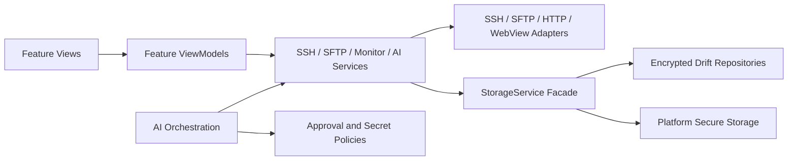

> 最新更新时间：2026-08-13

<p align="center">
  
</p>

<h1 align="center">SSH Mobile</h1>

<p align="center">
  面向长时间远程会话的跨平台 SSH / SFTP、服务器监控与 AI 辅助运维客户端
</p>

<p align="center">
  <a href="./README.md">English</a> | <strong>简体中文</strong>
</p>

<p align="center">
  <a href="https://github.com/hejulian2004/ssh_mobile/actions/workflows/flutter.yml"></a>
</p>

SSH Mobile 是一个基于 Flutter 的跨平台 SSH / SFTP 客户端，覆盖 Android、iOS、macOS、Windows 和 Web。它把多窗口终端、远程文件管理、服务器监控、安全存储和 OpenAI-compatible AI tools 整合为一个移动端与桌面端运维工作台。Terminal、SFTP、监控、系统管理、Playbook 和 RAG 已按计划建立独立 Feature Package；RAG 元数据写入 `rag.db`，正文与向量只进入有大小上限、TTL 和淘汰策略的缓存文件。

项目最初源于一台只有 2 核 CPU 和 1 GB 内存的服务器。完整 AI Agent 无法在这类低配置服务器上稳定运行，因此 SSH Mobile 将模型推理和 Agent 编排放在客户端，再通过 SSH 和 SFTP 检查、维护远程服务器，从而避免占用服务器有限的内存。

每个 Workspace Member 都维护简洁的 Package 合同文档：`README.md` 说明职责、
Public API、依赖、存储、生命周期和测试命令，`AGENTS.md` 说明允许修改范围、
禁止依赖、数据库与资源释放约束及必跑测试。只有确实存在需要发布说明的用户可见
变更时，才为 Package 增加 `CHANGELOG.md`。

> 移动系统的省电策略、网络切换和进程回收仍可能影响后台连接。需要长期保留远程工作现场时，推荐配合 `SSH + tmux` 使用。

## 核心亮点

- **SSH 连接管理**：支持密码、私钥、私钥密码、跳板机、服务器平台选择和 SSH Host Key 首次信任校验。
- **多终端窗口**：同一服务器可创建多个固定名称的终端窗口，并稳定绑定 tmux 会话。
- **SFTP 文件管理**：支持目录浏览、最近与收藏路径、上传、下载、编辑、预览和输入完整名称确认删除。
- **局域网快传与网络传输**：支持 mDNS/UDP 发现、扫码或设备列表发起配对邀请、双向 PIN 确认和加密设备间传输；文件发送统一进入 Rust 网络运行时，优先使用固定身份的 Quinn 直连，无法直达时由当前 WSS Relay 路径只转发 opaque AES-GCM 密文。Session 流量使用带前向保密的 authenticated Noise XX root、epoch/方向/单调 counter 结构化 nonce 和明确的 key rotation；经过身份认证的 TCP 与直连 WebSocket 也可作为有界 Delivery 路径，但不会静默把 E2EE 降级为明文。路由迁移会保留逻辑 SessionId、待处理 Delivery 和 Session crypto context。直连和中继的入站文件都通过全局弹窗显式审批，校验后才提交到应用沙箱，并在接收端持久化和确认后报告成功。当前开发版本不保留旧 HTTPS 文件发送降级路径。RealtimeSession 只向 Flutter
Feature 暴露 start/stop、状态、远端视频流和音频状态；PeerConnection、ICE、
SDP、Socket 与 Relay signaling 继续由 Rust/native/App Shell 持有。
- **服务器监控**：查看性能、端口、应用进程、服务、用户和活动会话。
- **AI Chat 与 Agent 执行**：支持流式输出、Plan Mode、审批式工具调用、聊天历史、消息分支、上下文压缩、RAG、Skills 和执行 Trace。
- **本地 MCP Server**：桌面端可生成 Codex、Claude Code 和 Gemini CLI 配置；支持默认的 `reviewConfiguredTools` 与显式启用的 `trustedAgent` 两种模式，同时始终执行回环监听和硬安全边界。
- **开发者面板**：可选显示运行时长、内存、FPS、掉帧、构建模式、平台、Dart 版本和已接入 Owner 的生命周期资源诊断，并可单独控制悬浮入口。
- **安全存储**：使用平台 Secure Storage、加密 Drift 字段、加密预览缓存、敏感信息脱敏和不可变审批目标。
- **自适应界面**：覆盖手机、平板和桌面环境，并提供专门的 1.5K 与 2K Android 测试配置。
- **备份与恢复**：可导入导出服务器、终端历史、AI 设置、聊天、Playbook、运行指标和路径记录，但不会导出密码、私钥或 API Key。

## 安装与运行

### 环境要求

- Flutter `>=3.44.0`，CI 固定使用 Flutter `3.44.2`。
- Dart SDK `>=3.12.0 <4.0.0`。
- Android Studio、Android SDK 或对应目标平台的开发工具链。
- Windows 构建需要 Visual Studio 的 `Desktop development with C++`。
- iOS 与 macOS 构建需要 macOS 和 Xcode。
- iOS 14.0 或更高版本。

### 安装依赖

```bash
git clone https://github.com/hejulian2004/ssh_mobile.git
cd ssh_mobile
dart pub get
```

### 运行项目

```bash
cd apps/ssh_mobile_full
flutter devices
flutter run -d <device-id>
```

示例：

```bash
flutter run -d android
flutter run -d windows
flutter run -d macos
flutter run -d chrome
```

应用在没有真实服务器或 AI 凭据时也可以启动。终端、SFTP 和监控的集成测试需要一台可访问的 SSH 服务器；只有 AI Chat 与 Agent 执行功能需要配置模型服务。

## 控制平面与中继服务器生产部署

仓库内的 `relay/` Go 服务提供设备控制平面和基于 HTTPS/WSS 的内存中继，用于网络传输与 P2P 备用链路；独立的 React + Vite + TypeScript 管理端位于根目录 `front/`。注册凭据与管理凭据必须显式配置；缺少密钥或使用弱口令时，服务会拒绝启动。

仅支持使用 Docker Compose 与 Caddy 进行生产部署。按照[中继部署说明](relay/README.zh-CN.md)完成配置后运行：

```powershell
cd relay
Copy-Item .env.example .env
# 在 .env 中设置公网域名、所有端口/运行参数，以及 Token、签名密钥和管理员凭据。
docker compose --env-file .env up --build
```

这一条命令会构建并启动 `front`、`relay` 与 `caddy`，随后持续显示三者的合并日志。Caddy 对外提供前端 SPA，并把 `/api/admin/v1`、`/v1` 和 `/healthz` 转发到内部 Relay 服务。中继状态仅驻留内存；服务重启后，客户端需要重新注册。

在 SSH Mobile 中打开“局域网共享设置”，填写具备有效 TLS 证书的 HTTPS 中继主机、端口和注册 Token。Token 只用于本次注册，不会写入偏好设置；应用只保存 Relay origin，设备凭据保存在平台安全存储中。设置页会显示已连接、已断开或失败状态，并提供手动连接、断开和清除操作。


### 各平台构建

```bash
# 以下命令从 apps/ssh_mobile_full 目录执行。
cd apps/ssh_mobile_full

# Android
flutter build apk --debug
flutter build apk --release
flutter build appbundle --release

# macOS
flutter config --enable-macos-desktop
flutter build macos

# iOS，仅能在 macOS 上执行
flutter build ios --release --no-codesign
```

```powershell
# Windows
Set-Location apps/ssh_mobile_full
flutter config --enable-windows-desktop
flutter build windows
Set-Location ../..
powershell -ExecutionPolicy Bypass -File .\scripts\build_windows_msi.ps1
```

Android CI 默认使用 Google、Maven Central 和 Flutter 官方制品仓库。国内本地环境需要阿里云镜像时，可设置环境变量 `USE_ALIYUN_MAVEN=true`，或使用 Gradle 参数 `-PuseAliyunMaven=true` 显式开启。

## 设置说明

SSH Mobile 将应用设置、服务器凭据和 LLM 设置分开管理，便于独立检查各自的安全边界。

### 1. 应用设置

桌面端可从导航轨底部进入应用设置；移动端可从 Servers 页面进入。AI 页面顶部的设置按钮只打开 LLM 设置，不会与应用设置混合。

重要默认值：

| 设置项 | 默认值 | 说明 |
| --- | --- | --- |
| 语言 | 中文 | 支持中文和英文。 |
| 主题 | 浅色 | 可切换深色和 OLED 深色主题。 |
| 服务器列表 | 列表 | 只有视口宽度足够时才允许使用网格。 |
| 通知隐私 | 隐藏服务器名 | 后台通知默认不展示服务器名称。 |
| RAG | 关闭 | 默认使用 BM25，Top-N 为 3。 |
| MCP Server | 关闭 | 开启后只绑定本机回环地址。 |
| MCP 审核模式 | 危险操作二次审核 | 可切换为 `trustedAgent`；两种模式都保留参数、目标、秘密和危险命令检查。 |
| SFTP 下载上限 | 512 MB | 可配置范围为 64 KB 至 2 GB。 |
| 文本预览上限 | 2 MB | 超过上限时需要先下载。 |
| 富媒体预览上限 | 20 MB | 用于受支持图片和富预览。 |
| 文本编辑上限 | 512 KB | 防止超大远程文件耗尽移动端内存。 |

### 2. SSH 服务器配置

在 Servers 页面新增服务器，并填写：

- 显示名称；
- 主机名或 IP 地址；
- SSH 端口，通常为 `22`；
- 用户名；
- 密码或私钥认证；
- Linux 或 Windows 平台；
- 普通 SSH 或 `SSH + tmux` 启动模式；
- 可选的跳板机信息。

应用会在保存前验证 SSH 登录信息。首次连接时需要检查并确认 SSH Host Key 指纹；如果后续指纹发生变化，应用会阻止连接，而不是静默信任新指纹。

### 3. LLM 与 GPT-5.6 设置

进入 AI 页面并打开 LLM Settings，需要配置：

- 模型服务 Base URL；
- API 格式：OpenAI Chat Completions、OpenAI Responses、Anthropic Messages、Gemini Native 或 Gemini OpenAI-compatible；
- 主模型；
- 可选的辅助模型和审计模型；
- API Key；
- 上下文窗口；
- 推理参数；
- Tool Call Budget 和 Agent Loop 模式；
- 可选的 Web Search、RAG、多 Agent 协作和自定义 Prompt。

GPT-5.6 并未写死在项目中。当模型服务提供兼容的模型 ID 时，可以把 GPT-5.6 设置为主模型、辅助模型或审计模型。每次 Agent 执行都会在内存中捕获不可变的服务地址、API 格式、模型角色和凭据快照，防止已经批准的操作在执行途中被新的设置重定向。

### 4. 本地 MCP Server

桌面端可以提供：

```text
http://127.0.0.1:<port>/mcp
```

Windows 和 macOS 的 MCP 设置卡可打开独立的**本地 MCP 控制台**。控制台提供
仅回环端点的状态、端口检查、带认证的 `initialize` / `tools/list` 三步自检、
Codex/Claude Code/Gemini CLI 配置复制以及全部工具的暴露决策。它最多保留 500 条
本机活动元数据：时间、事件类别、方法、工具名、结果、策略原因和耗时；绝不保存
Token、请求参数、工具输出、客户端地址、Origin、远端资源信息或异常原文，也不会
进入备份导出。外部 MCP 支持两种调用模式：默认的
`reviewConfiguredTools` 只让用户配置的 Tool 在动态风险判断生成审批请求时进入队列；
`trustedAgent` 直接执行已暴露且通过硬安全检查的 Tool。模式变化、Token 重生成、停止或
重启 Server 时会拒绝旧的待审批请求。

MCP Server 使用自动生成的 Bearer Token，拒绝未认证请求和非本地请求，并确保两种模式都不能绕过目标绑定、敏感路径、秘密过滤、输入校验和危险命令限制。

## 演示运行所需的样本数据

仓库不会包含真实生产凭据或密钥。以下占位数据是完成端到端演示所需的最小数据集。

### SSH 测试配置

| 字段 | 示例 |
| --- | --- |
| 名称 | `Demo Linux Server` |
| 主机 | `<reachable-server-host>` |
| 端口 | `22` |
| 用户名 | `<test-user>` |
| 认证方式 | 密码或私钥 |
| 平台 | `Linux` |
| 启动模式 | 已安装 tmux 时选择 `SSH + tmux`，否则选择 `SSH` |

建议使用独立的非生产测试账号，并只授予演示所需的最低权限。

### SFTP 演示文件

连接测试 Linux 服务器后，可创建以下小型数据集：

```bash
mkdir -p ~/ssh-mobile-demo
printf '# SSH Mobile Demo\nThis file is safe to edit through SFTP.\n' \
  > ~/ssh-mobile-demo/readme.md
printf '{"service":"ssh-mobile-demo","status":"ok"}\n' \
  > ~/ssh-mobile-demo/status.json
printf 'alpha\nbeta\ngamma\n' \
  > ~/ssh-mobile-demo/notes.txt
```

这些文件足以演示目录浏览、Markdown 与文本预览、编辑、下载、重命名和删除确认。

### AI 模型服务样本配置

| 字段 | 示例 |
| --- | --- |
| Base URL | `<provider-base-url>` |
| API 格式 | `OpenAI Responses` 或其他支持的格式 |
| 主模型 | `gpt-5.6` 或模型服务提供的兼容模型 ID |
| 辅助模型 | 可选的低成本模型 |
| 审计模型 | 可选的审查模型 |
| API Key | 只在应用的安全设置界面中输入 |

建议使用以下只读提示词完成第一次演示：

```text
检查当前选中的服务器，总结 CPU、内存、磁盘和 SSH 服务状态；
在执行任何写入操作前必须先请求我的批准。
```

## 测试指南

### 快速本地验证

```bash
dart pub get
dart run tool/architecture_check.dart
dart run tool/check_file_sizes.dart
dart run tool/check_module_dependencies.dart
dart run tool/check_resource_owners.dart
dart format --output=none --set-exit-if-changed apps/ssh_mobile_full/lib apps/ssh_mobile_full/test apps/ssh_mobile_full/tool
cd apps/ssh_mobile_full
flutter analyze --no-fatal-infos
flutter test
```

### Workspace 模块门禁

Pull Request 先通过 Melos 的 diff 过滤检查发生变更的 Package 及其依赖方，
再执行架构守卫：

```bash
dart run melos exec --diff=origin/main...HEAD --include-dependents --fail-fast -- "dart format --output=none --set-exit-if-changed lib test"
dart run melos exec --diff=origin/main...HEAD --include-dependents --fail-fast -- "flutter analyze --no-pub"
dart run melos exec --diff=origin/main...HEAD --include-dependents --fail-fast -- "flutter test --no-pub"
dart run tool/architecture_check.dart
dart run tool/check_module_dependencies.dart
dart run tool/check_resource_owners.dart
```

合并到 `main` 后，CI 会运行 `dart run melos run format`、
`dart run melos run analyze`、`dart run melos run test`，再执行 Full App Android
和 Terminal-only Windows 冒烟构建。Workspace analyze 脚本将既有 `info` 级 lint
视为非阻断项，但 error 和 warning 仍会使门禁失败。

### 完整质量门禁

```bash
dart pub get
dart run tool/check_file_sizes.dart
dart run tool/check_module_dependencies.dart
dart run tool/check_resource_owners.dart
dart format --output=none --set-exit-if-changed apps/ssh_mobile_full/lib apps/ssh_mobile_full/test apps/ssh_mobile_full/tool
cd apps/ssh_mobile_full
dart run tool/generate_app_icons.dart
dart run build_runner build
dart format --output=none --set-exit-if-changed lib test tool
flutter analyze
flutter test --coverage --reporter expanded
dart run tool/check_coverage.dart --minimum=35
```

检查生成文件和 Agent Skill：

```bash
cd ../..
git diff --exit-code -- apps/ssh_mobile_full/assets apps/ssh_mobile_full/android apps/ssh_mobile_full/ios apps/ssh_mobile_full/macos apps/ssh_mobile_full/web apps/ssh_mobile_full/windows/runner/resources/app_icon.ico
git diff --exit-code -- apps/ssh_mobile_full/lib/data/database/app_database.g.dart
```

```powershell
.\scripts\sync_agent_skills.ps1 -Mode Check
```

### 平台构建验证

```bash
cd apps/ssh_mobile_full
flutter build apk --debug --no-pub
flutter build macos
flutter build ios --release --no-codesign --no-pub
```

```powershell
Set-Location apps/ssh_mobile_full
flutter test --reporter expanded
flutter build windows
```

### 人工集成测试清单

1. 保存测试服务器，并确认错误凭据会被拒绝。
2. 首次连接时批准 SSH Host Key，再验证指纹变化后连接会被阻止。
3. 打开多个终端窗口，并在启用 tmux 时测试断线恢复。
4. 通过 SFTP 浏览和编辑 `~/ssh-mobile-demo` 中的样本文件。
5. 启动性能监控，并检查端口、进程、服务、用户和会话。
6. 配置模型服务，创建 Plan Mode 请求，并确认内置 Agent 的审批流程保持不变。
7. 分别测试 MCP `reviewConfiguredTools` 和 `trustedAgent`：确认配置的危险调用进入队列、信任模式的目标绑定调用走绑定执行路径，隐藏或敏感操作仍被阻断。
8. 在 MCP 审批打开时切换模式或重新生成 Token，确认旧请求被拒绝而不会自动执行。
9. 测试取消执行、网络中断、应用后台运行、语言切换、大字体和横屏键盘布局。
10. 按照 [docs/MOBILE_UI_QA.md](docs/MOBILE_UI_QA.md) 完成 1.5K 与 2K Android 专项视觉测试。

自动化测试使用 Fake、Mock 和受控 Fixture，不需要真实 SSH 凭据或 API Key。真实凭据不得提交到源代码、测试 Fixture、截图、日志、Agent Memory 或文档中。

## Codex 与 GPT-5.6 如何参与开发

Codex 和 GPT-5.6 是本项目开发流程中的重要工具，但产品范围、架构、安全边界、验收标准和最终审查仍由项目维护者负责。

### Codex 如何加速工作流程

Codex 主要用于：

- 搜索整个仓库的依赖关系和调用路径；
- 同时修改 Flutter UI、Service、测试、文档和平台配置文件；
- 在修复问题的同时生成回归测试；
- 执行结构化代码审查，定位旧状态覆盖、并发竞争和安全边界绕过问题；
- 通过 `.agents/skills/ssh-mobile-maintenance/SKILL.md` 固化维护规则；
- 使用 scoped `memory_docs/` 保存已核验的非敏感项目知识；
- 在保留修改前执行可复现的格式化、代码生成、静态分析、测试、覆盖率和构建检查。

### GPT-5.6 实现阶段：2026 年 7 月 10 日起

固定审查区间从 2026 年 7 月 10 日的 [`3ac2b73`](https://github.com/hejulian2004/ssh_mobile/commit/3ac2b7314930c6340200af1ab581e6d919d9ad5a) 开始，到 2026 年 7 月 16 日的 [`aecbf92`](https://github.com/hejulian2004/ssh_mobile/commit/aecbf924eda2e1d28c2f86e07dfbf7b4518b1742) 结束，**包含首尾共 81 个提交**。根据项目开发记录，这个固定区间内的全部提交都由 GPT-5.6 辅助实现，并由项目维护者提出需求、选择方案和完成审查。

完整对比：[`3ac2b73...aecbf92`](https://github.com/hejulian2004/ssh_mobile/compare/3ac2b7314930c6340200af1ab581e6d919d9ad5a...aecbf924eda2e1d28c2f86e07dfbf7b4518b1742)

| 工作方向 | GPT-5.6 辅助完成的主要内容 | 代表性提交 |
| --- | --- | --- |
| 设计系统与自适应 UI | 建立共用页面外壳与导航；引入 `MobileUiMetrics`；适配 1.5K 与 2K 手机；重构 Servers、Settings、AI Chat、审批、Tools、Logs、SFTP 和 System Administration，并处理键盘、安全区、大字体与 48 dp 可访问性要求。 | [`3ac2b73`](https://github.com/hejulian2004/ssh_mobile/commit/3ac2b7314930c6340200af1ab581e6d919d9ad5a)、[`e05f7ef`](https://github.com/hejulian2004/ssh_mobile/commit/e05f7ef07eb23b4702fd64cd6e36139296fb0de4)、[`33d5f63`](https://github.com/hejulian2004/ssh_mobile/commit/33d5f63e77381fe1c94b6feaf9967abb5926b4fb) |
| AI Chat 与 Agent 交互 | 重构输入框、Slash Commands、历史记录、附件、Trace Viewer、TODO 面板、执行摘要、Prompt 定制、工具选择器、目标服务器选择器和运行健康检查界面。 | [`275c1c3`](https://github.com/hejulian2004/ssh_mobile/commit/275c1c3ec751b9c6577c2211b760ad7650454bec)、[`64baeeb`](https://github.com/hejulian2004/ssh_mobile/commit/64baeeba2322b23491cacaefcc1679837f7e9eb5)、[`1c1c6cb`](https://github.com/hejulian2004/ssh_mobile/commit/1c1c6cb0b8fe35a8a1a10d1196c4595eecf6bb8e) |
| Plan Mode 与执行安全 | 实现单飞式 Plan 审批、不可变模型服务与服务器目标快照、运行前健康检查、取消与聊天修改锁、Compare-and-Swap 资源保护、过期目标拒绝和持久化 TODO/运行状态协调。 | [`f3abce3`](https://github.com/hejulian2004/ssh_mobile/commit/f3abce32ed54ebc83917e5db1dd4f0b5a2e6718c)、[`857c637`](https://github.com/hejulian2004/ssh_mobile/commit/857c637b5045d114630467c2abc6a438a2b5e49a)、[`a202779`](https://github.com/hejulian2004/ssh_mobile/commit/a202779a4aa02422a4b130652db9552b94602241) |
| SFTP 与附件安全 | 加入有界读取、加密且绑定目标的缓存、安全图片与文本预览、富预览外部导航阻断、PDF 外部打开策略、缓存刷新修复，以及编辑器、查看器、文件浏览器和服务器选择器重构。 | [`669262f`](https://github.com/hejulian2004/ssh_mobile/commit/669262f3311c13992e21e72bb4488af1212caedd)、[`d61b8b4`](https://github.com/hejulian2004/ssh_mobile/commit/d61b8b400208156eb3894a5cf65bed2a50b51bb8)、[`982b56e`](https://github.com/hejulian2004/ssh_mobile/commit/982b56e02c4edc1d4b7eb651bc18eded521f3927) |
| 终端与服务器运维 | 重构实时终端、终端历史、复制模式、窗口管理、服务器卡片、监控健康面板、服务器选择器，并修复账户与会话加载问题。 | [`1dc2702`](https://github.com/hejulian2004/ssh_mobile/commit/1dc2702050cc174d3ac74a7f548b64c2ee4314fe)、[`24b43af`](https://github.com/hejulian2004/ssh_mobile/commit/24b43af8df9918b7c598bc839ebf2a8af97dab18)、[`77bc0d3`](https://github.com/hejulian2004/ssh_mobile/commit/77bc0d376c794144cce8415b62fbf63f26ced376) |
| 架构与性能 | 推进 feature-first MVVM 迁移；抽取共用组件；缓存主题、图表和列表计算；缩小 Provider 监听范围；保留延迟加载；把远程输出解码和大型解析任务移到后台 isolate。 | [`9ffd48e`](https://github.com/hejulian2004/ssh_mobile/commit/9ffd48e2bc26fd3a3c6fc2cb83973076a7e01902)、[`3d2ceda`](https://github.com/hejulian2004/ssh_mobile/commit/3d2ceda56aba01be8f4452c492913b9f9fa11079)、[`1e587bf`](https://github.com/hejulian2004/ssh_mobile/commit/1e587bf3d521fd9007cd2636d86ad69cc26b2320)、[`833256a`](https://github.com/hejulian2004/ssh_mobile/commit/833256ab73134d474daea8aa9790678976f9c70b) |
| 测试、文档与 CI | 扩充 Widget、ViewModel、Parser、安全、Plan Mode、SFTP、终端、启动页、响应式和系统管理测试；记录移动端 QA Matrix；建立双语 README；修复 Android 制品仓库配置；统一 iOS 14 构建要求。 | [`7d17380`](https://github.com/hejulian2004/ssh_mobile/commit/7d1738078e9be026582245a9a7b496982e1872b8)、[`0e83eac`](https://github.com/hejulian2004/ssh_mobile/commit/0e83eacdf8e55251c444453603f64f2c0c0c8d02)、[`9d33194`](https://github.com/hejulian2004/ssh_mobile/commit/9d33194af6c05308b7dbadbe1accf4dd4f923e12) |

### 项目维护者作出的关键决策

影响项目最终实现的关键决策包括：

- 将 Agent 放在客户端运行，使 1 GB 服务器只需要提供 SSH/SFTP 能力；
- 采用 feature-first MVVM 和明确的 Service 边界，避免把 Agent 编排逻辑堆在 Screen 中；
- 以设备物理短边为高密度手机适配依据，同时保留系统文字缩放；
- 远程写入和敏感操作必须经过显式审批；
- 将审批绑定到不可变的服务器、模型服务、Playbook、Skill 和监控目标快照，防止异步状态变化重定向操作；
- 直接阻断破坏性 Shell 删除和敏感路径读取，而不是只依赖模型 Prompt；
- 凭据只进入平台 Secure Storage，持续增长的敏感数据在写入 Drift 前加密；
- MCP 只允许本机访问、必须认证，并复用同一套审批策略；
- AI 生成的修改必须经过自动化测试和确定性质量门禁。

### 审查与责任

GPT-5.6 和 Codex 提高了实现速度，但 AI 生成内容不会被直接视为正确结果。项目维护者负责检查行为、选择技术取舍、制定验收标准、拒绝不安全方案，并对每个合并修改承担最终责任。Gemini 也被用于对部分实现方案和文档内容进行交叉检查。

## 架构

SSH Mobile 采用 feature-first MVVM 架构，通过 Provider 和 Selector 管理状态，并将 UI 组合、协议适配、持久化存储、监控和 AI 编排拆分为可独立测试的层。



### 项目结构

- `apps/ssh_mobile_full/lib/main.dart`：精简的应用入口；App Shell 与依赖装配位于
  `apps/ssh_mobile_full/lib/app/`（`AppBootstrap`、`AppRuntimeFactory`、`AppRuntime`
  和 `SshMobileApp`）。
- `apps/ssh_mobile_full/lib/features/`：各 Feature 自有的 Model、ViewModel、Service、View 和
  Feature 内部 Widget。当前 Feature 根目录包括 `connection`、`terminal`、
  `sftp`、`ai_chat`、`ai_skills`、`client_webview`、`performance`、
  `system_admin`、`lan_share`、`playbook`、`rag`、`settings`、`startup`、
  `home` 和 `developer_log`。
- `packages/features/feature_connection/`：已经迁移的 Connection 编辑页、ViewModel、
  双语展示契约以及运行时/验证 Capability Port。它依赖 `connection_core`，不拥有
  Connection 数据库；在 SSH/SFTP 后续 Step 完成前，App 组合根会暂时桥接新 Core
  Repository 与仍使用旧 `StorageService` 的消费者。
- `packages/features/feature_terminal/`：已经迁移的 Terminal Pilot，包括路由作用域
  ViewModel、终端页面、终端输出历史和独立的 `terminal.db`。它只依赖公共 Core 合约
  与注入的 Port；后续存储/SSH Step 完成前，旧 App Terminal 路径保留为兼容导出。
- `packages/features/feature_playbook/`：已经迁移的 Playbook 编辑、审批绑定、串行
  执行和加密运行历史，Module 独占 `playbook.db`。AI 等跨 Feature 调用只依赖公开的
  `PlaybookAutomationPort`，SSH、日志和数据保护能力由 App Shell 注入。
- `packages/features/feature_mcp/`：本地 MCP HTTP/JSON-RPC Server、暴露与调用策略、
  审批队列、活动 Repository、控制台 UI 及独立的 `mcp.db`。设置、日志和 AI Tool
  Runtime 由 App Shell Adapter 注入；危险 Tool 的审批仍保留在执行层。
- `packages/features/feature_developer/`：Developer Log、Developer Panel 和
  生命周期诊断展示。Feature 只读取公共 Port；App Shell 适配器提供脱敏的
  Module、SSH、NetworkRuntime、数据库和已接入 Timer/订阅快照。
- `apps/ssh_mobile_full/lib/services/`：跨 Feature 的 SSH/SFTP/LLM/AI Tool、监控、存储、局域网
  快传兼容服务和平台适配基础设施。
- `apps/ssh_mobile_full/lib/data/`：Drift 数据库、DAO 和 Repository 实现。
- `packages/core/app_core/`：纯 Dart 的生命周期、Module、日志和 Capability 合约；生产代码不依赖 Flutter/UI。日志部分包括作用域 `AppLogger`、有界 `LogBuffer`、`LogSink` 和可释放的 `AppLoggerImpl`。
- `packages/core/app_ui/`：共享主题、响应式指标和跨 Feature 通用 Widget。只通过 `package:app_ui/app_ui.dart` 暴露，不依赖 Feature、SSH、网络、数据库或应用 Service；旧主题、响应式和通用 Widget 路径仅保留兼容导出。
- `packages/core/connection_core/`：Connection 领域模型与契约、独立的非敏感 Drift 数据库、Secure Storage 凭据和 Host Key 信任元数据。`ConnectionDatabase` 由 `AppRuntime` 创建和关闭；`feature_connection` 只消费其公共 Repository 与注入的 Capability。
- `packages/infrastructure/ssh_mobile_network_native/`：位于 Infrastructure 边界下的原生网络 Package。
- `packages/infrastructure/network_sdk/`：Flutter 层 Bootstrap、鉴权 API、Session 和事件流客户端契约，以及不拥有网络资源的 JSON 适配器；`SdkRequestExecutor` 由 App Shell 注入，不拥有 Socket、HTTP client、FFI handle、数据库或 App 生命周期。其 `RealtimeSession` 的 start/stop Future 只有在 App Shell 关联 native command result 后才完成。
- `packages/infrastructure/network_transport/`：App Scope `NetworkRuntime` Facade、lazy Capability 状态机、生命周期诊断快照、传输端点/连接合约、指标快照、显式 native handle adapter，以及非拥有型 `NetworkCommandGateway` 和 typed `NetworkRealtimeGateway`。Realtime start/stop 返回带 `commandId` 的 `NativeCommandTicket`，区分 queue acceptance 与操作完成；实例由 `AppRuntime` 唯一创建，当前 Step 不新增第二套协议实现。
- `packages/infrastructure/ssh_core/`：App Scope SSH Session Manager、Lease/Pool 生命周期、桌面端与移动端 Runtime Adapter、SSH Client/Host Key/命令执行边界及非敏感目标绑定。该包不依赖 `StorageService`；`AppRuntime` 只持有一个 Manager，`feature_terminal` 通过注入使用它，旧 `SshService` 仅作为兼容实现保留。
- `apps/ssh_mobile_full/lib/core/services/`：跨 Feature 的底层安全与协议工厂，包括 Host Key
  策略和数据保护。
- `apps/ssh_mobile_full/lib/theme/`、已迁移的共享 Widget 路径以及 `lib/utils/responsive.dart`：`packages/core/app_ui/` 的兼容导出；Feature 专属 Widget 继续放在所属 Feature 内。
- `apps/ssh_mobile_full/lib/models/`：仅保留小型的历史兼容共享模型；新增 Feature 模型放在所属的
  `apps/ssh_mobile_full/lib/features/<feature>/models/`。
- `apps/ssh_mobile_full/lib/screens/`：历史兼容目录；不要继续在此新增应用 UI。
- `apps/ssh_mobile_full/test/`：单元测试和 Widget 测试。
- `packages/core/app_core/test/`：Core 合约测试；可在该 Package 中执行 `flutter test`，或使用 Melos scope 命令。
- `packages/core/app_ui/test/`：共享主题、响应式工具和 Widget 测试；可在该 Package 中执行 `flutter test`。
- `packages/infrastructure/ssh_core/test/`：SSH Core 生命周期与安全契约测试。
- `docs/`：架构、安全、性能、验证和发布文档。
- `scripts/`：仓库级构建、打包和同步脚本；`tool/architecture_check.dart`：仓库级架构守卫；
  `tool/check_file_sizes.dart`：非 generated Dart 文件尺寸报告；
  `tool/check_module_dependencies.dart`：workspace 依赖图审计，结果维护在
  `docs/architecture/MODULE_DEPENDENCY.md`；
  `tool/check_resource_owners.dart`：资源生命周期 Owner 完整性检查，结果维护在
  `docs/architecture/RESOURCE_OWNERSHIP.md`；
  `apps/ssh_mobile_full/tool/`：App 专属生成和质量检查脚本。
- `third_party/xterm/`：仓库内维护的终端组件。

`AppRuntimeFactory` 创建应用生命周期服务，`AppRuntime` 是这些资源的唯一生命周期
Owner；`main.dart` 只委托给 `AppBootstrap`，`SshMobileApp` 通过 `MultiProvider`
暴露已有 Runtime 实例。路由或页面范围的 Feature 状态保持局部：例如 AI Chat
运行时由 `AiChatRuntimeFactory` 创建并由聊天页提供，终端页创建聚焦的会话、历史和
窗口 ViewModel。View 只持有布局与短生命周期展示状态；校验、异步编排和 Repository
协调由 ViewModel 与 Service 负责。

Terminal Pilot 位于 `packages/features/feature_terminal/`。进入终端路由时创建
`TerminalModule` 和 Route Scope ViewModel；Module 独占 `terminal.db` 的终端元数据，
路由销毁时关闭 Drift 资源。SSH 只能通过注入的
`ssh_core.SshSessionManager` 使用，不能在 Feature 内创建新的 SSH Service。App
组合根暂时提供设置、快捷键、连接对话框和历史的兼容适配器，旧 App 路径只是兼容
导出，不会形成第二套实现。
同一个 Runtime 还持有唯一的 lazy `NetworkRuntime`；QUIC 与 WSS Relay 能力共享
native 初始化，失败可重试，释放时等待并关闭 native handle。Realtime command ticket
在 App Shell adapter 内与 native result event 关联，pending command 有界、超时可回收，
dispose 会取消结果等待和事件订阅；session 状态以 native state event 为准，stop 要等
`closed`。旧 LAN Coordinator 通过 App Shell adapter 将其桥接为注入的
`network_sdk.SessionClient`，在专属迁移 Step 前仍暂时使用原有 v1 协议适配器。
`AppRuntime.logger` 暴露 Core Logger Contract；当前 Full App 仍由 App 层的
`AppLogService` 适配，因此数据库、磁盘、脱敏和 UI 通知行为在分阶段迁移期间保持不变。
新增模块应从 Runtime 获取作用域 Logger，不应自行构造日志服务。

Connection 模块在开发期使用全新的 `connection.sqlite` 基线；Drift 表刻意不保存
密码和私钥，这些值只能通过 `CredentialRepository` 进入平台 Secure Storage。当前
旧 Connection ViewModel 仍暂时使用 `StorageService`，待计划中的
`feature_connection` Step 再切换。

LAN 文件数据路径为 `LanShareViewModel → NetworkService → Rust
NetworkRuntime`。命令只返回 typed accepted 结果，进度和终态通过 typed events
返回。Rust 负责每 peer 路径选择、身份认证 QUIC/TCP/WebSocket、流式文件校验
以及原生 Relay 收发；Flutter 负责配对、审批 UI、历史记录和展示状态。Go Relay
只作为 v1 内存路由器，不接触文件明文元数据或明文字节。

Native Channel Delivery 会把仍在处理的 incoming handler 和 ordered buffer
独立于已完成消息的 dedup TTL/LRU。应用 ACK timeout 使用单独策略；严格有序
通道超时后进入失败态，不跳过 Sequence，显式关闭逻辑 Session 时会释放接收端
active state。

## AI Agent Runtime

AI Agent 运行在客户端，而不是被管理服务器上。SSH Mobile 负责构建模型上下文、调用已配置的模型服务、控制工具循环，并通过 SSH 和 SFTP 访问远程系统。

当前运行时包括：

- 主模型、辅助模型、审计模型和回退策略；
- SSE 流式输出、聊天持久化、消息分支和上下文压缩；
- 根据 Plan Mode、已批准计划、目标服务器和 WebView 可用性动态暴露工具；
- Tool Call Budget、独立 Agent Loop 限制和预算扩容前安全审计；
- 用于一次性任务的可审批 `todoSteps`，以及用户明确保存的可复用 Playbook；
- 由 RAG、AI Skills、有价值 Trace 和历史成功计划组成的运维记忆；
- 对网络、电池优化、通知权限和设备温度的客户端运行前检查；
- 每次操作独立的不可变运行设置与目标绑定；
- 服务健康检查、事故上下文收集和服务器状态对比等复合诊断工具。

### 工具安全边界

- 远程写入、上传、重命名、删除、敏感读取和下载必须显式审批。
- 破坏性 Shell 删除命令会被阻断。
- 环境变量整体导出、云 Metadata Endpoint 和敏感文件路径受到限制。
- `.ssh`、`.env`、私钥、Token、云凭据等内容不会进入预览缓存。
- 工具参数、结果和 Trace 会经过 `ToolSecretPolicy` 过滤或阻断。
- 外部 MCP 调用遵循所选审核模式；两种模式都不能绕过 `ToolSecretPolicy`、不可变目标绑定、隐藏 Tool 规则或破坏性 Shell 删除限制。
- SSH 会话变更、tmux 恢复、终端历史删除、日志清空和监控状态变更仍在同一审批边界内。
- 如果模型服务、服务器、资源或服务器集合快照已变化，原审批操作会被拒绝。

## SSH 与终端会话

Servers 页面负责保存连接配置、验证认证信息和管理终端窗口。首次看到 Host Key 时，用户必须确认指纹；后续指纹发生变化时，应用会阻断连接。

Linux 服务器推荐配合 `SSH + tmux` 使用。Windows 服务器默认使用普通 SSH，除非目标实际是 WSL 或其他类 Linux Shell。固定的终端窗口名使重连和 tmux 会话恢复更可预测。

## SFTP 安全与性能

SFTP 支持目录浏览、路径历史、收藏、上传、下载、文本编辑，以及文本、Markdown、图片和沙箱 HTML 预览。

Markdown 和 HTML 预览会阻断外部资源和导航。远程 PDF 不在应用内解析，而是要求下载后使用可信阅读器打开。删除文件或目录前必须输入完整目标名称。

内存读取会在分配前执行硬上限和分块校验。大型目录构建与排序、远程输出解码和监控数据解析在后台 isolate 中运行，避免阻塞 UI。

## 服务器监控

监控工作区包含四个主要分区：

- `Performance`：手动进行多服务器采样，并保留约 10 分钟内存历史。
- `Ports`：单服务器端口快照和管理操作。
- `Applications`：应用进程快照。
- `Services`：服务状态快照和管理操作。

Linux 监控读取 `/proc`、`df -P` 等数据；Windows 监控使用 PowerShell JSON。快照模式不需要 Root，只有管理操作才会按需请求提升权限。

## 数据与存储

AI 聊天、Agent 指标、终端历史元数据、Playbook、SFTP 路径记录以及脱敏的 MCP 活动元数据等持续增长的结构化数据存储在 Drift 中；MCP 活动归属 Feature 自己的 `mcp.db`，不再写入共享 AppDatabase；小型偏好设置仍使用 SharedPreferences；密码、私钥、API Key 和 MCP Token 只保存在平台 Secure Storage 中。

AI 消息正文、上下文、附件、工具 Trace、TODO Steps 和 Playbook 内容等敏感 Drift 字段会在写入 SQLite 前加密。当前开发阶段只维护一套版本号为 1 的最新 Drift Schema，不保留升级或旧数据导入逻辑；Schema 变化后应删除本地开发数据库并重新生成已提交的 Drift 代码。

生产数据库打开失败时不会静默回退到内存数据库，避免看似写入成功的数据在应用重启后消失。

## 工程质量

### 7 月 10 日起始验证基线

GPT-5.6 实现阶段开始时，项目使用 Flutter 3.44.2 和 Dart 3.12.2 完成了本地验证：

- `flutter analyze`：无问题。
- `flutter test --coverage`：568 个测试通过。
- 非生成代码行覆盖率为 39.3%（`12690/32302`），CI 最低门槛为 35%。
- Android Debug 与未签名 Release APK 构建成功。
- Windows Release 构建成功。
- 图标生成、Drift 生成、共享 Agent Skill 同步、格式化和差异检查均可复现。

此后又增加了大量测试。要获取当前检出提交的实际结果，请执行[测试指南](#测试指南)中的命令。

原始验证范围和仍需真机完成的项目见 [docs/VALIDATION_REPORT.md](docs/VALIDATION_REPORT.md)。

## Agent 协作文件

- Canonical 维护 Skill：`.agents/skills/ssh-mobile-maintenance/SKILL.md`
- Claude Code 生成镜像：`.claude/skills/ssh-mobile-maintenance/SKILL.md`
- 任务路由：`.agents/skills/ssh-mobile-maintenance/references/memory-map.md`
- Scoped 项目 Memory：`memory_docs/`
- 临时旧兼容入口（待退役）：`AGENT_MEMORY.md`

修改 canonical Skill 后，生成并校验镜像：

```powershell
.\scripts\sync_agent_skills.ps1 -Mode SyncFromAgents
.\scripts\sync_agent_skills.ps1 -Mode Check
```

不要在 Agent Skill、项目记忆、日志、测试、截图或文档中保存密码、私钥、API Key、Token 或服务器凭据。

## 相关文档

- [移动端 UI QA Matrix](docs/MOBILE_UI_QA.md)
- [发布检查清单](docs/RELEASE_CHECKLIST.md)
- [验证报告](docs/VALIDATION_REPORT.md)
- [工程基线 ADR](docs/ADR_ENGINEERING_BASELINE.md)
- [性能验收标准](docs/PERFORMANCE_ACCEPTANCE.md)
- [安全人工回归](docs/security_manual_regression.md)
- [Android 原生重写指南](docs/ANDROID_NATIVE_REWRITE_GUIDE.md)

## 运行注意事项

- 系统后台策略、网络切换和进程回收可能中断长时间连接。
- Android Release 默认禁用 Cleartext；Debug 和 Profile 仅用于测试本地模型服务。
- macOS 凭据使用普通 Keychain 配置，以避免 Entitlement 相关错误。
- Linux 服务器建议安装 tmux，使远程会话在客户端断开后继续运行。
- iOS 构建要求 iOS 14.0 或更高版本。

## License

当前仓库尚未声明开源许可证。公开分发或接受外部贡献前，应添加明确的 `LICENSE` 文件。
