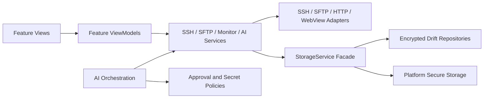

<p align="center">
  
</p>

<h1 align="center">SSH Mobile</h1>

<p align="center">
  面向长时间远程会话的跨平台 SSH / SFTP、服务器监控与 AI 辅助运维客户端
</p>

<p align="center">
  <a href="./README.md">English</a> | <strong>简体中文</strong>
</p>

<p align="center">
  <a href="https://github.com/hejulian2004/ssh_mobile/actions/workflows/flutter.yml"></a>
</p>

SSH Mobile 是一个基于 Flutter 的跨平台 SSH / SFTP 客户端，覆盖 Android、iOS、macOS、Windows 和 Web。它把多窗口 SSH 终端、远程文件管理、服务器监控、安全存储和 OpenAI-compatible AI tools 整合为一个移动与桌面运维工作台。

项目最初源于一台只有 2 核 CPU 和 1 GB 内存的服务器：服务器无法稳定运行完整的 AI Agent，因此 SSH Mobile 将大模型推理和 Agent 编排放在客户端，通过 SSH 和 SFTP 安全地管理低配置服务器，避免占用服务器有限的内存。

> 移动系统的省电策略、网络切换和进程回收仍可能影响后台连接。需要长期保留服务器工作现场时，推荐配合 `SSH + tmux` 使用。

## Codex 与 GPT-5.6 如何参与开发

Codex 和 GPT-5.6 被用于本项目的 AI 辅助开发流程，但最终代码、架构和安全决策均由开发者审查、测试并确认。

- **Codex**：用于仓库级代码分析、功能实现、重构、缺陷定位、测试生成、代码审查，以及文档和维护脚本同步。
- **GPT-5.6**：主要用于完成以下工作：
  - **1.5K 与 2K 手机屏幕适配**：引入基于设备物理短边的统一 `MobileUiMetrics` 策略。对于物理短边约 1280–1440 px 的 1.5K 屏幕，适度收紧控件和导航密度；对于 2K 屏幕，保持标准界面比例，同时不缩放系统文字。还调整了响应式断点，并优化 Servers、SFTP、Logs、Settings 和 System Administration 等主要页面的紧凑布局。
  - **UI 与组件重构**：压缩服务器卡片、SFTP 工具栏与文件列表、日志条目和监控控件；抽取 SFTP 与 System Administration 共用的服务器选择组件；并协助完成启动页、终端、性能监控和系统管理页面的 feature-first MVVM 重构。
  - **项目启动与运行时性能优化**：缓存 Material 与 Shad 主题对象，使应用根节点仅订阅不可变的视觉设置快照，避免终端字体等功能级设置触发整个应用外壳重建；保留页面和 Tab 的延迟加载；使用 `Selector` 缩小组件刷新范围；缓存图表采样点与列表计算结果；并把远程输出解码、SFTP 条目构建与排序、监控和系统管理数据解析迁移到后台 isolate。
  - 代表性提交：[`33d5f63`](https://github.com/hejulian2004/ssh_mobile/commit/33d5f63e77381fe1c94b6feaf9967abb5926b4fb)、[`97b52b5`](https://github.com/hejulian2004/ssh_mobile/commit/97b52b59ac31ce44e732a672ae61d65109304ad5)、[`1e587bf`](https://github.com/hejulian2004/ssh_mobile/commit/1e587bf3d521fd9007cd2636d86ad69cc26b2320)、[`833256a`](https://github.com/hejulian2004/ssh_mobile/commit/833256ab73134d474daea8aa9790678976f9c70b)、[`3d2ceda`](https://github.com/hejulian2004/ssh_mobile/commit/3d2ceda56aba01be8f4452c492913b9f9fa11079) 和 [`9ffd48e`](https://github.com/hejulian2004/ssh_mobile/commit/9ffd48e2bc26fd3a3c6fc2cb83973076a7e01902)。
- **Gemini**：用于部分实现方案与文档内容的交叉验证。
- 所有 AI 生成或修改的代码都需要通过格式化、静态分析、自动化测试、覆盖率检查和人工审查后才能保留。

AI 不只是项目内的功能，也是项目开发过程中的协作工具。项目同时为 Codex 和其他 Agent 提供维护技能文件、非敏感项目记忆和可复现的验证命令，使 AI 协作过程更可控。

## 核心功能

- **SSH 连接管理**：支持密码、私钥、私钥密码、跳板机、服务器平台选择和 SSH Host Key 首次信任校验。
- **多终端窗口**：同一服务器可以创建多个固定名称的终端窗口，并稳定绑定 tmux 会话。
- **SFTP 文件管理**：目录浏览、最近与收藏路径、上传、下载、文本编辑、文件预览和删除确认。
- **服务器监控**：查看性能、端口、应用进程、服务、用户和活动会话。
- **AI Chat**：支持流式输出、Markdown、聊天历史、消息编辑、重新生成、分支和上下文压缩。
- **AI Tools**：支持服务器诊断、命令执行、SFTP 路径操作、客户端状态检查、Web 搜索、日志和备份操作。
- **本地 MCP Server**：桌面端可提供本地 Streamable HTTP + JSON-RPC MCP 端点，并生成 Codex、Claude Code 和 Gemini CLI 配置。
- **安全存储**：凭据存放在平台 Secure Storage 中，敏感 Drift 字段和预览缓存加密保存。
- **审批与脱敏**：远程写入、敏感读取和危险操作需要用户审批，工具参数、结果和日志会执行敏感信息过滤。
- **自适应界面**：针对手机、平板和桌面环境提供不同导航与布局策略。
- **备份与恢复**：支持导入导出服务器配置、窗口历史、AI 设置、聊天、Playbook 和路径记录，但不会导出密码、私钥或 API Key。

## 架构

项目采用 feature-first MVVM 架构，通过 Provider / Selector 管理状态，并将 UI、协议、存储和 AI 编排分离。



主要目录：

- `lib/main.dart`：应用启动与依赖装配。
- `lib/features/`：按业务功能组织模型、ViewModel、服务和页面。
- `lib/services/`：SSH、SFTP、LLM、AI tools、监控、存储和 MCP 基础设施。
- `lib/data/`：Drift 数据库、DAO 和 repository 实现。
- `lib/core/services/`：跨功能底层服务和工厂。
- `lib/theme/`、`lib/widgets/`、`lib/utils/`：主题、复用组件和工具。
- `test/`：单元测试与组件测试。
- `docs/`：架构、安全、性能和发布文档。
- `scripts/`、`tool/`：构建、生成和质量检查脚本。

## AI Agent Runtime

AI Agent 运行在客户端，而不是被管理的服务器上。客户端负责构建上下文、调用 OpenAI-compatible 模型、执行工具循环并通过 SSH / SFTP 访问远程服务器。

当前运行时包含：

- 主模型、辅助模型、审计模型和回退策略。
- SSE 流式输出、聊天持久化和上下文压缩。
- 基于任务状态、服务器选择和 WebView 可用性的工具暴露路由。
- 工具调用预算、Agent loop 轮次限制和扩容前安全审计。
- 可批准的 `todoSteps` 执行计划与可复用 Playbook。
- RAG、AI Skills、历史执行记录和有价值 trace 的混合检索。
- 客户端运行健康预检，用于检查网络、电池优化、通知权限和热状态。
- 复合诊断工具，例如服务健康检查、事故上下文收集和服务器状态对比。

### 工具安全边界

- 远程写入、文件上传、重命名、删除和敏感读取必须经过统一审批。
- 破坏性 shell 删除命令会被拦截。
- 环境变量整体导出、云 metadata endpoint 和敏感路径读取受到限制。
- `.ssh`、`.env`、私钥、token 和云凭据等内容不会写入预览缓存。
- 所有工具参数、结果和 trace 都会经过 `ToolSecretPolicy` 过滤或阻断。
- 危险 MCP 工具默认返回 `approval_required`，不会绕过应用审批界面。

## SFTP 安全与性能

SFTP 支持文本、Markdown、图片和沙箱 HTML 预览。Markdown 与 HTML 的外部资源和导航会被阻断；远程 PDF 不在应用内解析，而是要求下载后使用可信阅读器打开。

删除文件或目录前必须输入完整目标名称。客户端还提供下载、文本预览、富媒体预览和文本编辑大小限制。大文件读取会执行硬上限和分块校验，大目录构建与排序会放到后台 isolate，避免阻塞 UI。

## 服务器监控

性能监控包含四个主要分区：

- `Performance`：多服务器性能采样，保留最近约 10 分钟内存数据。
- `Ports`：单服务器端口快照与管理。
- `Applications`：进程快照。
- `Services`：服务状态快照与管理。

Linux 端主要读取 `/proc` 和 `df -P`，Windows 端使用 PowerShell JSON 采样。解析和排序工作在后台 isolate 中完成，UI isolate 仅接收处理后的结果。

## 本地 MCP Server

Windows、macOS 等桌面端可以在设置中开启本地 MCP Server：

```text
http://127.0.0.1:<port>/mcp
```

MVP 仅绑定 `127.0.0.1`，使用 Bearer token，并拒绝未认证请求和非本地 Origin。用户可在应用中检查端口、重启服务、重新生成 token，并复制 Codex、Claude Code 与 Gemini CLI 的配置片段。

## 工程质量

### 验证基线

项目于 2026-07-10 使用 Flutter 3.44.2 / Dart 3.12.2 完成本地验证：

- `flutter analyze`：无问题。
- `flutter test --coverage`：568 个测试通过。
- 非生成代码行覆盖率：39.3%（`12690/32302`），CI 最低门槛为 35%。
- Android debug 和未签名 release APK 构建成功。
- Windows release 构建成功。
- 图标生成、Drift 生成、共享 Agent skill 同步、格式化和差异检查均可复现。

详细验证范围和仍需真机完成的检查见 [docs/VALIDATION_REPORT.md](docs/VALIDATION_REPORT.md)。

### 测试覆盖范围

自动化测试覆盖 ViewModel、存储迁移、协议解析、LLM 流式响应、工具循环、审批策略、安全过滤和部分 UI 组件。GitHub Actions 会执行格式化、静态分析、测试、覆盖率和构建质量门禁。

## 开发环境

- Flutter `>=3.44.0`，CI 固定为 `3.44.2`
- Dart SDK `>=3.12.0 <4.0.0`
- Android Studio / Android SDK 或对应平台工具链
- Windows 构建需要 Visual Studio 的 `Desktop development with C++`
- iOS / macOS 构建需要 macOS 和 Xcode

### 常用命令

```bash
flutter pub get
dart format lib test tool
flutter analyze
flutter test
flutter test --coverage
dart run tool/check_coverage.dart --minimum=35
flutter devices
flutter run -d <device-id>
```

### Android 构建

```bash
flutter build apk --debug
flutter build apk --release
flutter build appbundle --release
```

### Windows 构建

```powershell
flutter config --enable-windows-desktop
flutter build windows
powershell -ExecutionPolicy Bypass -File .\scripts\build_windows_msi.ps1
```

### macOS 与 iOS 构建

```bash
flutter config --enable-macos-desktop
flutter build macos

flutter build ios --debug
flutter build ios --release
```

## Agent 协作文件

- Codex：`.agents/skills/ssh-mobile-maintenance/SKILL.md`
- Claude Code：`.claude/skills/ssh-mobile-maintenance/SKILL.md`
- 跨会话非敏感项目记忆：`AGENT_MEMORY.md`

修改共享 skill 后可运行：

```powershell
.\scripts\sync_agent_skills.ps1 -Mode Check
.\scripts\sync_agent_skills.ps1 -Mode Link -Force
```

不要在 Agent skill、项目记忆、日志或文档中保存密码、私钥、API Key、token 或服务器凭据。

## 相关文档

- [发布检查清单](docs/RELEASE_CHECKLIST.md)
- [验证报告](docs/VALIDATION_REPORT.md)
- [工程基线 ADR](docs/ADR_ENGINEERING_BASELINE.md)
- [性能验收标准](docs/PERFORMANCE_ACCEPTANCE.md)
- [安全人工回归](docs/security_manual_regression.md)
- [Android 原生重写指南](docs/ANDROID_NATIVE_REWRITE_GUIDE.md)

## 运行注意事项

- 系统后台策略、网络切换和进程回收可能影响长时间连接。
- Android release 默认禁用 cleartext；debug/profile 仅用于本地 OpenAI-compatible provider 测试。
- macOS 上密码、私钥和 API Key 使用普通 Keychain 配置，以避免 entitlement 问题。
- Linux 服务器建议安装 tmux，以便应用断开后仍保留远程会话。

## License

当前仓库尚未声明开源许可证。公开分发或接受外部贡献前，应添加明确的 `LICENSE` 文件。