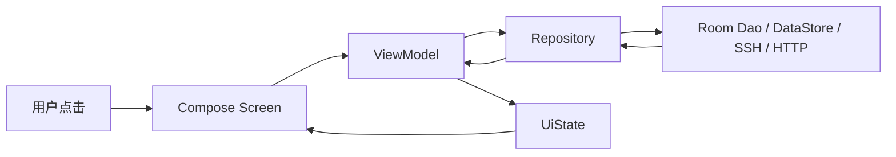

# SSH Mobile Android 原生复写零基础教程

这是一份从 0 开始复写 SSH Mobile 的 Android 原生教程。它假设你只学过传统 Java + XML Android 开发，现在想学习 Kotlin、Jetpack Compose 和 MVVM 架构，并用本项目已有功能做一个能投 Android 实习的作品。

这份教程的目标不是一天写完所有功能，而是带你按阶段做出一个越来越完整的原生 Android SSH 工具：

1. 先学会 Kotlin + Compose 的基本写法。
2. 搭出 MVVM 项目结构。
3. 做服务器配置管理。
4. 做 SSH 连接测试。
5. 做终端、多窗口和 tmux。
6. 做 SFTP 文件管理。
7. 做性能监控。
8. 做 AI 聊天、tools 和日志。
9. 最后补设置、备份、测试和简历表达。

你可以把它当成一门课程来学。每一章都包含：要学什么、为什么这样做、具体文件放哪里、代码骨架、验收标准。

## 0. 先回答一个关键问题

不要在当前 Flutter 项目的 `android/` 目录里直接改成原生项目。

原因很简单：当前 `android/` 是 Flutter 生成的 Android 宿主工程，它服务于 Flutter app，不适合拿来做完整原生重写。

建议新建一个独立项目：

```text
D:/coding/ssh_mobile_android/
```

也可以叫：

```text
ssh-mobile-native/
```

当前 Flutter 项目只作为功能参考。很多大页面已经拆成 `part` 结构，所以你主要对照这些当前入口页和服务文件理解业务：

| 当前 Flutter 文件 | 你要在 Android 原生版实现的功能 |
| --- | --- |
| `lib/models/connection.dart` | 服务器配置模型 |
| `lib/services/storage_service.dart` | 本地存储、密钥、备份 |
| `lib/services/ssh_service.dart` | SSH 会话、多窗口、tmux |
| `lib/services/sftp_service.dart` | SFTP 文件管理 |
| `lib/services/performance_monitor_service.dart` | 性能监控 |
| `lib/services/server_status_probe.dart` | Linux / Windows 只读状态命令和解析 |
| `lib/services/llm_chat_service.dart` | AI 流式聊天 |
| `lib/services/ai_tool_service.dart` | AI tools 和命令审批 |
| `lib/services/client_system_tool_service.dart` | 手机本机工具 |
| `lib/services/client_webview_service.dart` | 聊天绑定的客户端 WebView 状态 |
| `lib/services/playbook_service.dart` | Playbook |
| `lib/services/rag_service.dart` | RAG 知识库 |
| `lib/services/system_admin_service.dart` | 系统管理 |
| `lib/services/app_log_service.dart` | 开发日志 |
| `lib/screens/home_screen.dart` | 主导航和设置 |
| `lib/screens/add_edit_screen.dart` | 服务器新增/编辑 |
| `lib/screens/startup_screen.dart` | 启动页 |
| `lib/screens/terminal_screen.dart` | 终端页 |
| `lib/screens/terminal_windows_screen.dart` | 终端窗口总览 |
| `lib/screens/terminal_history_screen.dart` | 终端历史 |
| `lib/screens/sftp_screen.dart` | SFTP 页 |
| `lib/screens/sftp_editor_screen.dart` | 远程文本编辑 |
| `lib/screens/sftp_file_viewer_screen.dart` | 文件预览 |
| `lib/screens/performance_monitor_screen.dart` | 性能页 |
| `lib/screens/llm_chat_screen.dart` | AI 页 |
| `lib/screens/ai_skills_screen.dart` | 自定义 AI Skills 管理 |
| `lib/screens/client_webview_screen.dart` | 聊天绑定的客户端 WebView |
| `lib/screens/developer_log_screen.dart` | 开发日志 |
| `lib/screens/playbook_screen.dart` | Playbook |
| `lib/screens/rag_knowledge_screen.dart` | RAG 知识库 |
| `lib/screens/system_admin_screen.dart` | 系统管理 |

## 1. 你现在的知识怎么迁移

你学过 Java + XML，所以可以这样类比。

| Java + XML 老写法 | Kotlin + Compose 新写法 |
| --- | --- |
| `Activity` + XML layout | `Activity` + `setContent {}` |
| `TextView` | `Text()` |
| `Button` | `Button { Text(...) }` |
| `LinearLayout vertical` | `Column` |
| `LinearLayout horizontal` | `Row` |
| `FrameLayout` | `Box` |
| `RecyclerView` | `LazyColumn` |
| `onClickListener` | `onClick = { ... }` |
| `ViewModel + LiveData` | `ViewModel + StateFlow` |
| `findViewById` | 不需要，UI 是 Kotlin 函数 |
| `setText()` | 改 state，Compose 自动刷新 |
| XML selector/theme | Material3 theme + state |

最重要的思维变化：

```text
Java + XML:
你先拿到 View，再手动改 View。

Compose:
你准备好 state，UI 根据 state 自动画出来。
```

例如传统写法：

```java
textView.setText(server.name);
progressBar.setVisibility(isLoading ? View.VISIBLE : View.GONE);
```

Compose 写法：

```kotlin
@Composable
fun ServerRow(server: ServerUi, loading: Boolean) {
    Row {
        Text(server.name)
        if (loading) {
            CircularProgressIndicator()
        }
    }
}
```

这就是为什么后面我们一直强调 `UiState`。

## 2. 学习路线总览

不要一开始就写 SSH。SSH、SFTP、AI 都是复杂功能，初学 Compose 时直接碰它们很容易卡住。

推荐按这个顺序：

| 阶段 | 目标 | 你会学到 |
| --- | --- | --- |
| 第 1 阶段 | 新建 Compose 项目，跑起来 | Kotlin 文件、Composable、Preview |
| 第 2 阶段 | 做假数据服务器列表 | Compose 布局、LazyColumn、点击事件 |
| 第 3 阶段 | 做 MVVM 架构 | ViewModel、UiState、StateFlow |
| 第 4 阶段 | 接 Room 保存服务器 | Entity、Dao、Database、Repository |
| 第 5 阶段 | 接 DataStore 和 Keystore | 设置、敏感信息保存 |
| 第 6 阶段 | 做 SSH 连接测试 | Repository、协程、错误处理 |
| 第 7 阶段 | 做终端 MVP | 长连接、输出流、输入框 |
| 第 8 阶段 | 做 SFTP | 文件列表、上传下载、SAF |
| 第 9 阶段 | 做性能监控 | 定时任务、远端命令、图表 |
| 第 10 阶段 | 做 AI 聊天 | OkHttp、SSE、Markdown、tools |

每个阶段都要能运行、能演示、能提交。不要攒到最后一次性写。

## 3. 开发环境

### 3.1 安装工具

安装：

- Android Studio
- Android SDK
- JDK，优先用 Android Studio 自带的 JDK
- Git

不要在教程、代码、Gradle 文件里写死这种路径：

```text
C:\Users\xxx\AppData\Local\Android\Sdk
D:\Android\sdk
C:\Program Files\Java\jdk-xx
```

不同机器路径不同。用 Android Studio 自动配置，或者依赖这些环境变量：

```text
ANDROID_HOME
ANDROID_SDK_ROOT
JAVA_HOME
PATH
```

### 3.2 新建项目

在 Android Studio 里：

1. New Project
2. 选择 Empty Activity
3. Language 选 Kotlin
4. Build configuration language 选 Kotlin DSL
5. Minimum SDK 可以先选 26 或 28
6. Name 填 `SshMobileNative`
7. Package name 例如 `com.example.sshmobilenative`

创建后先运行一次。

验收标准：

- 模拟器或真机能打开 app。
- 屏幕显示模板自带的文字。
- Android Studio 没有红色报错。

## 4. 第一次认识 Compose

打开 `MainActivity.kt`，你会看到类似：

```kotlin
class MainActivity : ComponentActivity() {
    override fun onCreate(savedInstanceState: Bundle?) {
        super.onCreate(savedInstanceState)
        setContent {
            SshMobileNativeTheme {
                Text("Hello Android")
            }
        }
    }
}
```

你可以理解为：

- `Activity` 还是入口。
- `setContent {}` 代替以前的 `setContentView(R.layout.xxx)`。
- `Text()` 代替 `TextView`。
- `SshMobileNativeTheme {}` 代替主题 XML 的一部分能力。

### 4.1 创建第一个页面

创建文件：

```text
app/src/main/java/com/example/sshmobilenative/feature/home/HomeScreen.kt
```

写：

```kotlin
package com.example.sshmobilenative.feature.home

import androidx.compose.foundation.layout.Column
import androidx.compose.foundation.layout.fillMaxSize
import androidx.compose.foundation.layout.padding
import androidx.compose.material3.MaterialTheme
import androidx.compose.material3.Text
import androidx.compose.runtime.Composable
import androidx.compose.ui.Modifier
import androidx.compose.ui.tooling.preview.Preview
import androidx.compose.ui.unit.dp

@Composable
fun HomeScreen() {
    Column(
        modifier = Modifier
            .fillMaxSize()
            .padding(16.dp)
    ) {
        Text(
            text = "SSH Mobile Native",
            style = MaterialTheme.typography.headlineSmall
        )
        Text(
            text = "服务器、终端、SFTP、性能监控和 AI 运维工具",
            style = MaterialTheme.typography.bodyMedium
        )
    }
}

@Preview(showBackground = true)
@Composable
private fun HomeScreenPreview() {
    HomeScreen()
}
```

再回到 `MainActivity.kt`：

```kotlin
setContent {
    SshMobileNativeTheme {
        HomeScreen()
    }
}
```

验收标准：

- app 显示标题和说明。
- Preview 面板能看到页面。

## 5. Kotlin 快速入门

你会 Java，所以这里讲最容易混淆的点。

### 5.1 变量

Java：

```java
String name = "server";
final int port = 22;
```

Kotlin：

```kotlin
var name = "server"  // 可变
val port = 22        // 不可变，类似 final
```

项目里优先用 `val`。只有真的要改时才用 `var`。

### 5.2 数据类

Java 里你要写字段、构造、getter、equals。

Kotlin：

```kotlin
data class Server(
    val id: String,
    val name: String,
    val host: String,
    val port: Int,
    val username: String
)
```

自动有：

- `equals`
- `hashCode`
- `toString`
- `copy`

例如：

```kotlin
val old = Server("1", "prod", "1.2.3.4", 22, "root")
val next = old.copy(name = "production")
```

### 5.3 空安全

Java 里 `String` 可能是 null。

Kotlin 默认不能为 null：

```kotlin
val name: String = "server"
```

如果允许 null，要写 `?`：

```kotlin
val password: String? = null
```

使用时：

```kotlin
val length = password?.length ?: 0
```

意思是：如果 `password` 不为空，取长度；否则返回 0。

### 5.4 sealed class 表示状态

连接状态可以这样写：

```kotlin
sealed interface LoadState {
    data object Idle : LoadState
    data object Loading : LoadState
    data class Error(val message: String) : LoadState
}
```

比字符串安全：

```kotlin
when (state) {
    LoadState.Idle -> Text("空闲")
    LoadState.Loading -> CircularProgressIndicator()
    is LoadState.Error -> Text(state.message)
}
```

### 5.5 suspend 是什么

`suspend fun` 表示这个函数可能要等，例如网络、数据库、SSH。

```kotlin
suspend fun testConnection(server: Server): Boolean {
    // 这里可能要连服务器，所以是 suspend
    return true
}
```

它不能随便在普通函数里调用，要在协程里调用：

```kotlin
viewModelScope.launch {
    val ok = repository.testConnection(server)
}
```

## 6. Compose 基础

### 6.1 Composable 是 UI 函数

```kotlin
@Composable
fun ServerName(name: String) {
    Text(text = name)
}
```

Composable 函数有几个规则：

- 函数名大写开头更像组件，例如 `ServerList`。
- 不要在里面直接做耗时操作。
- 不要在里面直接开线程、连 SSH、读数据库。
- 它只负责根据 state 画 UI。

### 6.2 Row、Column、Box

```kotlin
Column {
    Text("第一行")
    Text("第二行")
}
```

```kotlin
Row {
    Text("左")
    Text("右")
}
```

```kotlin
Box {
    Text("可以叠放")
}
```

### 6.3 Modifier

Modifier 类似以前 XML 里的 layout_width、padding、background。

```kotlin
Text(
    text = "服务器",
    modifier = Modifier
        .fillMaxWidth()
        .padding(16.dp)
)
```

顺序很重要。通常先尺寸，再背景，再 padding。

### 6.4 LazyColumn

以前写 RecyclerView，现在写：

```kotlin
@Composable
fun ServerList(servers: List<Server>) {
    LazyColumn {
        items(
            items = servers,
            key = { it.id }
        ) { server ->
            Text(server.name)
        }
    }
}
```

一定要给稳定 key，例如服务器 id。后面日志、聊天、SFTP 文件列表都这样做。

### 6.5 State

简单页面内部状态：

```kotlin
@Composable
fun Counter() {
    var count by remember { mutableStateOf(0) }
    Button(onClick = { count++ }) {
        Text("count=$count")
    }
}
```

但业务页面不要把核心状态都放在 `remember` 里。服务器列表、SFTP、AI 聊天应该放 ViewModel。

## 7. MVVM 和单向数据流

先记住一句话：

```text
Screen 只画 UI。
ViewModel 管屏幕状态。
Repository 做业务。
Dao/DataSource 读写真实数据。
```

本项目推荐的数据流：



屏幕不要直接这样做：

```kotlin
// 不推荐
@Composable
fun ServerScreen() {
    val dao = ...
    val servers = dao.getServers()
}
```

应该这样：

```kotlin
@Composable
fun ServerScreen(viewModel: ServerViewModel) {
    val uiState by viewModel.uiState.collectAsStateWithLifecycle()
    ServerContent(
        uiState = uiState,
        onAddClick = viewModel::addServer
    )
}
```

ViewModel：

```kotlin
data class ServerListUiState(
    val loading: Boolean = true,
    val servers: List<ServerUi> = emptyList(),
    val error: String? = null
)

class ServerViewModel(
    private val repository: ServerRepository
) : ViewModel() {
    val uiState: StateFlow<ServerListUiState> =
        repository.observeServers()
            .map { servers ->
                ServerListUiState(
                    loading = false,
                    servers = servers.map { it.toUi() }
                )
            }
            .stateIn(
                scope = viewModelScope,
                started = SharingStarted.WhileSubscribed(5_000),
                initialValue = ServerListUiState()
            )
}
```

## 8. 添加依赖和基础架构

这一章先搭架子，不写复杂功能。

### 8.1 推荐包结构

创建这些目录：

```text
app/src/main/java/com/example/sshmobilenative/
  MainActivity.kt
  SshMobileApp.kt
  di/
  core/
    model/
    database/
    datastore/
    crypto/
    logging/
    ssh/
    sftp/
    performance/
    ai/
    system/
  feature/
    home/
    server/
    terminal/
    sftp/
    monitor/
    ai/
    logs/
    settings/
  ui/
    theme/
    components/
```

为什么这样分：

- `core` 放通用能力。
- `feature` 放页面。
- `di` 放 Hilt 依赖注入。
- `ui` 放主题和公共组件。

### 8.2 依赖

版本不要照抄死。用 Android Studio 模板生成的 Compose 和 Kotlin 版本为准，然后在 `gradle/libs.versions.toml` 里增加需要的库。

你最终会用到：

- Compose Material3
- Navigation Compose
- lifecycle ViewModel Compose
- lifecycle runtime Compose
- Kotlin Coroutines
- Room
- DataStore
- Hilt
- WorkManager
- OkHttp
- Paging，日志多时再加

先不要一口气全加。按照教程阶段加。

第一阶段只需要：

- Compose
- Navigation Compose
- lifecycle runtime compose
- lifecycle viewmodel compose

## 9. 做主导航

当前 Flutter 项目的导航顺序是：

1. AI
2. Servers
3. SFTP
4. Performance
5. Logs

但启动默认进入 Servers。Android 原生版也这样做。

### 9.1 定义路由

创建：

```text
core/model/AppDestination.kt
```

```kotlin
package com.example.sshmobilenative.core.model

import androidx.compose.material.icons.Icons
import androidx.compose.material.icons.outlined.Folder
import androidx.compose.material.icons.outlined.Memory
import androidx.compose.material.icons.outlined.SmartToy
import androidx.compose.material.icons.outlined.Storage
import androidx.compose.material.icons.outlined.Terminal
import androidx.compose.ui.graphics.vector.ImageVector

enum class AppDestination(
    val route: String,
    val label: String,
    val icon: ImageVector
) {
    Ai("ai", "AI", Icons.Outlined.SmartToy),
    Servers("servers", "Servers", Icons.Outlined.Storage),
    Sftp("sftp", "SFTP", Icons.Outlined.Folder),
    Monitor("monitor", "Monitor", Icons.Outlined.Memory),
    Logs("logs", "Logs", Icons.Outlined.Terminal)
}
```

如果 icon 依赖没开，先不用 icon，后面再补。

### 9.2 创建 App Shell

创建：

```text
SshMobileApp.kt
```

```kotlin
@Composable
fun SshMobileApp() {
    var current by rememberSaveable { mutableStateOf(AppDestination.Servers) }

    Scaffold(
        bottomBar = {
            NavigationBar {
                AppDestination.entries.forEach { destination ->
                    NavigationBarItem(
                        selected = current == destination,
                        onClick = { current = destination },
                        icon = { Icon(destination.icon, contentDescription = destination.label) },
                        label = { Text(destination.label) }
                    )
                }
            }
        }
    ) { padding ->
        Box(modifier = Modifier.padding(padding)) {
            when (current) {
                AppDestination.Ai -> PlaceholderScreen("AI")
                AppDestination.Servers -> PlaceholderScreen("Servers")
                AppDestination.Sftp -> PlaceholderScreen("SFTP")
                AppDestination.Monitor -> PlaceholderScreen("Performance")
                AppDestination.Logs -> PlaceholderScreen("Logs")
            }
        }
    }
}

@Composable
private fun PlaceholderScreen(title: String) {
    Box(
        modifier = Modifier.fillMaxSize(),
        contentAlignment = Alignment.Center
    ) {
        Text(title)
    }
}
```

`MainActivity.kt`：

```kotlin
setContent {
    SshMobileNativeTheme {
        SshMobileApp()
    }
}
```

验收标准：

- 底部 5 个 tab 能切换。
- 默认打开 Servers。

之后你可以换成 Navigation Compose，但初学阶段先用 `when` 更容易理解。

## 10. 做日志系统

先做日志，因为后面 SSH、SFTP、AI 出错都要记日志。

### 10.1 先用内存版 Logger

创建：

```text
core/logging/AppLog.kt
```

```kotlin
data class AppLog(
    val id: String,
    val timeMillis: Long,
    val level: LogLevel,
    val message: String,
    val details: String? = null
)

enum class LogLevel {
    Debug, Info, Warning, Error, Service, Tool
}
```

创建：

```text
core/logging/AppLogger.kt
```

```kotlin
interface AppLogger {
    val logs: StateFlow<List<AppLog>>

    fun debug(message: String, details: String? = null)
    fun info(message: String, details: String? = null)
    fun warning(message: String, details: String? = null)
    fun error(message: String, throwable: Throwable? = null, details: String? = null)
}
```

内存实现：

```kotlin
class InMemoryAppLogger : AppLogger {
    private val _logs = MutableStateFlow<List<AppLog>>(emptyList())
    override val logs: StateFlow<List<AppLog>> = _logs.asStateFlow()

    override fun debug(message: String, details: String?) =
        add(LogLevel.Debug, message, details)

    override fun info(message: String, details: String?) =
        add(LogLevel.Info, message, details)

    override fun warning(message: String, details: String?) =
        add(LogLevel.Warning, message, details)

    override fun error(message: String, throwable: Throwable?, details: String?) {
        add(LogLevel.Error, message, buildString {
            if (!details.isNullOrBlank()) append(details)
            if (throwable != null) append("\n").append(throwable.stackTraceToString())
        }.trim().ifBlank { null })
    }

    private fun add(level: LogLevel, message: String, details: String?) {
        val item = AppLog(
            id = UUID.randomUUID().toString(),
            timeMillis = System.currentTimeMillis(),
            level = level,
            message = message,
            details = details
        )
        _logs.update { old -> (listOf(item) + old).take(500) }
    }
}
```

### 10.2 做日志页面

```kotlin
data class LogsUiState(
    val logs: List<AppLog> = emptyList(),
    val selectedLevel: LogLevel? = null
)
```

```kotlin
class LogsViewModel(
    private val logger: AppLogger
) : ViewModel() {
    private val selectedLevel = MutableStateFlow<LogLevel?>(null)

    val uiState: StateFlow<LogsUiState> =
        combine(logger.logs, selectedLevel) { logs, level ->
            LogsUiState(
                logs = if (level == null) logs else logs.filter { it.level == level },
                selectedLevel = level
            )
        }.stateIn(
            viewModelScope,
            SharingStarted.WhileSubscribed(5_000),
            LogsUiState()
        )

    fun selectLevel(level: LogLevel?) {
        selectedLevel.value = level
    }
}
```

UI：

```kotlin
@Composable
fun LogsScreen(viewModel: LogsViewModel) {
    val state by viewModel.uiState.collectAsStateWithLifecycle()

    Column {
        LazyRow(modifier = Modifier.padding(8.dp)) {
            item {
                FilterChip(
                    selected = state.selectedLevel == null,
                    onClick = { viewModel.selectLevel(null) },
                    label = { Text("All") }
                )
            }
            items(LogLevel.entries) { level ->
                FilterChip(
                    selected = state.selectedLevel == level,
                    onClick = { viewModel.selectLevel(level) },
                    label = { Text(level.name) }
                )
            }
        }

        LazyColumn {
            items(state.logs, key = { it.id }) { log ->
                ListItem(
                    headlineContent = { Text(log.message) },
                    supportingContent = {
                        if (log.details != null) Text(log.details, maxLines = 3)
                    },
                    overlineContent = { Text(log.level.name) }
                )
                HorizontalDivider()
            }
        }
    }
}
```

验收标准：

- 进入 Logs 页面能看到测试日志。
- 能按日志级别筛选。

后面再把内存日志替换成 Room 持久化。

## 11. 做服务器模型

先对照 Flutter 的 `ConnectionConfig`。

Android 原生 domain model：

```kotlin
data class Server(
    val id: String,
    val name: String,
    val host: String,
    val port: Int,
    val username: String,
    val authMethod: AuthMethod,
    val terminalWidth: Int = 80,
    val terminalHeight: Int = 24,
    val keepAlive: Boolean = true,
    val keepAliveIntervalSeconds: Int = 3,
    val launchMode: TerminalLaunchMode = TerminalLaunchMode.Tmux,
    val serverPlatform: ServerPlatform = ServerPlatform.Linux,
    val tmuxAutoDeleteSeconds: Int = 600,
    val jumpHost: String? = null,
    val jumpPort: Int? = null,
    val jumpUsername: String? = null,
    val groupName: String? = null,
    val createdAtMillis: Long,
    val updatedAtMillis: Long
)

enum class AuthMethod {
    Password,
    PrivateKey,
    Both
}

enum class TerminalLaunchMode {
    Ssh,
    Tmux
}

enum class ServerPlatform {
    Linux,
    Windows
}
```

规则：

- Windows 服务器不能选 tmux。
- 新增或编辑服务器前必须测试 SSH 登录。
- 密码和私钥不直接放在 `Server` 里。

## 12. 做服务器列表，先用假数据

先不要接 Room。先把 UI 写出来。

```kotlin
data class ServerUi(
    val id: String,
    val name: String,
    val host: String,
    val username: String,
    val platform: String,
    val launchMode: String
)
```

```kotlin
@Composable
fun ServersScreen() {
    val servers = remember {
        listOf(
            ServerUi("1", "本地测试机", "192.168.1.10:22", "root", "Linux", "SSH + tmux"),
            ServerUi("2", "Windows 运维机", "192.168.1.20:22", "Administrator", "Windows", "SSH")
        )
    }

    Scaffold(
        floatingActionButton = {
            FloatingActionButton(onClick = { }) {
                Icon(Icons.Default.Add, contentDescription = "添加服务器")
            }
        }
    ) { padding ->
        LazyColumn(
            modifier = Modifier
                .fillMaxSize()
                .padding(padding),
            contentPadding = PaddingValues(12.dp),
            verticalArrangement = Arrangement.spacedBy(8.dp)
        ) {
            items(servers, key = { it.id }) { server ->
                ServerCard(server)
            }
        }
    }
}

@Composable
fun ServerCard(server: ServerUi) {
    ElevatedCard(
        modifier = Modifier.fillMaxWidth()
    ) {
        Column(modifier = Modifier.padding(12.dp)) {
            Text(server.name, style = MaterialTheme.typography.titleMedium)
            Text("${server.username}@${server.host}")
            Text("${server.platform} · ${server.launchMode}")
        }
    }
}
```

验收标准：

- Servers 页面能显示假服务器。
- 点击底部导航切回来，列表还在。

## 13. 接入 ViewModel

把假数据从 UI 移到 ViewModel。

```kotlin
data class ServersUiState(
    val loading: Boolean = false,
    val servers: List<ServerUi> = emptyList(),
    val error: String? = null
)
```

```kotlin
class ServersViewModel : ViewModel() {
    private val _uiState = MutableStateFlow(
        ServersUiState(
            servers = listOf(
                ServerUi("1", "本地测试机", "192.168.1.10:22", "root", "Linux", "SSH + tmux")
            )
        )
    )
    val uiState: StateFlow<ServersUiState> = _uiState.asStateFlow()
}
```

UI：

```kotlin
@Composable
fun ServersScreen(
    viewModel: ServersViewModel = viewModel()
) {
    val state by viewModel.uiState.collectAsStateWithLifecycle()

    LazyColumn {
        items(state.servers, key = { it.id }) { server ->
            ServerCard(server)
        }
    }
}
```

验收标准：

- UI 还是一样。
- 数据已经来自 ViewModel。

到这里你已经完成了 MVVM 的第一步。

## 14. 接 Room 保存服务器

Room 相当于 SQLite 的现代封装。

你需要三个东西：

1. Entity：表结构。
2. Dao：SQL 操作。
3. Database：数据库入口。

### 14.1 ServerEntity

```kotlin
@Entity(tableName = "servers")
data class ServerEntity(
    @PrimaryKey val id: String,
    val name: String,
    val host: String,
    val port: Int,
    val username: String,
    val authMethod: String,
    val passwordSecretKey: String?,
    val privateKeySecretKey: String?,
    val terminalWidth: Int,
    val terminalHeight: Int,
    val keepAlive: Boolean,
    val keepAliveIntervalSeconds: Int,
    val launchMode: String,
    val serverPlatform: String,
    val tmuxAutoDeleteSeconds: Int,
    val jumpHost: String?,
    val jumpPort: Int?,
    val jumpUsername: String?,
    val groupName: String?,
    val createdAtMillis: Long,
    val updatedAtMillis: Long
)
```

为什么 Entity 里 enum 用 String？

因为数据库迁移更直观。后期 enum 改名时你也能清楚处理。

### 14.2 ServerDao

```kotlin
@Dao
interface ServerDao {
    @Query("SELECT * FROM servers ORDER BY updatedAtMillis DESC")
    fun observeServers(): Flow<List<ServerEntity>>

    @Query("SELECT * FROM servers WHERE id = :id")
    suspend fun getServer(id: String): ServerEntity?

    @Upsert
    suspend fun upsert(server: ServerEntity)

    @Query("DELETE FROM servers WHERE id = :id")
    suspend fun deleteById(id: String)
}
```

### 14.3 AppDatabase

```kotlin
@Database(
    entities = [ServerEntity::class],
    version = 1,
    exportSchema = true
)
abstract class AppDatabase : RoomDatabase() {
    abstract fun serverDao(): ServerDao
}
```

### 14.4 先手动创建 Repository

不急着上 Hilt，先手动写通。

```kotlin
class ServerRepository(
    private val serverDao: ServerDao
) {
    fun observeServers(): Flow<List<Server>> {
        return serverDao.observeServers().map { entities ->
            entities.map { it.toDomain() }
        }
    }

    suspend fun addDemoServer() {
        val now = System.currentTimeMillis()
        serverDao.upsert(
            ServerEntity(
                id = UUID.randomUUID().toString(),
                name = "测试服务器",
                host = "192.168.1.10",
                port = 22,
                username = "root",
                authMethod = "Password",
                passwordSecretKey = null,
                privateKeySecretKey = null,
                terminalWidth = 80,
                terminalHeight = 24,
                keepAlive = true,
                keepAliveIntervalSeconds = 3,
                launchMode = "Tmux",
                serverPlatform = "Linux",
                tmuxAutoDeleteSeconds = 600,
                jumpHost = null,
                jumpPort = null,
                jumpUsername = null,
                groupName = null,
                createdAtMillis = now,
                updatedAtMillis = now
            )
        )
    }
}
```

映射函数：

```kotlin
fun ServerEntity.toDomain(): Server {
    val platform = enumValueOf<ServerPlatform>(serverPlatform)
    val mode = enumValueOf<TerminalLaunchMode>(launchMode)
    return Server(
        id = id,
        name = name,
        host = host,
        port = port,
        username = username,
        authMethod = enumValueOf(authMethod),
        terminalWidth = terminalWidth,
        terminalHeight = terminalHeight,
        keepAlive = keepAlive,
        keepAliveIntervalSeconds = keepAliveIntervalSeconds,
        launchMode = if (platform == ServerPlatform.Windows) TerminalLaunchMode.Ssh else mode,
        serverPlatform = platform,
        tmuxAutoDeleteSeconds = tmuxAutoDeleteSeconds,
        jumpHost = jumpHost,
        jumpPort = jumpPort,
        jumpUsername = jumpUsername,
        groupName = groupName,
        createdAtMillis = createdAtMillis,
        updatedAtMillis = updatedAtMillis
    )
}
```

验收标准：

- 点击按钮能插入一台 demo server。
- 重启 app 后服务器还在。

## 15. 引入 Hilt

Hilt 是依赖注入工具。你可以理解为：它帮你创建 Repository、Dao、Database、ViewModel，不用你手动到处 new。

### 15.1 Application

创建：

```text
SshMobileNativeApplication.kt
```

```kotlin
@HiltAndroidApp
class SshMobileNativeApplication : Application()
```

在 `AndroidManifest.xml`：

```xml
<application
    android:name=".SshMobileNativeApplication"
    ...>
</application>
```

### 15.2 MainActivity

```kotlin
@AndroidEntryPoint
class MainActivity : ComponentActivity() {
    ...
}
```

### 15.3 DatabaseModule

```kotlin
@Module
@InstallIn(SingletonComponent::class)
object DatabaseModule {
    @Provides
    @Singleton
    fun provideDatabase(
        @ApplicationContext context: Context
    ): AppDatabase {
        return Room.databaseBuilder(
            context,
            AppDatabase::class.java,
            "ssh_mobile_native.db"
        ).build()
    }

    @Provides
    fun provideServerDao(database: AppDatabase): ServerDao {
        return database.serverDao()
    }
}
```

### 15.4 Repository 构造注入

```kotlin
class ServerRepository @Inject constructor(
    private val serverDao: ServerDao
) {
    ...
}
```

### 15.5 ViewModel

```kotlin
@HiltViewModel
class ServersViewModel @Inject constructor(
    private val repository: ServerRepository
) : ViewModel() {
    val uiState: StateFlow<ServersUiState> =
        repository.observeServers()
            .map { servers ->
                ServersUiState(
                    servers = servers.map { it.toUi() }
                )
            }
            .stateIn(
                viewModelScope,
                SharingStarted.WhileSubscribed(5_000),
                ServersUiState()
            )

    fun addDemo() {
        viewModelScope.launch {
            repository.addDemoServer()
        }
    }
}
```

UI：

```kotlin
@Composable
fun ServersScreen(
    viewModel: ServersViewModel = hiltViewModel()
) {
    ...
}
```

验收标准：

- app 能启动。
- Room、Repository、ViewModel 不需要手动 new。

## 16. 做新增服务器表单

这个阶段先做表单，不急着真的 SSH 连接。

### 16.1 UiState

```kotlin
data class ServerFormUiState(
    val name: String = "",
    val host: String = "",
    val port: String = "22",
    val username: String = "",
    val password: String = "",
    val privateKey: String = "",
    val authMethod: AuthMethod = AuthMethod.Password,
    val serverPlatform: ServerPlatform = ServerPlatform.Linux,
    val launchMode: TerminalLaunchMode = TerminalLaunchMode.Tmux,
    val saving: Boolean = false,
    val error: String? = null
)
```

### 16.2 ViewModel

```kotlin
@HiltViewModel
class ServerFormViewModel @Inject constructor(
    private val repository: ServerRepository
) : ViewModel() {
    private val _uiState = MutableStateFlow(ServerFormUiState())
    val uiState = _uiState.asStateFlow()

    fun updateName(value: String) = update { it.copy(name = value) }
    fun updateHost(value: String) = update { it.copy(host = value) }
    fun updatePort(value: String) = update { it.copy(port = value.filter(Char::isDigit)) }
    fun updateUsername(value: String) = update { it.copy(username = value) }
    fun updatePassword(value: String) = update { it.copy(password = value) }

    fun updatePlatform(value: ServerPlatform) {
        update {
            it.copy(
                serverPlatform = value,
                launchMode = if (value == ServerPlatform.Windows) {
                    TerminalLaunchMode.Ssh
                } else {
                    it.launchMode
                }
            )
        }
    }

    private fun update(block: (ServerFormUiState) -> ServerFormUiState) {
        _uiState.update(block)
    }
}
```

### 16.3 表单 UI

```kotlin
@Composable
fun ServerFormScreen(
    viewModel: ServerFormViewModel = hiltViewModel(),
    onSaved: () -> Unit
) {
    val state by viewModel.uiState.collectAsStateWithLifecycle()

    Column(
        modifier = Modifier
            .fillMaxSize()
            .verticalScroll(rememberScrollState())
            .padding(16.dp),
        verticalArrangement = Arrangement.spacedBy(12.dp)
    ) {
        OutlinedTextField(
            value = state.name,
            onValueChange = viewModel::updateName,
            label = { Text("名称") },
            modifier = Modifier.fillMaxWidth()
        )
        OutlinedTextField(
            value = state.host,
            onValueChange = viewModel::updateHost,
            label = { Text("主机") },
            modifier = Modifier.fillMaxWidth()
        )
        OutlinedTextField(
            value = state.port,
            onValueChange = viewModel::updatePort,
            label = { Text("端口") },
            modifier = Modifier.fillMaxWidth(),
            keyboardOptions = KeyboardOptions(keyboardType = KeyboardType.Number)
        )
        OutlinedTextField(
            value = state.username,
            onValueChange = viewModel::updateUsername,
            label = { Text("用户名") },
            modifier = Modifier.fillMaxWidth()
        )
        OutlinedTextField(
            value = state.password,
            onValueChange = viewModel::updatePassword,
            label = { Text("密码") },
            modifier = Modifier.fillMaxWidth(),
            visualTransformation = PasswordVisualTransformation()
        )
        Button(
            onClick = { /* 后面接保存 */ },
            enabled = !state.saving,
            modifier = Modifier.fillMaxWidth()
        ) {
            Text(if (state.saving) "保存中..." else "测试并保存")
        }
        if (state.error != null) {
            Text(state.error, color = MaterialTheme.colorScheme.error)
        }
    }
}
```

验收标准：

- 能打开新增页。
- 能输入服务器信息。
- 切 Windows 后 tmux 自动变 SSH。

## 17. SecretStore 保存密码和私钥

本项目要求：

- 密码不存 Room 明文。
- 私钥不存 Room 明文。
- API Key 不导出。

初学阶段可以分两步做。

### 17.1 第一步：假 SecretStore

先用内存版，跑通流程：

```kotlin
interface SecretStore {
    suspend fun put(key: String, value: String)
    suspend fun get(key: String): String?
    suspend fun delete(key: String)
}

@Singleton
class InMemorySecretStore @Inject constructor() : SecretStore {
    private val data = mutableMapOf<String, String>()

    override suspend fun put(key: String, value: String) {
        data[key] = value
    }

    override suspend fun get(key: String): String? = data[key]

    override suspend fun delete(key: String) {
        data.remove(key)
    }
}
```

### 17.2 第二步：Android Keystore

等服务器 CRUD 和 SSH 测试跑通后，再实现真正加密。

实现方向：

- Android Keystore 里保存不可导出的 AES key。
- 用 AES/GCM 加密 secret。
- 加密后的 bytes 写入 app 私有文件或 DataStore。
- 备份导出不包含 secret。

接口不变，所以 Repository 不用改。

## 18. 保存服务器前做 SSH 测试

先定义 SSH 引擎接口。不要让页面直接依赖某个第三方 SSH 库。

```kotlin
interface SshEngine {
    suspend fun testConnection(server: Server, credentials: Credentials)
    suspend fun openShell(server: Server, credentials: Credentials): SshShell
    suspend fun runCommand(
        server: Server,
        credentials: Credentials,
        command: String,
        timeoutMillis: Long
    ): CommandResult
}

data class Credentials(
    val password: String?,
    val privateKey: String?,
    val privateKeyPassphrase: String?
)

data class CommandResult(
    val exitCode: Int,
    val stdout: String,
    val stderr: String
)
```

先做 Fake：

```kotlin
class FakeSshEngine @Inject constructor() : SshEngine {
    override suspend fun testConnection(server: Server, credentials: Credentials) {
        delay(800)
        if (server.host.isBlank()) {
            error("Host is empty")
        }
    }

    override suspend fun openShell(server: Server, credentials: Credentials): SshShell {
        TODO("后面实现")
    }

    override suspend fun runCommand(
        server: Server,
        credentials: Credentials,
        command: String,
        timeoutMillis: Long
    ): CommandResult {
        return CommandResult(0, "fake output", "")
    }
}
```

Hilt 绑定：

```kotlin
@Module
@InstallIn(SingletonComponent::class)
abstract class SshModule {
    @Binds
    abstract fun bindSshEngine(impl: FakeSshEngine): SshEngine
}
```

保存逻辑：

```kotlin
suspend fun saveAfterTest(input: ServerFormInput) {
    val server = input.toServer()
    val credentials = input.toCredentials()

    sshEngine.testConnection(server, credentials)

    val passwordKey = if (!credentials.password.isNullOrBlank()) {
        "server:${server.id}:password"
    } else {
        null
    }
    if (passwordKey != null) {
        secretStore.put(passwordKey, credentials.password!!)
    }

    serverDao.upsert(server.toEntity(passwordSecretKey = passwordKey))
    logger.info("Server saved", "server=${server.name}")
}
```

ViewModel：

```kotlin
fun save(onSuccess: () -> Unit) {
    viewModelScope.launch {
        _uiState.update { it.copy(saving = true, error = null) }
        runCatching {
            repository.saveAfterTest(_uiState.value.toInput())
        }.onSuccess {
            onSuccess()
        }.onFailure { e ->
            _uiState.update { it.copy(error = e.message ?: "保存失败") }
        }
        _uiState.update { it.copy(saving = false) }
    }
}
```

验收标准：

- 点击“测试并保存”会 loading。
- host 为空时保存失败。
- 成功后回到列表。
- 重启 app 后服务器还在。

## 19. 接真实 SSH 库

这一步比较难，可以单独建一个 branch 做。

候选：

- Apache MINA SSHD：功能完整，纯 Java，包较大。
- SSHJ：常见 Java SSHv2 客户端库。
- mwiede/JSch：JSch 维护 fork，API 简单，适合初学者先做 MVP。

建议顺序：

1. 先用 FakeSshEngine 写完整 app 流程。
2. 再用 JSch fork 做密码登录和 exec command。
3. 再扩展私钥、SFTP、shell channel。
4. 如果算法兼容或 SFTP 能力不够，再评估 SSHJ/MINA。

真实实现时必须支持：

- 密码登录。
- 私钥登录。
- 私钥密码。
- host key 校验。
- 连接超时。
- 断网异常。
- 资源关闭。

最小连接测试伪代码：

```kotlin
override suspend fun testConnection(server: Server, credentials: Credentials) {
    withContext(Dispatchers.IO) {
        val session = createSession(server, credentials)
        try {
            session.connect(10_000)
            if (!session.isConnected) error("SSH connect failed")
        } finally {
            session.disconnect()
        }
    }
}
```

注意：

- 所有网络和 SSH 操作必须在 `Dispatchers.IO`。
- 不要在 Compose 函数里连 SSH。
- 不要在主线程做阻塞 IO，否则可能 ANR。

## 20. 终端 MVP

先做一个能输入命令、显示输出的简易终端。不要一开始就追求完整 xterm。

### 20.1 Shell 接口

```kotlin
interface SshShell {
    val output: Flow<String>
    suspend fun write(text: String)
    suspend fun resize(columns: Int, rows: Int)
    suspend fun close()
}
```

Fake shell：

```kotlin
class FakeShell : SshShell {
    private val _output = MutableSharedFlow<String>(extraBufferCapacity = 64)
    override val output: Flow<String> = _output.asSharedFlow()

    override suspend fun write(text: String) {
        _output.emit("> $text")
        _output.emit("fake shell output\n")
    }

    override suspend fun resize(columns: Int, rows: Int) {}
    override suspend fun close() {}
}
```

### 20.2 TerminalUiState

```kotlin
data class TerminalUiState(
    val title: String = "Terminal",
    val connected: Boolean = false,
    val outputText: String = "",
    val input: String = "",
    val error: String? = null
)
```

### 20.3 TerminalViewModel

```kotlin
@HiltViewModel
class TerminalViewModel @Inject constructor(
    private val terminalRepository: TerminalRepository
) : ViewModel() {
    private val _uiState = MutableStateFlow(TerminalUiState())
    val uiState = _uiState.asStateFlow()

    fun connect(serverId: String) {
        viewModelScope.launch {
            runCatching {
                val shell = terminalRepository.openShell(serverId)
                _uiState.update { it.copy(connected = true) }
                shell.output.collect { chunk ->
                    _uiState.update { old ->
                        old.copy(outputText = (old.outputText + chunk).takeLast(200_000))
                    }
                }
            }.onFailure { e ->
                _uiState.update { it.copy(error = e.message, connected = false) }
            }
        }
    }

    fun updateInput(value: String) {
        _uiState.update { it.copy(input = value) }
    }

    fun send() {
        val text = _uiState.value.input
        _uiState.update { it.copy(input = "") }
        viewModelScope.launch {
            terminalRepository.write(text + "\n")
        }
    }
}
```

### 20.4 TerminalScreen

```kotlin
@Composable
fun TerminalScreen(viewModel: TerminalViewModel = hiltViewModel()) {
    val state by viewModel.uiState.collectAsStateWithLifecycle()

    Column(modifier = Modifier.fillMaxSize()) {
        Text(
            text = state.outputText,
            modifier = Modifier
                .weight(1f)
                .fillMaxWidth()
                .background(Color.Black)
                .padding(8.dp)
                .verticalScroll(rememberScrollState()),
            color = Color.Green,
            fontFamily = FontFamily.Monospace
        )

        Row(modifier = Modifier.padding(8.dp)) {
            OutlinedTextField(
                value = state.input,
                onValueChange = viewModel::updateInput,
                modifier = Modifier.weight(1f),
                singleLine = true
            )
            Spacer(Modifier.width(8.dp))
            Button(onClick = viewModel::send) {
                Text("发送")
            }
        }
    }
}
```

验收标准：

- 打开终端页。
- 输入命令，能看到 fake 输出。
- 输出很多时不崩。

后面真实终端再做：

- ANSI 解析。
- 光标。
- 颜色。
- 快捷键。
- 选择复制。
- 搜索。
- scrollback 限制。

## 21. 多窗口终端

当前项目支持同一服务器打开多个窗口。Android 原生版也要做。

数据模型：

```kotlin
data class TerminalSessionSummary(
    val sessionId: String,
    val serverId: String,
    val serverName: String,
    val displayName: String,
    val connected: Boolean,
    val tmuxSessionName: String?,
    val updatedAtMillis: Long
)
```

SessionManager：

```kotlin
@Singleton
class TerminalSessionManager @Inject constructor(
    private val sshEngine: SshEngine
) {
    private val sessions = MutableStateFlow<Map<String, LiveTerminalSession>>(emptyMap())

    val summaries: StateFlow<List<TerminalSessionSummary>> =
        sessions.map { map -> map.values.map { it.summary() } }
            .stateIn(appScope, SharingStarted.Eagerly, emptyList())

    suspend fun open(server: Server, credentials: Credentials): String {
        val sessionId = UUID.randomUUID().toString()
        val shell = sshEngine.openShell(server, credentials)
        val live = LiveTerminalSession(sessionId, server, shell)
        sessions.update { it + (sessionId to live) }
        return sessionId
    }
}
```

初学阶段如果没有 `appScope`，可以先放在 Repository 里，等前台服务时再整理。

服务器页展示：

- 每个服务器卡片显示已打开窗口数量。
- 点击“打开终端”创建新 session。
- 点击已有窗口进入 TerminalScreen。

验收标准：

- 同一服务器能打开两个终端窗口。
- 两个窗口的输出互不覆盖。

## 22. tmux 模式

tmux 是这个项目的核心能力。它解决手机后台断开后，服务器端任务还能继续的问题。

### 22.1 普通 SSH 和 tmux 的区别

普通 SSH：

```text
手机断开 -> 远端 shell 可能退出 -> 正在跑的任务可能断
```

SSH + tmux：

```text
手机断开 -> tmux session 还在服务器上 -> 下次重新 attach
```

### 22.2 tmux 最小流程

Linux 服务器，创建或恢复 session：

```bash
tmux has-session -t ssh_mobile_xxx || tmux new-session -d -s ssh_mobile_xxx
tmux attach -t ssh_mobile_xxx
```

Android 里伪代码：

```kotlin
fun tmuxSessionName(serverId: String, sessionId: String): String {
    return "ssh_mobile_${serverId.take(8)}_${sessionId.take(8)}"
}
```

连接时：

```kotlin
if (server.launchMode == TerminalLaunchMode.Tmux && server.serverPlatform == ServerPlatform.Linux) {
    val name = tmuxSessionName(server.id, sessionId)
    sshEngine.runCommand(server, credentials, "tmux has-session -t '$name' || tmux new-session -d -s '$name'", 10_000)
    val shell = sshEngine.openShell(server, credentials)
    shell.write("tmux attach -t '$name'\n")
}
```

注意：

- shell quote 要处理单引号。
- Windows 不走 tmux。
- 服务器没有 tmux 时要给出错误提示。

### 22.3 保存可恢复记录

Room 表：

```kotlin
@Entity(tableName = "restorable_tmux_sessions")
data class RestorableTmuxSessionEntity(
    @PrimaryKey val sessionId: String,
    val serverId: String,
    val displayName: String,
    val tmuxSessionName: String,
    val updatedAtMillis: Long
)
```

启动 app 后：

- 读取 restorable tmux sessions。
- 在服务器卡片里显示“可恢复窗口”。
- 用户点击后重新 attach。

验收标准：

- 连接 tmux 后退出 app。
- 重新打开 app 能看到可恢复窗口。
- 点击后能回到同一个 tmux session。

## 23. 前台服务和保活

Android 后台限制很严格。长 SSH 连接要使用前台服务。

需要做：

- 请求通知权限。
- 启动前台服务。
- 显示“SSH 会话正在运行”通知。
- 必要时请求忽略电池优化。
- 获取 wake lock 和 wifi lock 时要谨慎释放。

Service：

```kotlin
@AndroidEntryPoint
class SshForegroundService : Service() {
    override fun onStartCommand(intent: Intent?, flags: Int, startId: Int): Int {
        startForeground(
            1001,
            buildNotification("SSH service is running")
        )
        return START_STICKY
    }

    override fun onBind(intent: Intent?): IBinder? = null
}
```

Android 14+ 需要在 Manifest 里声明前台服务类型和权限。具体类型要按官方文档选择，SSH 长连接和 SFTP 上传下载通常优先评估 `dataSync`，但要注意 Android 15 对 data sync 前台服务的限制。

启动引导页：

- 告诉用户后台连接受系统省电影响。
- 推荐使用 SSH + tmux。
- 提供“打开应用设置”按钮。
- 提供“继续进入应用”按钮。

验收标准：

- 打开终端后通知栏有前台服务通知。
- 关闭最后一个 SSH 会话后通知消失。

## 24. SFTP 文件管理

先做目录列表，再做上传下载。

### 24.1 数据模型

```kotlin
data class SftpEntry(
    val serverId: String,
    val name: String,
    val path: String,
    val isDirectory: Boolean,
    val isLink: Boolean,
    val sizeBytes: Long?,
    val modifiedAtMillis: Long?
)
```

UI model：

```kotlin
data class SftpEntryUi(
    val name: String,
    val path: String,
    val subtitle: String,
    val isDirectory: Boolean
)
```

### 24.2 SFTP 接口

```kotlin
interface SftpEngine {
    suspend fun connect(server: Server, credentials: Credentials): SftpSession
}

interface SftpSession {
    suspend fun list(path: String): List<SftpEntry>
    suspend fun read(path: String, maxBytes: Long): ByteArray
    suspend fun write(path: String, bytes: ByteArray)
    suspend fun delete(path: String, isDirectory: Boolean)
    suspend fun rename(from: String, to: String)
    suspend fun close()
}
```

### 24.3 SFTP UI state

```kotlin
data class SftpUiState(
    val selectedServerId: String? = null,
    val currentPath: String = ".",
    val entries: List<SftpEntryUi> = emptyList(),
    val loading: Boolean = false,
    val error: String? = null
)
```

### 24.4 页面

```kotlin
@Composable
fun SftpScreen(viewModel: SftpViewModel = hiltViewModel()) {
    val state by viewModel.uiState.collectAsStateWithLifecycle()

    Column(modifier = Modifier.fillMaxSize()) {
        Text(
            text = state.currentPath,
            modifier = Modifier
                .fillMaxWidth()
                .horizontalScroll(rememberScrollState())
                .padding(12.dp)
        )

        if (state.loading) {
            LinearProgressIndicator(modifier = Modifier.fillMaxWidth())
        }

        LazyColumn {
            items(state.entries, key = { it.path }) { entry ->
                ListItem(
                    leadingContent = {
                        Icon(
                            imageVector = if (entry.isDirectory) Icons.Default.Folder else Icons.Default.Description,
                            contentDescription = null
                        )
                    },
                    headlineContent = { Text(entry.name) },
                    supportingContent = { Text(entry.subtitle) },
                    modifier = Modifier.clickable {
                        if (entry.isDirectory) viewModel.openPath(entry.path)
                    }
                )
            }
        }
    }
}
```

### 24.5 删除确认

本项目规则：删除文件要输入名称确认。

```kotlin
suspend fun deleteEntry(entry: SftpEntry, confirmedName: String) {
    require(confirmedName.trim() == entry.name) {
        "输入的名称不匹配，已取消删除"
    }
    session.delete(entry.path, entry.isDirectory)
    logger.warning("SFTP entry deleted", "path=${entry.path}")
}
```

### 24.6 上传下载

Android 原生不要直接读公共路径。用 Storage Access Framework：

- 上传：`ACTION_OPEN_DOCUMENT`
- 下载：`ACTION_CREATE_DOCUMENT`
- 选择目录：`ACTION_OPEN_DOCUMENT_TREE`

限制建议沿用当前项目：

| 操作 | 默认限制 |
| --- | --- |
| 文本编辑 | 512 KB |
| 文本预览 | 2 MB |
| 图片/PDF 预览 | 20 MB |
| 上传 | 50 MB |
| 下载 | 512 MB |

验收标准：

- 能列出远端目录。
- 能进入目录和返回上级。
- 删除必须输入名称。
- 大文件按限制提示。

## 25. 性能监控

当前 Flutter 项目性能页支持：

- 多选服务器。
- 开始监控后定时采样。
- CPU、内存、磁盘 IO、网络 IO 图表。
- 磁盘使用率。
- 健康评分和告警。
- 端口快照。
- 应用内存快照。

### 25.1 采样模型

```kotlin
data class PerformanceSample(
    val serverId: String,
    val timeMillis: Long,
    val cpuPercent: Double,
    val memoryPercent: Double,
    val diskBytesPerSecond: Double,
    val networkBytesPerSecond: Double,
    val diskUsage: List<DiskUsage>
)

data class DiskUsage(
    val filesystem: String,
    val mount: String,
    val totalBytes: Long,
    val usedBytes: Long,
    val availableBytes: Long,
    val usedPercent: Double
)
```

### 25.2 Linux 命令

沿用当前项目思路：

```bash
printf '__PROC__\n'
cat /proc/stat /proc/meminfo /proc/diskstats /proc/net/dev
printf '\n__DF__\n'
df -P -B1
```

你要解析：

- `/proc/stat` 的 CPU 总量和 busy。
- `/proc/meminfo` 的 MemTotal 和 MemAvailable。
- `/proc/diskstats` 的读写扇区。
- `/proc/net/dev` 的收发字节。
- `df` 的磁盘使用率。

### 25.3 Windows 命令

Windows 走 PowerShell，输出 JSON：

```powershell
Get-CimInstance Win32_OperatingSystem
Get-CimInstance Win32_Processor
Get-Counter '\PhysicalDisk(_Total)\Disk Bytes/sec'
Get-NetTCPConnection -State Listen
Get-Process
```

Android 端不要用 Linux 命令监控 Windows。

### 25.4 MonitorViewModel

```kotlin
data class MonitorUiState(
    val running: Boolean = false,
    val selectedServerIds: Set<String> = emptySet(),
    val samplesByServer: Map<String, List<PerformanceSample>> = emptyMap(),
    val intervalSeconds: Int = 10,
    val historyWindowSeconds: Int = 300,
    val error: String? = null
)
```

```kotlin
class PerformanceMonitorRepository @Inject constructor(
    private val sshEngine: SshEngine,
    private val serverRepository: ServerRepository,
    private val logger: AppLogger
) {
    private var job: Job? = null
    private val _state = MutableStateFlow(MonitorUiState())
    val state = _state.asStateFlow()

    fun start(serverIds: Set<String>) {
        job?.cancel()
        job = appScope.launch {
            while (isActive) {
                sampleOnce(serverIds)
                delay(_state.value.intervalSeconds * 1000L)
            }
        }
        _state.update { it.copy(running = true, selectedServerIds = serverIds) }
    }

    fun stop() {
        job?.cancel()
        job = null
        _state.update { it.copy(running = false) }
    }
}
```

### 25.5 图表性能

初学阶段可以先用简单 Canvas：

```kotlin
@Composable
fun LineChart(
    values: List<Double>,
    modifier: Modifier = Modifier
) {
    Canvas(modifier = modifier.height(160.dp).fillMaxWidth()) {
        if (values.size < 2) return@Canvas
        val max = values.maxOrNull()?.coerceAtLeast(1.0) ?: 1.0
        val stepX = size.width / (values.size - 1)
        val path = Path()
        values.forEachIndexed { index, value ->
            val x = index * stepX
            val y = size.height - (value / max).toFloat() * size.height
            if (index == 0) path.moveTo(x, y) else path.lineTo(x, y)
        }
        drawPath(path, color = Color(0xFF2E7D32), style = Stroke(width = 3f))
    }
}
```

长时间监控必须降采样：

```kotlin
fun <T> thin(list: List<T>, maxPoints: Int): List<T> {
    if (list.size <= maxPoints) return list
    val step = ceil(list.size.toDouble() / (maxPoints - 1)).toInt()
    val result = list.filterIndexed { index, _ -> index % step == 0 }.toMutableList()
    if (result.last() != list.last()) result.add(list.last())
    return result
}
```

验收标准：

- 能选服务器开始监控。
- CPU/内存有折线。
- 停止后能修改服务器选择。
- 监控 10 分钟后页面不卡。

## 26. AI 聊天

这部分最复杂，建议放在 SSH/SFTP 后面。

### 26.1 先做普通聊天 UI

```kotlin
data class ChatMessageUi(
    val id: String,
    val role: String,
    val text: String,
    val streaming: Boolean = false
)

data class AiChatUiState(
    val messages: List<ChatMessageUi> = emptyList(),
    val input: String = "",
    val sending: Boolean = false,
    val error: String? = null
)
```

UI：

```kotlin
@Composable
fun AiChatScreen(viewModel: AiChatViewModel = hiltViewModel()) {
    val state by viewModel.uiState.collectAsStateWithLifecycle()

    Column(modifier = Modifier.fillMaxSize()) {
        LazyColumn(
            modifier = Modifier.weight(1f),
            reverseLayout = true
        ) {
            items(state.messages.reversed(), key = { it.id }) { message ->
                Text(
                    text = "${message.role}: ${message.text}",
                    modifier = Modifier.padding(12.dp)
                )
            }
        }
        Row(modifier = Modifier.padding(8.dp)) {
            OutlinedTextField(
                value = state.input,
                onValueChange = viewModel::updateInput,
                modifier = Modifier.weight(1f)
            )
            Button(onClick = viewModel::send) {
                Text("发送")
            }
        }
    }
}
```

### 26.2 AI 设置

需要保存：

- base URL
- model
- API Key
- timeout
- context window
- DeepSeek thinking 开关
- SearXNG web search 设置

普通设置用 DataStore，API Key 用 SecretStore。

### 26.3 SSE 流式输出

OpenAI-compatible Chat Completions 一般是：

```http
POST /chat/completions
{
  "model": "...",
  "messages": [...],
  "stream": true
}
```

SSE 每行类似：

```text
data: {"choices":[{"delta":{"content":"你"}}]}

data: {"choices":[{"delta":{"content":"好"}}]}

data: [DONE]
```

Parser：

```kotlin
fun ResponseBody.sseLines(): Flow<String> = flow {
    source().use { source ->
        while (!source.exhausted()) {
            val line = source.readUtf8Line() ?: break
            if (line.startsWith("data:")) {
                val data = line.removePrefix("data:").trim()
                if (data == "[DONE]") break
                emit(data)
            }
        }
    }
}.flowOn(Dispatchers.IO)
```

UI 更新要节流：

- 不要每个 token 都重组完整 Markdown。
- 可以每 50 ms 合并一次。
- 正在 streaming 时先显示普通文本，完成后再渲染 Markdown。

### 26.4 Tool calling

当前项目 tools 包括：

- `list_servers`
- `detect_os`
- `run_command`
- `sftp_list_dir`
- `sftp_read_text`
- `get_server_status`
- `generate_ops_report`
- `client_get_time`
- `client_get_device_info`
- `client_get_network_info`
- `client_get_battery_status`
- `client_open_app_settings`
- `client_set_clipboard`
- `client_set_alarm`
- `client_webview_get_page_text`
- `web_search`

先做前三个：

```kotlin
interface AiTool {
    val name: String
    val description: String
    suspend fun execute(argumentsJson: String): String
}
```

命令安全规则：

- 删除命令直接阻断。
- 写命令弹出人工审批。
- Linux 服务器只接受 Linux/POSIX 命令。
- Windows 服务器必须显式 `cmd /c`、`powershell` 或 `pwsh`。

审批 UI：

```kotlin
data class ToolApprovalRequestUi(
    val toolName: String,
    val serverName: String,
    val command: String,
    val reason: String
)
```

验收标准：

- AI 请求 `list_servers` 时不泄露密码。
- AI 请求危险命令时弹审批或阻断。
- 用户点拒绝后本轮停止执行。

## 27. 客户端系统工具

Android 原生版不用 MethodChannel，可以直接调用系统 API。

实现：

| 工具 | Android API |
| --- | --- |
| 当前时间 | `ZonedDateTime`、`Locale` |
| 设备信息 | `Build`、`Locale` |
| 网络状态 | `ConnectivityManager` |
| 电池状态 | `BatteryManager`、`PowerManager` |
| 打开设置 | `Settings.ACTION_APPLICATION_DETAILS_SETTINGS` |
| 剪贴板 | `ClipboardManager` |
| 闹钟 | `AlarmClock.ACTION_SET_ALARM` |
| 通知提醒 | `NotificationManager` |

注意：

- 返回结果要写明这是 client device，不是 SSH server。
- 网络 SSID 可能受 Android 隐私限制。
- 闹钟 intent 可能没有 app 处理，要 graceful fallback。

## 28. WebView 工具

当前项目 AI 页有当前聊天绑定的 WebView。AI 可以读取页面可见文本。

原生实现：

- 每个 chatId 保存一个 WebView session。
- Compose 用 `AndroidView` 包 WebView。
- 不要每次重组都创建新 WebView。
- 只提取可见纯文本。
- 不读取密码字段、隐藏 DOM、跨域 iframe。

可见文本 JS：

```kotlin
val script = """
(function() {
  const walker = document.createTreeWalker(document.body, NodeFilter.SHOW_TEXT);
  const parts = [];
  while (walker.nextNode()) {
    const text = walker.currentNode.nodeValue.trim();
    if (text) parts.push(text);
  }
  return parts.join('\n').slice(0, 100000);
})();
""".trimIndent()
```

## 29. AI Skills 管理

功能：

- 新建 skill。
- 编辑 skill markdown。
- 启用/禁用。
- 删除。
- disabled 不注入 AI 上下文。

Room：

```kotlin
@Entity(tableName = "ai_skills")
data class AiSkillEntity(
    @PrimaryKey val id: String,
    val name: String,
    val description: String,
    val contentMarkdown: String,
    val enabled: Boolean,
    val createdAtMillis: Long,
    val updatedAtMillis: Long
)
```

UI：

- 手机上用两个 tab：列表、编辑。
- 大屏可以左列表右编辑。
- 保存时更新 `updatedAtMillis`。

## 30. 设置和备份

### 30.1 DataStore 保存设置

设置包括：

- 主题：跟随系统、浅色、深色。
- 语言：中文、英文。
- 字体名。
- SFTP 文件大小限制。
- AI base URL、model、timeout。
- 凭据缓存 TTL。

DataStore 适合小配置，不适合大量聊天和日志。

### 30.2 备份导出

导出 JSON 包含：

- 服务器非敏感配置。
- AI 聊天。
- AI skills。
- 普通设置。
- 终端窗口 metadata。

不导出：

- 密码。
- 私钥。
- API Key。
- Keystore key。
- WebView cookies。

备份结构：

```json
{
  "schemaVersion": 1,
  "exportedAt": "2026-05-18T12:00:00Z",
  "servers": [],
  "aiChats": [],
  "aiSkills": [],
  "settings": {}
}
```

导入前必须弹确认：

```text
导入会替换当前服务器、AI 聊天、Skills 和设置。
密码、私钥、API Key 不会从备份恢复，需要重新配置。
是否继续？
```

## 31. 安全规则

这几个规则不能破：

- 密码、私钥、API Key 不写日志。
- 导出文件不包含 secret。
- AI tools 不返回 secret。
- SFTP 删除必须输入文件名。
- AI 删除命令直接阻断。
- AI 写命令必须人工审批。
- Windows/Linux 命令不能混跑。
- WebView tool 不读密码和隐藏内容。
- SSH host key 变化要警告。

Host key 初学版：

- 第一次连接显示 fingerprint。
- 用户确认后保存。
- 下次 fingerprint 不一致就阻断。

## 32. 测试

你要学会写测试，因为这会让实习作品更像工程项目。

先写单元测试：

- `ServerFormValidationTest`
- `CommandReviewTest`
- `SseParserTest`
- `HealthScoreTest`
- `LinuxPerformanceParserTest`
- `WindowsStatusParserTest`
- `BackupExportTest`

Repository 测试：

- fake `SshEngine`
- fake `SecretStore`
- in-memory Room

测试保存前连接失败：

```kotlin
@Test
fun saveServer_doesNotWriteDatabase_whenConnectionFails() = runTest {
    val ssh = FakeSshEngine(fail = true)
    val repository = ServerRepository(dao, secretStore, ssh, logger)

    assertFails {
        repository.saveAfterTest(input)
    }

    assertThat(dao.getAll()).isEmpty()
}
```

Compose UI 测试：

- 新增服务器表单。
- SFTP 删除确认。
- AI 命令审批弹窗。
- 日志筛选。

## 33. 每个阶段的提交清单

### 第 1 周：Kotlin + Compose 入门

完成：

- 新建项目。
- 5 个底部导航。
- 服务器假列表。
- 日志假列表。

提交信息：

```text
feat: scaffold native compose app shell
```

### 第 2 周：MVVM + Room

完成：

- ServerEntity、Dao、Database。
- ServerRepository。
- ServersViewModel。
- 新增服务器表单。
- 重启后数据还在。

提交信息：

```text
feat: add server persistence and form flow
```

### 第 3 周：SecretStore + SSH 测试

完成：

- SecretStore 接口。
- FakeSecretStore。
- SshEngine 接口。
- FakeSshEngine。
- 保存前测试逻辑。
- 失败不保存。

提交信息：

```text
feat: validate ssh connection before saving server
```

### 第 4 周：真实 SSH MVP

完成：

- 密码登录。
- exec command。
- 普通 shell。
- 简易终端页。

提交信息：

```text
feat: add native ssh shell MVP
```

### 第 5 周：多窗口 + tmux

完成：

- 多 session。
- 窗口列表。
- tmux 创建和 attach。
- 可恢复 tmux 记录。

提交信息：

```text
feat: support terminal windows and tmux restore
```

### 第 6 周：SFTP

完成：

- SFTP 连接。
- 目录列表。
- 上传下载。
- 删除确认。
- 文本预览。

提交信息：

```text
feat: add sftp file manager
```

### 第 7 周：性能监控

完成：

- Linux parser。
- Windows parser。
- CPU/内存图表。
- 端口和进程快照。
- 图表降采样。

提交信息：

```text
feat: add remote performance monitor
```

### 第 8 周：AI 聊天

完成：

- AI 设置。
- SSE 流式输出。
- 聊天历史。
- tools 基础版。
- 命令审批。

提交信息：

```text
feat: add streaming ai chat and safe tools
```

## 34. 你最容易踩的坑

### 坑 1：在 Composable 里做耗时操作

不要：

```kotlin
@Composable
fun Screen() {
    val data = dao.loadAll()
}
```

要放 ViewModel/Repository。

### 坑 2：把可变 List 直接暴露给 UI

不要：

```kotlin
val servers: MutableList<Server>
```

要：

```kotlin
val servers: List<Server>
```

### 坑 3：每个 token 都重绘 Markdown

AI 流式输出要节流。

### 坑 4：终端输出无限拼接

只保留 UI 需要的 scrollback，例如 200,000 字符；完整历史另存。

### 坑 5：SSH 操作在主线程

所有 SSH/SFTP/HTTP/文件 IO 都用 `Dispatchers.IO`。

### 坑 6：先追求完整 xterm

先做纯文本终端 MVP。能连、能输入、能输出，比一开始卡在 ANSI parser 更重要。

## 35. 最终作品应该展示什么

投 Android 实习时，建议 README 展示：

- 技术栈。
- 架构图。
- 功能截图。
- SSH 连接测试。
- 多窗口终端。
- SFTP 上传下载。
- 性能监控图表。
- AI 命令审批。
- 测试截图。
- 性能优化说明。

简历可以这样写：

```text
使用 Kotlin + Jetpack Compose 从 0 实现 Android 原生 SSH/SFTP 客户端。
采用 MVVM + StateFlow + Room + DataStore + Hilt 架构，封装 SSH/SFTP 引擎接口，
实现服务器凭据安全存储、保存前 SSH 验证、多窗口终端、tmux 会话恢复、
SFTP 文件管理、远端性能监控、OpenAI-compatible SSE 流式聊天和 AI tools 安全审批。
```

## 36. 官方学习资料

建议按这个顺序看：

1. [Android Basics with Compose](https://developer.android.com/courses/android-basics-compose/course)
2. [Android Compose Tutorial](https://developer.android.com/develop/ui/compose/tutorial)
3. [Jetpack Compose](https://developer.android.com/compose)
4. [Guide to app architecture](https://developer.android.com/topic/architecture)
5. [Recommendations for Android architecture](https://developer.android.com/topic/architecture/recommendations)
6. [UI layer](https://developer.android.com/topic/architecture/ui-layer)
7. [State and Jetpack Compose](https://developer.android.com/develop/ui/compose/state)
8. [StateFlow and SharedFlow](https://developer.android.com/kotlin/flow/stateflow-and-sharedflow)
9. [Kotlin coroutines on Android](https://developer.android.com/kotlin/coroutines)
10. [Lifecycle-aware coroutines](https://developer.android.com/topic/libraries/architecture/coroutines)
11. [Room](https://developer.android.com/training/data-storage/room)
12. [DataStore](https://developer.android.com/topic/libraries/architecture/datastore)
13. [Hilt](https://developer.android.com/training/dependency-injection/hilt-android)
14. [Background tasks](https://developer.android.com/develop/background-work/background-tasks)
15. [Foreground service types](https://developer.android.com/develop/background-work/services/fgs/service-types)
16. [Storage Access Framework](https://developer.android.com/guide/topics/providers/document-provider)
17. [Android Keystore system](https://developer.android.com/privacy-and-security/keystore)
18. [Keep your app responsive](https://developer.android.com/training/articles/perf-anr.html)
19. [What to test in Android](https://developer.android.com/training/testing/fundamentals/what-to-test)
20. [Compose testing](https://developer.android.com/develop/ui/compose/testing)

SSH/SFTP 候选资料：

- [Apache MINA SSHD](https://mina.apache.org/sshd-project/)
- [Apache MINA SSHD GitHub](https://github.com/apache/mina-sshd)
- [SSHJ Maven Central](https://central.sonatype.com/artifact/com.hierynomus/sshj)
- [mwiede/JSch](https://github.com/mwiede/jsch)
- [Termux Libraries](https://github.com/termux/termux-app/wiki/Termux-Libraries)

Markdown 和 SSE：

- [MDN Server-sent events](https://developer.mozilla.org/en-US/docs/Web/API/Server-sent_events)
- [commonmark-java](https://github.com/commonmark/commonmark-java)
- [Markwon](https://github.com/noties/Markwon)

## 37. 最小毕业标准

如果你时间有限，至少做到这些：

- Compose 主导航。
- Room 保存服务器。
- SecretStore 保存密码。
- 保存前 SSH 连接测试。
- 简易 SSH 终端。
- 多窗口。
- tmux 恢复。
- SFTP 目录浏览和上传下载。
- 性能监控 CPU/内存图表。
- 日志页面。
- 10 个以上单元测试。

这已经足够作为一个 Android 实习作品。AI 聊天和 tools 是加分项，不要为了它牺牲 SSH/SFTP 的稳定性。
