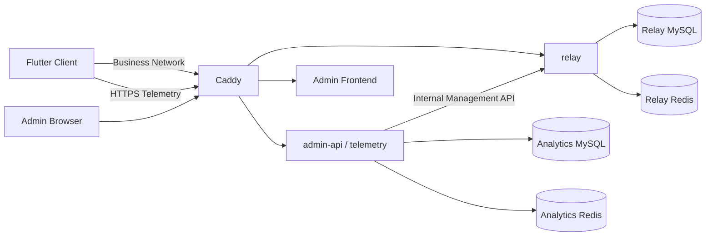

> 最新更新时间：2026-08-31

# 数据埋点架构

> 状态：Approved for implementation  
> 文档类型：技术架构设计约束  
> 目标：定义客户端 Telemetry、服务端采集与存储、动态策略、幂等、查询和 Admin Panel 的系统边界与长期不变量。本文不维护具体业务事件清单，也不规定页面级实现细节。

---

## 1. 目标与非目标

系统必须满足：

- 统一采集客户端结构化行为事件和诊断错误。
- 事件可通过 `deviceId`、`sessionId`、`traceId` 关联。
- 客户端具备本地持久化、离线缓存、失败重试和人工重传能力。
- 服务端具备设备认证、幂等接收、独立持久化、动态策略和数据保留能力。
- Admin Panel 可查看聚合指标、错误、最近活跃设备并按统一条件筛选。
- Telemetry 故障不得影响 Relay、SSH、文件传输或 UI 主流程。

第一版明确不做：

- 不引入 Kafka、RabbitMQ、NATS 等独立消息队列。
- 不把 Telemetry 数据写入 Relay MySQL，也不复用 Relay Redis。
- 不依赖 Rust Network SDK 的 QUIC/TCP/Relay 业务链路完成 Telemetry 上报。
- 不上传 Terminal 内容、Shell 命令、SSH 主机信息、AI Prompt/Response 等敏感业务内容。
- 不允许 Feature 直接操作 Telemetry HTTP、数据库或自行定义事件字符串。
- 不在本架构文档维护完整业务事件列表；事件属于独立 Contract Catalog。

---

## 2. 系统边界

第一版采用：

**Flutter Telemetry Runtime + 独立 HTTPS + `admin-api` 内 Telemetry 模块 + 独立 Analytics MySQL + 独立 Analytics Redis + 现有 Admin Frontend。**



必须保持：

1. `relay` 不依赖 Telemetry。
2. Telemetry 不 import `internal/relay`。
3. Telemetry 与 Relay 使用独立数据库、账号和持久化边界。
4. Analytics Redis 与 Relay Redis 使用独立实例/部署单元，不共享内存上限和故障域。
5. Analytics MySQL 是 Telemetry 的权威存储；Redis 仅是可丢失的有界热缓存。
6. Telemetry 属于 Observability Plane，业务网络故障不能同时切断其唯一上报路径。
7. 在 2C4G 部署上，Telemetry 的数据库连接池、Ingest 并发和 Redis 内存必须有硬上限，不能通过增加常驻中间件换取吞吐。

---

## 3. 数据契约

### 3.1 统一 Envelope

所有记录共享以下基础字段：

```text
eventId
recordType        // analytics | diagnostic
eventName
eventVersion
deviceId
sessionId
traceId
occurredAt
feature
severity
appVersion
buildNumber
platform
properties
error?             // diagnostic 或失败记录
```

服务端额外记录：

```text
receivedAt
```

约束：

- `eventId`：全局唯一幂等身份；重传时不得重新生成。
- `deviceId`：复用现有网络设备 ID，不建立第二套设备身份。
- `sessionId`：一次 App Session。
- `traceId`：一次业务操作或故障链。
- `occurredAt`：客户端事件时间，仅用于还原业务时间线。
- `receivedAt`：服务端可信接收时间，用于 Retention、最近活跃设备和服务端运行指标。

客户端时钟不可信。服务端以收到请求时的可信 UTC 时钟校验 `occurredAt`：允许最多提前
5 分钟以覆盖正常设备时钟漂移，超过该边界的事件在入库前拒绝；较早的离线补传事件仍然允许。
不得仅依赖 `occurredAt` 做数据保留或最近活跃判断。

投递延迟统一定义为 `receivedAt - occurredAt`，单位为毫秒；服务端接收时间由服务端写入，
不采信客户端提供的 `receivedAt`。历史数据中若仍出现未来 `occurredAt`，延迟样本按 0 ms
计入并通过 `futureTimestampCount` 单独标识。

### 3.2 Analytics 与 Diagnostic

- `analytics`：稳定、可聚合的业务事实。
- `diagnostic`：结构化错误、异常和降级信息。

禁止将 `AppLogger` 原始日志全量上传。上传内容必须经过事件契约、字段白名单和脱敏规则。

### 3.3 Event Catalog

事件名称、版本、允许字段、错误码和指标映射只有一个 Source of Truth：

```text
contracts/telemetry/
├── events.yaml
├── error_codes.yaml
└── policy.schema.json
```

Dart、Go、TypeScript 只能使用该 Contract 生成或校验出的常量/Registry。业务代码不得散布原始事件名称和错误码。

事件命名采用稳定业务语义：

```text
<domain>.<object>.<action>
```

不得按 Widget、按钮、ViewModel 或文件名定义事件。语义不兼容变化必须提升 `eventVersion`。

### 3.4 错误模型

错误至少包含：

```text
errorCode
category
terminalFailure
```

`terminalFailure=false` 表示中间步骤失败但业务仍可继续，例如 QUIC 失败后 TCP/Relay fallback 成功；此类记录不得直接计入最终业务失败率。

---

## 4. 客户端 Runtime 与初始化

客户端只有一个 App Scope Telemetry Runtime，由 `AppRuntimeFactory` 创建、`AppRuntime` 持有和释放。

禁止：

- `Analytics.instance` 等静态全局单例。
- Feature 自建 Telemetry Client。
- Feature 自行打开 Telemetry 数据库。

初始化由 `AppRuntimeFactory` 按组合根依赖顺序完成，顺序约束为：

```text
Core settings and device identity
-> Feature module owners
-> shared NetworkRuntime/NetworkFacade
-> Telemetry local storage and Telemetry Runtime
-> telemetry producer bridges and sinks
-> AppRuntime ownership commit
```

Telemetry enrollment 适配器需要借用已建立的 Relay identity/network 能力，因此
Telemetry Runtime 在这些 App Scope 依赖就绪后创建，且只创建一次。Telemetry
建立前的初始化错误进入注入的 AppLogger 并触发组合根回滚；不通过内存数据库
静默兜底。Runtime 建立后，采集、落库、上传或策略刷新失败均不得改变 SSH、SFTP、
Relay 或 UI 业务结果。

业务操作不得依赖 Telemetry 成功；采集、持久化或上传失败均不得改变业务操作结果。

---

## 5. 客户端本地数据库与状态机

### 5.1 本地数据库是客户端可靠性边界

Telemetry 记录必须进入本地数据库后才能进入上传流程。网络上传不是业务调用链上的同步依赖。

本地状态使用两个正交维度，避免 `synced -> logical_deleted` 的隐式状态歧义：

```text
syncState = pending | synced | rejected
logicalDeletedAt = null | timestamp
```

语义：

- `pending`：尚未获得服务端成功 ACK，可自动重试。
- `synced`：服务端返回 `accepted` 或 `already_seen`。
- `rejected`：服务端判定为永久不可自动重试的 Contract/Schema 错误。
- `logicalDeletedAt != null`：该记录已同步，不再属于正常待处理数据，但仍保留用于人工重传。
- `logicalDeletedAt` 仅允许在 `syncState=synced` 时非空；`pending/rejected` 必须保持为空。

当服务端返回 `accepted` 或 `already_seen` 时，客户端必须在同一数据库事务中：

```text
syncState = synced
logicalDeletedAt = now
```

`rejected` 不得无限自动重试，也不得按自动 FIFO 物理删除；它必须计入 Telemetry degraded/backlog 状态，并允许开发者查看和人工重试。

### 5.2 自动清理不变量

> 未成功同步到服务端的记录不得被自动物理删除。

服务端下发的 `clientMaxLocalRecords` 是**目标上限**，不是允许丢数据的硬上限。

当本地总记录数超过目标上限时：

- 只从最老的 `synced + logicalDeletedAt != null` 记录开始 FIFO 物理删除。
- `pending` 和 `rejected` 均不得因数量、时间或缓存上限自动删除。
- 若不可删除记录本身已超过目标上限，客户端允许超限，并暴露 `cacheOverflow/backlog`。

### 5.3 人工重传

Developer 页面提供“一键重传本地 Telemetry 数据”，并将永久拒绝记录的重试作为
独立的显式操作。`replayAllLocalRecords()` 只发送 `pending` 与 `synced` 记录；
`retryRejectedRecords()` 只发送 `rejected` 记录。后者遇到网络/5xx 失败时保持
`rejected`，不得重新进入自动上传的 `pending` 队列。

重传保持原始：

```text
eventId
deviceId
sessionId
traceId
occurredAt
payload/version
```

不得把历史记录重新包装成新事件。服务端负责幂等。

客户端本地容量维护在 durable insert 后独立、按有界频率执行，不依赖成功上传；
健康诊断可报告 `oldestPendingAge`、`oldestRejectedAge` 与
`overflowCount = max(totalCount - clientMaxLocalRecords, 0)`。

---

## 6. 上传策略与远端配置

客户端由版本化 `TelemetryUploadPolicy` 控制上传时机，至少支持：

- `uploadEnabled`
- 条数阈值触发
- 时间阈值触发
- 特殊触发
- 最大单批条数
- 客户端目标缓存条数

特殊触发可包括：

```text
highPriorityError
appBackground
networkRecovered
appForegroundWithBacklog
```

各触发条件采用 OR 语义。特殊触发只决定“何时尝试上传”，不得决定“是否记录/持久化”。

若 `uploadEnabled=true`，至少必须启用一种自动触发条件；若希望暂停自动上传，应显式关闭 `uploadEnabled`，而不是构造无触发器策略。

客户端必须内置不可绕过的安全边界，例如最小时间间隔、最大 batch、最大请求体和缓存目标的合理范围。远端 Policy 必须同时通过服务端校验与客户端 clamp/reject。

客户端保存最后一次有效 Policy 和 `policyVersion`：

- 拉取失败：继续使用 Last-Known-Good。
- 从未成功拉取：使用内置安全默认值。
- 收到非法配置：拒绝应用并保留上一版本。

Telemetry 默认关闭，只有 App Shell 确认当前 Relay origin 存在有效 enrollment 后才开启。Relay 未注册时，客户端不创建、不写入新的埋点记录，也不写入记录缓存；已存在的历史行保留，待重新开启后再按原 eventId 处理。Relay enrollment 有效时，`uploadEnabled` 只控制上传调度，不关闭本地记录；Policy 刷新仍是独立控制面行为，即使 `uploadEnabled=false` 也必须以有界频率刷新，以便管理员远程重新开启上传。

---

## 7. HTTPS、设备认证与批量 ACK

Telemetry 使用独立 HTTPS API，不复用 Rust Network SDK 数据链路。

Public Telemetry Ingest 必须具备独立设备认证，不能只相信请求体中的 `deviceId`，也不能在 APK 中内置全局共享 secret。

认证约束：

- 使用既有设备身份材料证明 deviceId 的持有关系。
- Telemetry 服务签发 Telemetry-scope credential/token。
- 后续 batch 使用该凭据认证。
- Telemetry credential 只授权 Telemetry，不得获得 Relay/Admin 权限。
- 认证协议的精确 wire shape 属于 `contracts/telemetry`，但不得要求 Rust Network Runtime 正常工作才能完成普通 HTTPS 上传。

服务端对每个 batch 返回逐记录结果：

```text
accepted
already_seen
rejected
```

一个永久非法记录不得阻塞同一 batch 中其他合法记录的接收。

客户端状态推进：

- `accepted` / `already_seen` -> `synced + logicalDeletedAt`。
- `rejected` -> `rejected`，停止自动重试。
- 网络错误、超时、429、5xx -> 保持 `pending`，指数退避 + jitter。

客户端必须保证同一 Runtime 内只有一个逻辑 uploader owner，避免并发领取同一批记录。

---

## 8. 服务端采集、幂等与存储

### 8.1 Telemetry 模块

第一版 Telemetry 运行在 `admin-api` 进程中，但必须保持独立 Config、Handler、Service、Store、Validation Registry、Retention Worker 和 Cache Adapter 边界。

未来若吞吐要求提高，可将该模块抽为独立进程，不改变客户端协议和 Admin 查询契约。

### 8.2 不引入服务端 MQ

第一版可靠性由以下组合提供：

```text
Client durable DB
+ HTTPS retry
+ per-record idempotency
+ MySQL transaction
```

服务端使用有界 body、有限 batch、Ingest 并发上限、Rate Limit 和 Batch Insert 做准入与削峰。

### 8.3 Analytics MySQL

Analytics MySQL 是服务端唯一权威 Telemetry 存储。

逻辑上至少覆盖：

```text
device telemetry identity/credential
events / diagnostic records
ingest receipts
telemetry settings
```

物理表可按查询性能选择统一 raw-record 表或分表，但对外必须维持统一 Envelope、统一筛选和统一 Retention 语义。

查询契约必须支持以下筛选字段：

```text
deviceId
traceId
eventName + receivedAt
severity/errorCode + receivedAt
appVersion/platform
```

当前 MySQL 表为 `deviceId`、`traceId`、`eventName + receivedAt`、
`severity + receivedAt`、`errorCode + receivedAt`、`releaseChannel + receivedAt`
和 `receivedAt` 建立索引；`appVersion` 与 `platform` 已持久化并可筛选，但当前
未承诺专用索引。

### 8.4 幂等 Receipt

原始记录可能被 Retention 删除，因此不能仅依赖 raw table 的 `eventId UNIQUE`。

服务端必须维护独立 `ingest_receipt`：

- 仅 `accepted` 的 eventId 创建 receipt。
- 对一条 `accepted` 记录，raw Telemetry 写入与对应 receipt 创建必须在同一数据库事务中原子提交；不得出现“只有 raw 无 receipt”或“只有 receipt 无 raw”的成功状态。
- receipt 不随 raw Telemetry Retention 一起删除。
- 在第一版中 receipt 默认长期保留，以保证当前仍可能存在于客户端本地数据库的历史记录重传后返回 `already_seen`。
- receipt 属于幂等元数据，不计入 Admin 配置的 raw Telemetry `maxRows`。
- 若未来 receipt 规模成为独立容量问题，应升级幂等协议，而不是静默缩短去重窗口。

---

## 9. Redis 热缓存

Analytics Redis 只缓存指定数量的**最新诊断日志摘要**。当前适配器使用有界
Redis list 实现；Admin API 的“诊断流”是逻辑上的分页/轮询视图，不把 Redis
当作消息队列或权威数据源。

Admin Panel 可动态配置：

```text
enabled
maxRecords
```

服务端必须对 `maxRecords` 设置不可突破的硬上限。

Redis 只允许用于：

- 最新日志快速首屏。
- 明确可由缓存完整回答的最近记录请求。

Redis 不允许作为：

- Dashboard 聚合指标来源。
- Retention 来源。
- 幂等来源。
- 任意复杂筛选结果的权威来源。

当查询带有 Redis 无法证明完整性的筛选条件时，必须查询 MySQL。

Redis 故障时 MySQL Ingest 和 ACK 不受影响；最近日志查询允许降级到 MySQL。Redis 恢复后无需补齐完整历史，只缓存之后的新记录。

---

## 10. 服务端 Retention

Admin Panel 可独立配置：

```text
按接收时间保留：enabled + duration
按 raw Telemetry 总条数保留：enabled + maxRows
```

两种条件可同时开启、只开一个或全部关闭。同时开启时采用 OR 语义。

约束：

- 时间 Retention 以服务端可信 `receivedAt` 为基准。
- `maxRows` 指 Analytics/Event + Diagnostic 的 raw Telemetry 逻辑总量，不包括 receipt 和 settings 等内部元数据。
- 清理按全局最旧 `receivedAt` 优先。
- 清理必须小批量执行，避免大事务长时间锁表。

---

## 11. Admin Panel

Analytics 继续位于现有 `front/`，不建设第二套管理前端。

### 11.1 Dashboard

Dashboard 只展示有明确口径的指标，包括：

- 事件总量和趋势。
- 最近活跃设备数。
- 错误/关键错误数量和趋势。
- 错误影响设备数。
- 业务操作成功率。
- Error-free session 比例。
- Telemetry Pipeline 健康状态。

指标口径必须保持以下定义：

- `businessOperationSuccessRate` 只统计 Catalog 中 `businessOperation=true` 且
  `operationRole=success|failure` 的终结事件，分母为两类终结事件之和，不受 `recordType` 限制；
  `started`、`businessOperation=false` 的诊断/投递记录不计入。`coreOperationSuccessRate`
  仅为兼容旧客户端的弃用别名，取相同结果，前端不得再使用它。
- 成功率分母为 0 时代表“无可计算数据”，不是 100% 或 0% 的业务结论；响应同时返回显式
  denominator 字段，由客户端展示 No data。
- `eventsTrend` 仅统计 Analytics 记录，和 `totalEvents` 使用同一分母；`1d`（以及兼容别名
  `24h`）按 UTC 小时分桶，`7d`/`30d` 按 UTC 日分桶。错误趋势以所有 error/critical 记录为分母。
- `serverIngestLatency` 是 `Service.IngestBatch` 从调用到返回的真实服务边界耗时；
  `serverIngestErrorRate` 是该边界返回 error 的调用数除以调用总数，不含认证、解码、限流、
  过载拒绝或单条 rejected ACK。两个指标都只保留有界、无请求标签的聚合数据。

默认“最近活跃设备”定义为：指定时间窗口内至少有一条**服务端成功接收记录**的唯一 `deviceId`，即基于 `receivedAt`，避免客户端时钟漂移和离线补传破坏口径。

“整体健康状况”必须由可解释底层指标组成；第一版不强制合成主观 Health Score。

### 11.2 Explorer / Diagnostic

统一支持：

```text
时间范围
deviceId
traceId
eventName
feature
severity
errorCode
appVersion
platform
releaseChannel
```

Dashboard、Event Explorer、Diagnostic Logs 必须共享 Filter Contract。所有聚合指标的 numerator/denominator 关系由 Event Catalog/Metric Mapping 定义，前端不得自行猜测。

### 11.3 Settings

Admin Panel 至少可以配置：

- Upload Policy。
- 客户端目标缓存条数。
- 服务端 Retention。
- Redis Recent Log Cache 数量。

所有配置均由服务端权威校验，并携带 `policyVersion` 或更新时间。

---

## 12. 安全与隐私

默认禁止上传：

- SSH 用户名、主机名、IP、端口组合、认证信息。
- Terminal 输入输出和 Shell 命令。
- 文件名、完整路径和文件内容。
- API Key、Token、Cookie、密码。
- AI Prompt/Response。
- MCP Tool 原始参数。
- WebView 完整 URL 和用户输入。
- 广告 ID、IMEI、MAC、硬件序列号、精确地理位置。

错误堆栈如需上传必须长度受限、脱敏，并可 fingerprint 化。

服务端必须拒绝 Catalog 未声明字段，不能只依赖客户端自觉脱敏。

Public Telemetry API 不使用 Admin Cookie Session；Admin Query/Settings API 必须使用现有管理员认证体系。

---

## 13. Telemetry 自身健康

系统至少暴露：

```text
localPendingCount
localRejectedCount
localSyncedCount
cacheOverflow
lastUploadAt
lastUploadError
policyVersion
serverIngestLatency
serverIngestErrorRate
```

Telemetry 自身错误不得递归制造无限 Telemetry 事件。例如 `telemetry.upload.failed` 只能由受控路径记录，不能因为上传该事件再次失败而继续产生同类事件。

---

## 14. 测试、CI 与实施约束

CI 必须覆盖以下架构不变量：

- Contract 可解析，Dart/Go/TypeScript 定义一致，未注册事件/属性被拒绝。
- Telemetry Runtime 全局唯一，并在依赖就绪后只挂载一次 producer/sink bridge。
- `pending/rejected` 不被自动删除；已同步数据按 FIFO 受控物理删除。
- Policy 的 Last-Known-Good、非法配置拒绝和触发逻辑正确。
- accepted/already_seen/rejected 的部分 ACK 与本地状态推进正确。
- `logicalDeletedAt` 只允许用于 `synced`；raw record 与 ingest receipt 对 accepted 记录原子提交。
- Relay 未注册时不产生新的本地埋点记录；Relay enrollment 有效时，`uploadEnabled=false` 暂停上传但本地采集与远端 Policy 刷新仍可工作。
- 人工重传保持原 eventId。
- 服务端设备认证不能只信任 deviceId。
- receipt 在 raw 数据删除后仍阻止旧 eventId 重复插入。
- Retention 两种条件的四种组合正确，且基于 receivedAt。
- Redis 故障不影响 MySQL Ingest，复杂筛选不会错误依赖 Redis。
- Dashboard/Explorer 使用统一 Filter/Metric Contract。
- Relay/Telemetry 架构边界测试持续通过。

End-to-End 至少验证：

```text
Client record
-> local DB
-> HTTPS auth + batch
-> server idempotency
-> Analytics MySQL
-> Admin query
```

以及：

```text
same eventId replay
-> already_seen
-> no duplicate raw record
```

Client / Backend / Front / Contract 必须作为同一架构变更整体保持契约一致。实施过程中的版本控制组织方式不属于本文约束；任何阶段都必须保持可测试、可审查，且不得暂时破坏上述跨层契约。

本文不绑定任何分支、提交、Pull Request、发布日期或仓库快照。后续实现必须以开发时仓库的有效架构边界和当前 Contract 为准；若代码结构发生演进，应保持本文定义的职责、不变量和接口语义，而不是机械复制历史文件布局。

---

## 15. 最终架构不变量

1. **Observability 与业务网络解耦**：Telemetry 使用独立 HTTPS，不依赖 Rust Network Runtime 正常工作。
2. **客户端先持久化再上传**：未进入本地可靠存储的事件不视为可靠 Telemetry 记录。
3. **未同步数据永不自动删除**：`pending/rejected` 不能被容量或时间策略自动物理删除。
4. **ACK 原子推进状态**：`accepted/already_seen` 必须原子变为 `synced + logicalDeletedAt`。
5. **eventId 决定幂等身份**：重传不得生成新 eventId。
6. **deviceId 复用既有设备身份，但请求仍必须认证**：服务端不能只相信 deviceId 字符串。
7. **traceId 贯穿一次业务操作**：用于跨层故障关联。
8. **事件定义集中治理**：业务代码不得散布原始事件名、错误码和任意 properties。
9. **Analytics MySQL 是权威存储**：Redis 只保存有界最近诊断摘要，不参与权威统计。
10. **Telemetry 与 Relay 存储隔离**：数据库/Redis/连接池/容量边界不得混用。
11. **动态 Policy 只能影响调度和目标容量**：不得破坏数据可靠性不变量。
12. **Retention 使用 receivedAt**：客户端时钟不能决定服务端数据生命周期。
13. **Receipt 生命周期独立于 raw Retention**：人工重传不能使已清理历史数据复活。
14. **Admin 指标必须有稳定口径**：Filter 和 Metric Mapping 是共享 Contract。
15. **隐私默认拒绝**：Catalog 白名单优先于任意自由字段。
16. **Telemetry 故障不得影响核心业务**：采集、上传、Redis、Analytics DB 异常均不得阻塞 SSH/Relay/UI 主流程。
17. **成功接收必须原子持久化**：raw Telemetry 与 ingest receipt 必须同事务提交，客户端 ACK 不得早于权威持久化。
